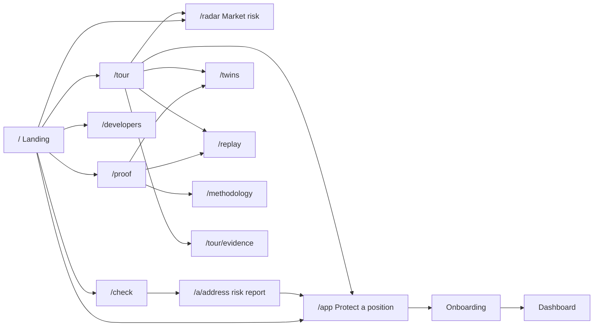

# Lifeline: Backlog for the coding agent

This file is the execution plan for building Lifeline as specified in `prd.md`. A coding agent works through it top to bottom, marks progress in place, records evidence, and **stops to ask the human whenever a task is tagged `HUMAN`.**

Source-of-truth order:

1. `prd.md` decides *what* to build.
2. This backlog decides *how and in what order*.
3. `analysis.md` explains *why*.

If this backlog and the PRD disagree, the PRD wins. Log the conflict in the Decision log (§9) and fix the backlog.

**Start here (a fresh agent):**

1. The pnpm workspace from S0.1 is in place. Product docs stay at the repo root. Role keys and service secrets live only in gitignored `secrets/`.
2. Read `prd.md` §2–§5 and §9, then this file's §1–§6.
3. Scan the Decision log (§9) and every task marked `[~]` or `[!]` to recover state from earlier sessions.
4. Continue with the first eligible task (§1.1). Phase 0, gates G5, G8, G6, G1, G7, G3, G2, and G4, Phase 2 (C1–C8), Phase 3 (P1–P3), W1–W9, U2, U1, U15, U3, U4, U5, U7, A1–A10, U6, U8, U9, U10, U12, U13, and U16 are done. D1–D6 and U11 and U14 are done. V0, V1, V2, V3, V4, V5, V6, and V7 are done. The sponsor received 10 MON, `pnpm cli status` prints `budget ok`, `/health` is `low:false`, and ops run 37722089588 is green. D7 waits for V14.
5. **Read §7A (Planner review) before taking the next task.** It solves G4: `liquidationPricePNS` matches the contract to the tick on the fork fixtures, and `CALIBRATED=true`. It also adds corrections and upgrades aimed at the cash prizes, and it sets the order to interleave them with the remaining tasks. U2, U1, U15, W7, U3, W8, W9, U4, U5, U7, A1–A10, U6, U8, U9, U10, U12, U13, and U16 are done. D1–D6, U11, and U14 are done.
6. **Then read §7B (Productization) in full. It comes before D7.** It turns the prototype into the product: two user stories (a trader and a judge), one landing page, a persistent `/app` with onboarding and a dashboard, a judge tour, and an Anthropic-style design system. It also fixes the flow-breakers and wrong numbers found on production on 2026-10-07. V0, V1, V2, V3, V4, V5, and V6 are done. Production serves this shell at `https://lifeline-five-murex.vercel.app` (deployment `dpl_2bmd451cTK2dQnav2goxnwkS37qh`). The next product task is **V13**. V7, V8, V9, V10, V11, and V12 are `[x]`.

**Where the build stands (2026-10-08).** Phases 0–5, every U-task, and D1–D6 are `[x]`. The site is `https://lifeline-five-murex.vercel.app`. The Worker is `https://lifeline.lifeline-shreyas.workers.dev`, version `8fbaa719-7fe7-452d-b314-2950eaa43ccb`. V0, V1, V3, V4, V5, and V6 are done locally. The Durable Object quota has reset. `/health` is 200 with `degraded:false`, `low:false`, `armed` 100, `lastBlock` 69139671, `claimsToday` 1, `poolAvailable` 60, `poolInBand` 17. `pool:register --restore-twins` exited 0. Twin distances are numeric on all 14 legs. Ops run 37722089588 is green. `/health` is `low:false` (`poolInBand` 11, `poolAvailable` 55, `armed` 110). `pnpm cli status` prints `budget ok` with sponsor 33.3862 MON. Production serves V3–V7 at `https://lifeline-five-murex.vercel.app` (deployment `dpl_2bmd451cTK2dQnav2goxnwkS37qh`). V7 is `[x]`: guest `0x68927BE500A643BBDc3bAAac1372fDDD2ffa23d4` owns `0xC0385344A3641F3ba8fb7c5AdFB47a5bEeb7702A`, and top-up `0x81508908` moved distance 45765 → 89997 against a 9% safety line. V8 is `[x]`: "Saved to your email" left `owner()` of `0xC0385344` at `0x68927BE5`. V9 is `[x]`. V10 is `[x]`: `/developers` runs the risk example, copies the curl, and shows the 60-per-minute limit. V11 is `[x]`: the five-stop tour, reload at stop 2, and the evidence map. V12 is `[x]`: the copy sweep. Next is V13. V13, V14, D7, D8, R1, and R2 are not started.

**Done**

| Task | Status | What landed |
|---|---|---|
| V0 | `[x]` | `prd.md` matches §7B: both stories, §4.0 routes, F1 landing sentence, F4 resume, F7 withdraw-any and `login()`, F9 1% rule, F10 dashboard, five-beat §9 tour. |
| V1 | `[x]` | Liquidation dollars use market decimals. Eligible means idle AUSD is at least 1% of notional. The history window is 30 days by block. Prices render as dollars. Mainnet links use Monadscan. Live check: 577 rows from block 102785487, latest 50 notionals match the formula, avoidable penalty is less than paid. |
| V2 | `[x]` | Quota reset, pool registered, twin distances numeric, sponsor topped up, `budget ok`, ops run 37722089588 green. Worker `8fbaa719`. |
| V3 | `[x]` | Anthropic tokens, Poppins / Lora / JetBrains Mono, the component set, the ivory shell, `/dev/ui` (404 in production), and `/api/ops-health`. Lighthouse mobile accessibility on `next start` `/` is 100. On production with the V7 deploy. |
| V4 | `[x]` | `/` is the landing page. Live strip uses `/api/radar?chain=143` every 10 s. Lighthouse mobile on `next start` `/`: performance 95, accessibility 100, best practices 100. On production with the V7 deploy. |
| V5 | `[x]` | `/radar` is the market-risk page: chain control, stats, one chart per market with buckets, empty markets collapsed, crash slider, at-risk table, and the testnet "Your position" highlight. On production with the V7 deploy. |
| V6 | `[x]` | `/check` and `/a/[address]` are the risk report. Liquidation prices are dollars. The testnet example is pool account `0xe3929EB4`. On production with the V7 deploy. |
| V7 | `[x]` | `/app` onboarding is live. Three test-wallet runs, resume, fallbacks, and screenshots. Human guest `0x68927BE5` owns `0xC0385344`; top-up `0x81508908` at block 69204928 moved an ETH long from 4.6% to 9.0%, inside the 9% band. |
| V8 | `[x]` | `/app` reloads into the dashboard. Live test adjusted the safety line, paused to 404, resumed, withdrew 25 AUSD, and a breach top-up showed up in Activity. "Saved to your email" kept `owner()` at `0x68927BE5`. |
| V9 | `[x]` | `/proof`, twins, the mainnet replay chart, and contract-exact. Twin amounts are AUSD. Screenshots at 390 and 1440. |
| V10 | `[x]` | `/developers` documents the risk API from `lib/api-docs.ts`, runs the example, and copies the curl. A 61st call in a minute shows the limit. Screenshot at 1440. |
| V11 | `[x]` | `/tour` and `/tour/evidence`. The rail walks five stops, survives a reload, and Exit hides it. Screenshots of each stop at 390. |

**V2 live checks are done.** Ops run [37722089588](https://github.com/shreyas-sovani/Metropolis/actions/runs/37722089588) is green: refill, `pool:register` (`registered 117 file 85 mandates 84`), the AUSD faucet, and `budget ok need=31.1400 sponsor=33.3862`. `/health` after that run: `degraded:false`, `low:false`, `poolAvailable` 55, `poolInBand` 11, `armed` 110, `lastBlock` 69147465, `claimsToday` 1.

**Do not run a large `pool:refill`.** `/health` is 200 and `poolInBand` is 17. The scheduled ops run at 2026-10-08 01:36 UTC (37713754527) created four BTC accounts and then failed `register count registered=87 expected=79`. Those four are now in the local pool file and registered. The count check is fixed locally and has to be on `master` before the next scheduled run, or the runner keeps failing that check.

**After the quota resets, in this order**

1. Push `master` so the ops workflow passes `ADMIN_SECRET` and `PROXY_SECRET` and saves `cli-state` even when a step fails.
2. `pnpm cli secrets:sync-vercel` so production can forward the real client IP.
3. `pnpm cli pool:register`, then `pnpm cli pool:register --restore-twins`.
4. `curl` `/health` until it is `degraded:false`. Confirm `armed`, `lastBlock`, `claimsToday`, and whether `low` is false. If the in-band target cannot be met without a large refill, stop and ask.
5. `gh workflow run ops.yml` and wait for one green run with `pool:register` exiting 0.
6. V2 is `[x]`. V3 through V7 are `[x]` and on production. Continue at **V8**. The Privy email setting was replied "done" on 2026-10-08.

**Recovered accounts (already verified, waiting on register).** Twenty proxies from those three failed runs: pool owner, pending owner zero, six operator selectors revoked, one open BTC position (perp 16). Appended to local `cli-state/pool.json` (85 accounts). Left out, no open position: `0x240dBDd7`, `0x8d33670A`, `0xB2337bbE`, `0x1DF440A0`. Marked `role: "sandbox"` instead of minting new ones: `0x9d5c146f` (short) and `0x0d603487` (long).

**Durable Object storage (2026-10-07).** The free plan's 5,000,000 `rows_read` per day was used up. Storage calls failed, the Lifeline constructor threw, and `/health` returned 500. Worker `ebeb878d-64f6-40aa-9381-2a520056d346` keeps the 2 second alarm. A tick reads armed mandates, pending actions, and confirmed actions with no `dist_after` from memory, and reads SQLite again at most once a minute. A send still reads and writes `keys` for the nonce. Migration 9 adds indexes for the residual scans and `actions.created_at`. `/saves` and the soak history are the last 7 days and at most 200 rows. `/twins` is at most 200 pairs. While storage is down, `/health` returns 503 `{"status":"error","degraded":"..."}` and the next request retries migration. Production returned that 503 at 2026-10-07 15:17 UTC (`Exceeded allowed rows read in Durable Objects free tier.`). The same 503 was still returned at 2026-10-07 16:47 UTC, after Worker `1f8bfcc5` deployed. The quota resets at 2026-10-08 00:00 UTC. The next successful `/health` should return 200 and arm the keeper. Local `wrangler dev` returned 200, `degraded:false`, with 43 ticks. `pnpm --filter @lifeline/worker exec vitest run` passed 46 tests before V2 and 56 tests after V2. Expected steady state is about 150,000 rows read per day.

**Still required to finish the core, in order:**

| Next | Task | Who | What it takes |
|---|---|---|---|
| 1 | D1 | Done | Production `https://lifeline-five-murex.vercel.app`. Privy and Turnstile allow that origin. |
| 2 | D2 | Done | `/health` is `degraded:false` with `ticksLast10m` 285. |
| 3 | D3 | Done | `budget ok`, pool 31 available (27 BTC, 4 ETH), twins 7, every free position above the house trigger. |
| 4 | D4 | Done | Uptime monitors are up. The human received the test email. |
| 5 | D5 | Done | Three production public runs, plus one human Privy claim verified onchain. |
| 6 | D6 | Done | Ops runbook in `README.md`. Refill and the kill switch were dry-run. |
| 6b | U11 | Done | `/judges` bounty map. Proof links answered. |
| 7 | U14 | Done | Static replay of mainnet Bitcoin liquidation block 111199304. |
| 8a | V0 | Done | PRD matches §7B. Commit `9705f73`. |
| 8b | V1 | Done | Liquidation numbers, 30-day window, dollar prices, Monadscan. Commit `edd5cd7`. |
| 8c | V2 | Done | Ops run 37722089588 green. `budget ok`, `/health` `low:false`. |
| 8d | V3 | Done | Design system and ivory shell. Local only; production is unchanged. Lighthouse accessibility 100. |
| 8e | V13–V14 | Not started | Routing and journeys. V12 is `[x]`. |
| 9 | D7 | Human | Run both §7B.2 stories on a phone and a laptop. |
| 10 | D8 | Human | Record the ≤ 3 minute judge tour and send the link. |
| 11 | R1 | Agent | README, MIT license, clean `secrets:check`. |
| 12 | R2 | Human | Submit on the Metropolis portal: Track 1, plus Perpl API, Perpl Analytics, Envio, and Privy. |

Phase 8 (X1–X9, B1–B7) starts only after D5. X5 is already `[-]`, replaced by U14. Those items are not required to submit.

---

## 1. Agent operating protocol

### 1.1 How to work through this file

1. Find the first task whose status is `[ ]` (not started) and whose `Depends on` tasks are all `[x]`.
2. Mark it `[~]`, do the work, then run every check under **Pass**.
3. **If all checks pass:**
   - fill in the task's **Evidence** line (commands run plus key output, never secrets);
   - mark it `[x]`;
   - commit with message `<task-id>: <short summary>`.
4. **If any check fails:** fix it and re-run. If you can't make it pass, apply the task's **Fallback**. If there is no fallback, mark the task `[!]`, write the reason under Evidence, and stop and ask the human (§1.3).
5. Don't start Phase 8 (if-time) until **D5** is `[x]`.

**Status markers:**

| Marker | Meaning |
|---|---|
| `[ ]` | Not started |
| `[~]` | In progress |
| `[x]` | Done (all Pass checks met) |
| `[!]` | Blocked; waiting on the human |
| `[-]` | Descoped, with a reason logged in §9 |

### 1.2 Human steps

A task tagged **`HUMAN`** needs a person: creating an account, using a browser faucet, approving an OAuth login, recording video, or submitting the entry. When you reach one:

1. Stop all work.
2. Print the request using the template in §1.3. If several `HUMAN` tasks are ready at the same moment and don't depend on each other, put them in one prompt to save interruptions.
3. Wait for the human's reply. Don't continue other tasks while waiting.
4. Verify the human's result using the task's **Pass** checks before marking it `[x]`. If verification fails, say exactly what's missing and prompt again.

**Recurring human step (MON top-up).** Whenever `pnpm cli status` shows the sponsor's balance under its floor (§4.3), prompt the human to fund it again with the S0.4 template, even in the middle of a phase.

### 1.3 Templates

**Human-step prompt:**

```
=== HUMAN STEP REQUIRED: <task-id> <title> ===
Why this is needed: <one or two sentences>
Please do:
  1. <exact step, with URL>
  2. <exact step>
Put secrets here (do NOT paste private keys into chat): <file path and variable names>
Reply with: <what to type back, for example "done", or a public value such as an App ID>
I will verify by: <the Pass check you will run>
```

**Blocked-task prompt:**

```
=== BLOCKED: <task-id> ===
What failed: <check and observed result>
What I tried: <bullets>
Options: <A / B / C, with your recommendation first>
I need from you: <decision or action>
```

### 1.4 When the agent must stop and ask, even without a `HUMAN` tag

- **A hard rule would be broken** (§2.1).
- **Money would be spent,** or a card, a paid plan, or a paid API would be needed.
- **A mainnet write transaction** would be sent. Mainnet is read-only, always.
- **A gate fails** and its fallback also fails.
- **A destructive action** would be taken on shared state: deleting the Worker, rotating keys that hold funds, or force-pushing.
- **The PRD is ambiguous** in a way that changes what judges see.

### 1.5 Autonomy: improve things, within the PRD

You're encouraged to use your judgment to make the product better. You may:

- choose libraries, file structure inside the layout in §3, UI design, and component patterns;
- refactor, add tests, add useful logging or metrics;
- improve copy and visual polish, and add small robustness improvements;
- tune any **tunable default** (§2.2) when you have measured evidence;
- correct factual errors in the PRD (wrong addresses, ABI shapes, event fields).

Every non-trivial choice like this gets one line in the Decision log (§9): what you changed, why, and the evidence.

You may **not**:

- break a hard rule;
- remove or weaken a core feature (PRD §3);
- add paid services;
- change the product idea or the primary track.

### 1.6 Secrets hygiene

- **Private keys and tokens live only in gitignored files** (§4) and in platform secret stores (Wrangler secrets, Vercel env).
- **Never** print secret values in chat, logs, test output, commit messages, or client bundles.
- Scripts that sync secrets read from files and write to stores without echoing the values.
- Before every commit, run `pnpm secrets:check`, which greps the staged diff for 64-hex keys and known token prefixes. It must exit 0.

---

## 2. Rules from the PRD

### 2.1 Hard rules (never change without asking the human)

| # | Rule | PRD |
|---|---|---|
| H1 | Web app only. No Android or iOS app. | §10 |
| H2 | Mainnet is read-only. All writes happen on Monad testnet (10143). | §10 |
| H3 | The demo-critical path depends only on Monad RPC, Perpl's contracts, Privy, our Worker/DO, and our Vercel routes. **No Perpl web app, Perpl REST, or Perpl WebSocket on it.** No browser request may go to `*.perpl.xyz`. | Principles, §10 |
| H4 | No new smart contracts in the core. | §3, §10 |
| H5 | The operator key can call only `increasePositionCollateral`. All six other operator selectors are revoked at provisioning, and this is checked every time. | §5.2 |
| H6 | Lifeline never opens, closes, or reduces positions automatically in the core. | §10 |
| H7 | Privy is the only account layer, and judges get guest accounts with no login. No Mera, Dynamic, or thirdweb. | §5.4, §10 |
| H8 | $0. No paid plans, no card-required services, no paid APIs, no gas sponsorship services. | Principles |
| H9 | The liquidation math follows PRD §5.3. Values show an "est." label until G4 passes. | §5.3 |
| H10 | Operator transactions are serialized through one Durable Object, so there are no nonce races. | §F6 |
| H11 | Secrets never go into git, the client bundle, or logs. | — |
| H12 | The judge flow needs at most one wallet transaction (`acceptOwnership`) before seeing Lifeline act. The mandate is a gasless signature. | §F4–F5 |

### 2.2 Tunable defaults (change only with measured evidence, logged in §9)

| Parameter | Default | Where |
|---|---|---|
| User mandate | trigger 4%, target 6%, per-action cap 150 AUSD, budget 50% of free balance, expiry 7 days | §F5 |
| House mandate | trigger 1.5%, target 2.5% | §F4 |
| Twin house mandate | trigger 4%, target 6%, budget 300 AUSD | §F8 |
| Minimum action | 5 AUSD | §5.3 |
| Cooldown | 3 blocks per position | §5.3 |
| Alarm interval | 2 s | §5.5 |
| Canary interval | 10 min | §5.5 |
| Dust threshold | $10 notional | §5.3 |
| Buckets | 0.25% of mark, from −15% to +15% | §5.3 |
| At-risk threshold | distance under 5% | §5.3 |
| Crash slider range | ±10% | §F2 |
| "Saved" rule | free balance covers the deposit needed to stay at least 1% from the shocked price | §F2 |
| Claim drip | 0.08 testnet MON | §F4 |
| Rate limits | 1 claim per Privy user; 10 claims and 10 demo-mode arms per real client IP per hour. The IP is the one our server forwards with `PROXY_SECRET`. | §F4 |
| Pool account funding | 400 AUSD (about 100 to the position, about 300 free) | §5.9 |
| Pool size | at least 20 available; alert below 10 | §5.9 |
| Pool positions | BTC at the highest allowed leverage up to 15×; ETH up to 12× | §5.9 |
| Cache | radar 2 s; history 60 s | §5.7 |

---

## 3. Repository map (target layout)

Create this layout in S0.1. Keep it unless the Decision log records a better one.

```
/                              repo root (this directory)
├─ prd.md  analysis.md   backlog.md      product docs (do not edit prd.md except factual fixes, logged in §9)
├─ README.md                   what it is, how to run, architecture, ops runbook (written in R1)
├─ package.json                pnpm workspace root: scripts lint, test, build, secrets:check, cli
├─ pnpm-workspace.yaml
├─ tsconfig.base.json
├─ .gitignore                  must include: secrets/, .env*, .dev.vars, cli-state/, node_modules, .next, .wrangler
├─ .env.example                every variable name from §4, with empty values and comments
├─ secrets/                    GITIGNORED. testnet-keys.env (agent-generated), services.env (human-filled)
├─ cli-state/                  GITIGNORED. Provisioning state (pool.json, twins.json), resumable
├─ docs/reference/             Planner reference material (not built, not linted): G4 fork probe and its result tables
├─ packages/
│  └─ core/                    @lifeline/core: runtime-agnostic TypeScript, no Node- or Worker-only APIs
│     ├─ src/config/           chains, addresses, RPC lists, gas limits, tunable defaults
│     ├─ src/abi/              Exchange (from PerplFoundation/dex-sdk, MIT), DelegatedAccount/Factory (minimal fragments), ERC20, faucet, Multicall3
│     ├─ src/math/             liquidation, distance, sizing, buckets, crash simulation
│     ├─ src/chain/            viem client factory with fallback, readers (perps, positions, accounts), multicall
│     ├─ src/radar/            snapshot builder and types (zod schemas)
│     ├─ src/lifeline/         mandate EIP-712, validator, evaluator, transaction builders
│     ├─ src/hypersync/        query client and event decoders
│     └─ test/                 vitest unit and integration tests
├─ apps/
│  ├─ web/                     Next.js (App Router) on Vercel: UI plus /api routes (Node runtime)
│  │  └─ e2e/                  Playwright specs
│  ├─ worker/                  Cloudflare Worker plus Lifeline Durable Object (SQLite), via wrangler
│  └─ cli/                     Node CLI: keys, funding, faucet, gates, pool, twins, status
└─ (if-time) apps/node-keeper/, apps/mm-plugin/, apps/cre/
```

**Standard commands.** Create these in S0.1 and keep them working:

| Command | Does |
|---|---|
| `pnpm install` | Install everything |
| `pnpm -r build` | Build all packages and apps |
| `pnpm -r test` | Unit tests (vitest). Integration tests are tagged and run with `pnpm test:int` |
| `pnpm lint` | ESLint and TypeScript `--noEmit` |
| `pnpm secrets:check` | Scan staged changes for secrets |
| `pnpm cli <command>` | Run CLI commands (§5) |
| `pnpm --filter web dev` | Local web app on `http://localhost:3000` |
| `pnpm --filter worker dev` | Local Worker (`wrangler dev`) |
| `pnpm --filter web e2e` | Playwright against `E2E_BASE_URL` (default localhost) |

---

## 4. Environment and secrets catalog

### 4.1 `secrets/testnet-keys.env` (generated by the agent in S0.3; never committed)

| Variable | Role |
|---|---|
| `SPONSOR_PK` | Holds MON. Gas drips to judges, operator, and the other roles |
| `POOL_OWNER_PK` | Owns pool and twin proxies until a claim; signs house mandates |
| `OPERATOR_PK` | Lifeline operator. Only `increasePositionCollateral` |
| `MAKER_PK` | Counterparty for self-match fills |
| `CALIBRATION_PK` | A plain EOA Perpl account for G4 UI calibration. Testnet only; the human may import it into a browser wallet |
| `TEST_OWNER_PK` | A scripted stand-in for a judge wallet in integration tests |

### 4.2 `secrets/services.env` (filled by the human in S0.6)

| Variable | Source |
|---|---|
| `ENVIO_API_TOKEN` | app.envio.dev → API tokens |
| `PRIVY_APP_ID` | Privy dashboard (public value) |
| `PRIVY_CLIENT_ID` | Privy dashboard, if the SDK version needs it (public value) |
| `PRIVY_VERIFICATION_KEY` | Privy dashboard → app settings → verification key (public key for access tokens) |
| `ALCHEMY_MONAD_MAINNET_URL` / `ALCHEMY_MONAD_TESTNET_URL` | Optional free fallback RPC |
| `ADMIN_SECRET` | Generated by the agent (random 32 bytes) |
| `RADAR_SALT` | Generated by the agent (random), used to anonymize account IDs |

### 4.3 Derived configuration

**Worker secrets** (set with `wrangler secret put` from the files above by `pnpm cli secrets:sync-worker`):

- `OPERATOR_PK`, `POOL_OWNER_PK`, `SPONSOR_PK`;
- `ADMIN_SECRET`, `PRIVY_APP_ID`, `PRIVY_VERIFICATION_KEY`;
- `RPC_URLS_TESTNET`, `LIFELINE_PAUSED`.

**Vercel env** (set by `pnpm cli secrets:sync-vercel`, after the human links the project):

- `NEXT_PUBLIC_PRIVY_APP_ID`, `NEXT_PUBLIC_PRIVY_CLIENT_ID`;
- `NEXT_PUBLIC_WORKER_URL`;
- `ENVIO_API_TOKEN`, `RPC_URLS_MAINNET`, `RPC_URLS_TESTNET`;
- `RADAR_SALT`, `WORKER_HEALTH_URL`.

**Balance floors** (checked by `pnpm cli status`):

| Role | Floor |
|---|---|
| Sponsor | ≥ 3 MON |
| Operator | ≥ 1 MON (auto-topped from sponsor below 1, up to 5) |
| Pool owner | ≥ 1 MON |
| Maker | ≥ 0.5 MON and ≥ 5,000 AUSD |

Below any floor, `pnpm cli status` prints `LOW:` lines and exits non-zero.

---

## 5. CLI command catalog (apps/cli)

The agent builds these across phases. Every command is idempotent or resumable, and prints only addresses, amounts, and transaction hashes.

| Command | Purpose | Built in |
|---|---|---|
| `keys:generate` | Create `secrets/testnet-keys.env` if it's missing (never overwrite) and print the addresses | S0.3 |
| `verify:addresses` | Check code exists at every PRD §5.2 address on both chains, and cross-check the collateral token and faucet token | S0.2 |
| `status` | MON and AUSD balances for each role, pool inventory and distances, twins, floors, and the 31.14 MON judging budget | S0.5, U5 |
| `fund:mon` | Distribute MON from the sponsor to each role up to its target | S0.5 |
| `faucet:ausd` | Loop `requestFunds` (respecting the global 60 s cooldown) until the AUSD targets are met | S0.5 |
| `gate:<n>` | Gate scripts G1–G8 | Phase 1 |
| `pool:create --count N --market BTC\|ETH` | Full provisioning (§P3) | Phase 3 |
| `pool:refill --target 30 --per-side 12 --in-band 10` | Create pool accounts until those inventory targets are met | U4 |
| `twins:create` | Twin pairs (§P4) | Phase 3 |
| `twins:volatile` | Rank testnet markets by mark variance and open the top pairs | U15 |
| `pool:register` | Register state-file entries with the Worker `/admin/pool` | Phase 4 |
| `arm:trial` | Live arm, latency, 403, 409, and disarm checks for one owner | W7 |
| `arm:demo --count 20` | Claim, accept, and arm with distance-based defaults | U3 |
| `secrets:sync-worker` / `secrets:sync-vercel` | Push secrets to the platforms without echoing them | Phase 6 |

---

## 6. Human steps at a glance

The human can prepare these in advance.

| ID | Step | Needed by |
|---|---|---|
| S0.4 | Fund the sponsor address with testnet MON from faucets (repeat whenever the agent asks) | All onchain work |
| S0.6 | Envio API token; Privy app plus dashboard settings; Cloudflare login approval; optional Alchemy free RPC | Gates G2, G3, G5 |
| G2-H | Only if browser automation can't drive Privy: click through a local test page | G2 |
| G4-H | Import the calibration key into a browser wallet, open the Perpl testnet UI (works from India), and read one liquidation price | G4 |
| D1 | Vercel login and project link | Deploy |
| D4 | UptimeRobot free monitor (keyword check on `/health`) | Ops |
| D7 | A real judge run on your own phone and laptop browsers | Release |
| D8 | Record the backup demo video | Release |
| R2 | Submit on the Metropolis portal (Track 1 plus bounties) | Release |
| If-time | Perpl testnet API key (X1), MetaMask Agent Wallet login (X2), Nansen API key (X3), Telegram bot token (X4), CRE login (X6), laptop standby host (B1) | Phase 8 |

---

## 7. Backlog

### Phase 0: Setup

#### [x] S0.1 Repository scaffold
- **Type:** AGENT · **Depends on:** none · **PRD:** §5.1
- **Do:**
  - `git init`.
  - Set up the pnpm workspace in the §3 layout, a strict `tsconfig.base.json`, ESLint, vitest, and the root scripts from §3.
  - Add a `.gitignore` covering every path in §3, and a `.env.example` listing every variable in §4.
  - Add `secrets:check`, a script that scans `git diff --cached` for `0x` followed by 64 hex characters and for token patterns.
- **Pass:**
  - `pnpm install && pnpm -r build && pnpm -r test && pnpm lint` exit 0.
  - `git check-ignore secrets/x cli-state/x .dev.vars .env.local` prints all four paths.
  - Staging a fake 64-hex key makes `pnpm secrets:check` exit non-zero.
- **Evidence:** `pnpm install && pnpm -r build && pnpm -r test && pnpm lint` exit 0 (Next.js 15.5.27, vitest 5 tests). `git check-ignore` printed `secrets/x`, `cli-state/x`, `.dev.vars`, `.env.local`. Staging `0x` + 64 hex made `pnpm secrets:check` exit 1 (`private-key`). `git init` reinitialized an existing empty repo.

#### [x] S0.2 Core config, addresses, ABIs
- **Type:** AGENT · **Depends on:** S0.1 · **PRD:** §5.2
- **Do:**
  - In `packages/core/src/config`, add chain objects for 10143 and 143 (viem `monadTestnet` and `monad`), every address from PRD §5.2, ordered RPC fallback lists, and an empty `GAS_LIMITS` map to be filled in G7.
  - Vendor `Exchange.json` from `github.com/PerplFoundation/dex-sdk` (`crates/sdk/abi/dex/Exchange.json`, MIT) and note its license and the commit hash.
  - Hand-write minimal ABI fragments for `DelegatedAccount` and its factory: `create`, `owner`, `pendingOwner`, `transferOwnership`, `acceptOwnership`, `createAccount`, `withdrawCollateral`, `setOperatorAllowlist`, `isOperator`, `operatorNonces`, `DOMAIN_SEPARATOR`, fallback-forwarded Exchange calls, and the `DelegatedAccountCreated` event. **Don't copy BUSL source code.**
  - Add ERC20, the Agora faucet (`requestFunds`, `faucetDripAmount`, `maxAmountToOwn`, `maxDripFrequency`, `lastDripTimestamp`, `token`), and Multicall3.
  - Implement `pnpm cli verify:addresses`.
- **Pass:**
  - `verify:addresses` reports code at every address on its chain.
  - `Exchange.getExchangeInfo()` collateral equals the AUSD address on both chains.
  - `faucet.token()` equals testnet AUSD.
  - Multicall3 has code on both chains.
  - The command exits 0.
- **Evidence:** `pnpm cli verify:addresses` exit 0. Code present on mainnet exchange (225), AUSD (5937), Multicall3 (3808) and testnet exchange (225), factory (4514), AUSD (5937), faucet (1200), Multicall3 (3808). `getExchangeInfo` collateral and `faucet.token()` both matched the PRD AUSD address on the chain where each exists. Exchange ABI vendored from dex-sdk `dbb37c59` (MIT).

#### [x] S0.3 Generate testnet role keys
- **Type:** AGENT · **Depends on:** S0.1 · **PRD:** §5.4
- **Do:**
  - Implement `pnpm cli keys:generate`, which writes `secrets/testnet-keys.env` with the six keys in §4.1. It refuses to overwrite an existing file.
  - Print only the role and its address.
  - Generate `ADMIN_SECRET` and `RADAR_SALT` into `secrets/services.env`, creating the file if needed and never overwriting existing values.
- **Pass:**
  - The file exists with six distinct valid keys.
  - `git check-ignore secrets/testnet-keys.env` succeeds.
  - Re-running the command doesn't change the file (compare checksums).
- **Evidence:** `pnpm cli keys:generate` created `secrets/testnet-keys.env` and printed six addresses (sponsor `0x85db51Abac83F8B1DF2E674c29f8D68527Bf6b10`). Second run printed `testnet-keys.env unchanged` and the file checksum matched. `git check-ignore secrets/testnet-keys.env` printed the path. `ADMIN_SECRET` and `RADAR_SALT` were written into `secrets/services.env` and kept on the second run. Values were not printed.

#### [x] S0.4 Fund the sponsor with testnet MON
- **Type:** **HUMAN** (recurring) · **Depends on:** S0.3 · **PRD:** §5.9
- **Prompt the human:** fund the **SPONSOR** address (print it) with testnet MON. **Target ≥ 15 MON** in total; the first batch can be smaller (≥ 5).
  - Use `https://faucet.monad.xyz`. Connecting Discord or X raises the amount; full-access Discord roles get up to 5 MON per 12 hours per address.
  - Several personal addresses can claim and then send to the sponsor.
  - Other testnet faucets (QuickNode, Chainlink, Owlto) are fine if they're free.
- **Pass:** `pnpm cli status` shows sponsor MON ≥ 5 for the first pass, and ≥ 15 cumulative before D3.
- **Evidence:** `pnpm cli status` showed `SPONSOR MON=10.0000` before the first distribution (first pass ≥ 5). A second 10 MON transfer brought the pre-top-up balance to 13.001. Cumulative received is 20, which clears the 15 MON bar for D3. After the final `fund:mon`, sponsor `MON=11.9650`.

#### [x] S0.5 Distribute MON and accumulate AUSD
- **Type:** AGENT · **Depends on:** S0.2, S0.4 · **PRD:** §5.9
- **Do:**
  - Implement `fund:mon`, which sends MON to the operator (target 5), pool owner (2), maker (0.5), calibration (0.2), and test owner (0.2), keeping the sponsor at or above its floor.
  - Implement `faucet:ausd`. It reads the faucet parameters onchain, respects the global `lastDripTimestamp + maxDripFrequency` cooldown, and loops `requestFunds` for the pool owner and maker until each holds **≥ 25,000 AUSD**, and the calibration and test-owner keys hold **≥ 1,000**. Each transaction uses an explicit gas limit.
  - Implement `status`.
- **Pass:**
  - `pnpm cli status` shows every role at or above target. The command exits 0, with no `LOW:` lines.
  - Each faucet call's receipt status is 1.
- **Fallback:** If the faucet reverts with `MaxFrequencyExceeded`, back off and retry. If it reverts with `InsufficientFunds` or similar, stop and ask the human (§1.4).
- **Evidence:** Eight `requestFunds` receipts, all `status=1`. Pool owner and maker hold 30000 AUSD. Calibration and test owner hold 10000 AUSD. Final `fund:mon` receipts, all `status=1`: pool owner +0.12563874 MON `0xb0af20e9`, maker +0.5 MON `0x8f1dc2c6`, calibration +0.2 MON `0x0b0c218f`, test owner +0.2 MON `0x580789f1`. `pnpm cli status` exit 0 with no `LOW:` lines: sponsor 11.9650 MON, operator 5, pool owner 2 and 30000 AUSD, maker 0.5 and 30000 AUSD, calibration 0.2 and 10000 AUSD, test owner 0.2 and 10000 AUSD.

#### [x] S0.6 Service accounts and credentials
- **Type:** **HUMAN** · **Depends on:** S0.1 · **PRD:** §5.4, §5.6
- **Prompt the human to do all of these in one sitting** and put the values in `secrets/services.env`:
  1. **Envio:** create a free account at `https://app.envio.dev`, create an API token, and set `ENVIO_API_TOKEN`.
  2. **Privy:** create a free app at `https://dashboard.privy.io`.
     - Enable **Guest accounts** (Settings → Advanced).
     - Enable **embedded wallets** for EVM (create for users without wallets).
     - Add allowed origins `http://localhost:3000`. The production origin gets added in D1.
     - Set `PRIVY_APP_ID`, `PRIVY_CLIENT_ID` (if shown), and `PRIVY_VERIFICATION_KEY` (the access-token verification public key).
  3. **Cloudflare:** create a free account with no card. When the agent runs `pnpm --filter worker exec wrangler login`, approve the browser prompt.
  4. **Optional Alchemy:** a free account, with Monad mainnet and testnet RPC URLs in `ALCHEMY_MONAD_*_URL`.
- **Pass:**
  - A HyperSync request with the token returns HTTP 200 (G5 runs the full check).
  - `wrangler whoami` shows the account.
  - The Privy values are non-empty, and `PRIVY_VERIFICATION_KEY` parses as a public key.
- **Evidence:** HyperSync `POST /query` on `monad.hypersync.xyz` returned HTTP 200. `wrangler whoami` shows an OAuth account. `PRIVY_APP_ID` is non-empty. `PRIVY_VERIFICATION_KEY` parses as an EC public key. `PRIVY_CLIENT_ID` was not in the file (set it later only if the dashboard shows one). Optional Alchemy URLs are set.

### Phase 1: Gates (PRD §5.9). Build no product features on a dependency until its gate passes.

#### [x] G5 HyperSync access and liquidation counts
- **Type:** AGENT · **Depends on:** S0.6 · **PRD:** §5.6, §F9
- **Do:**
  - Implement `packages/core/src/hypersync`: a POST `/query` client and decoders for `PositionLiquidated` and `IncreasePositionCollateral`. Compute topic0 from the ABI, not by hand.
  - Count mainnet and testnet `PositionLiquidated` events from each Exchange's deploy block, which the SDK chain constants or the first Exchange log provide.
  - Log both counts in §9.
- **Pass:**
  - Both queries return 200 and paginate to the head.
  - Decoding a sample of 5 or more mainnet events (or all, if fewer exist) yields sane fields: `perpId` is an existing market, prices are close to the historical range, and lots are greater than 0.
  - Counts are recorded.
- **Fallback:**
  - If testnet's count is 0, set the twins display mode to "crossed liquidation price" (PRD F8) and log it.
  - If the token fails, re-prompt S0.6.
- **Evidence:** `pnpm cli gate:5` exit 0. Both scans reached the HyperSync head. Mainnet first Exchange log block 54773010, 3488 `PositionLiquidated` events, 5 pages. Testnet first log block 12174508, 272 events, 2 pages. Five mainnet samples decoded: perpIds 1 and 10 are live markets, scaled marks about 70600, 67302, 69164, 0.0225, and 0.0228, and every `liqLotLNS` was greater than 0.

#### [x] G8 Mainnet snapshot performance and open-interest cross-check
- **Type:** AGENT · **Depends on:** S0.2 · **PRD:** §5.2, §5.3
- **Do:**
  - Implement chain readers in `packages/core/src/chain`: perps from `getPerpetualExistsBitmap`, `getPerpetualInfoV2`, and paged `getPositionsV2` (page size 200, following `nextNodeId`).
  - Use Multicall3 batching and the RPC fallback client.
  - Add the script `gate:8`.
- **Pass:**
  - A cold full mainnet read finishes in **≤ 5 s** on the public RPC, best of 3.
  - For every market, the sum of lots over long positions equals `longOpenInterestLNS` exactly, and the same holds for shorts. Count before any dust filtering.
  - The total position count matches the sum of `numPositions` across pages.
- **Fallback:** If it's slow or rate-limited, add the optional Alchemy URL (prompt S0.6 item 4) and tune batching.
- **Evidence:** `pnpm cli gate:8` exit 0 on the public RPC. Best of 3 was 411 ms (attempts 1073, 411, 648). 17 markets, 696 positions. Every market's long and short lot sums equaled `longOpenInterestLNS` and `shortOpenInterestLNS`, and each market's position count equaled the sum of `numPositions`.

#### [x] G6 Self-match fill on testnet
- **Type:** AGENT · **Depends on:** S0.5 · **PRD:** §5.9 provisioning step 5
- **Do:**
  1. As the pool owner, create one `DelegatedAccount` through the factory. The operator signs the `AssignOperator(owner, nonce, deadline)` consent using the factory's EIP-712 domain.
  2. Fund it with 400 AUSD and call `createAccount`.
  3. The maker (a plain EOA Perpl account; create it with `createAccount` if needed) posts a **post-only** resting order near the mark.
  4. The proxy owner crosses it with an IOC `execOrder` through the proxy, opening a small BTC long at the target leverage.
  5. Also try a fill against existing testnet liquidity, with no maker.
- **Pass:**
  - The proxy has an open position with the intended side, a lot within ±1 lot unit of the request, and leverage within ±0.5× of the target.
  - The maker holds the opposite position.
  - Receipt status is 1, and gas used is recorded.
  - Both paths (self-match and existing liquidity) are tried, with their outcomes recorded.
- **Fallback:** If the self-match fails, inspect the order fields and post-only semantics against the dex-sdk docs and retry. If both paths fail, mark `[!]` and ask the human.
- **Evidence:** `pnpm cli gate:6` exit 0. Proxy `0xEc73AFB31b20729160c247A3009C193a4842e95A` (account 816) is a BTC long, lot 100, entry pricePNS 856095, leverage 14.95×. Maker account 817 is the opposite short, lot 100. IOC open `0x5019f425` status 1, gas 521210. Existing-liquidity IOC `0x6b7f7649` status 1, gas 209468, no fill. Factory create gas 895509, AUSD transfer gas 87488, proxy createAccount gas 362057, maker approve gas 85319, maker createAccount gas 242716, post-only gas 301050.

#### [x] G1 Operator least privilege: increase-only round-trip
- **Type:** AGENT · **Depends on:** G6 · **PRD:** §5.2, gate 1
- **Do:**
  - On the G6 proxy, the owner calls `setOperatorAllowlist(selector, false)` for `execOrder`, `execOrders`, `requestDecreasePositionCollateral`, `buyLiquidations`, `depositCollateral`, and `allowOrderForwarding`.
  - The operator then sends `increasePositionCollateral(perpId, 1e6)` through the proxy.
  - Simulate operator calls (`eth_call` with `from` set to the operator) to each revoked selector, to `withdrawCollateral`, and to an ERC20 `transfer` from the proxy.
- **Pass:**
  - The real top-up succeeds, the position's `depositCNS` rises by exactly `1e6`, and the account's free balance falls by the same amount.
  - All seven simulated operator calls revert.
  - The owner can still `withdrawCollateral(1e6)` successfully.
- **Evidence:** `pnpm cli gate:1` exit 0 on proxy `0xEc73AFB31b20729160c247A3009C193a4842e95A`. Owner set all six selectors false (`0x4d8dc985`, `0x39435dac`, `0x171a5b81`, `0xbbac6c95`, `0xbad4a01f`, `0x7962f910`); each read back `allowed=false`. Operator `increasePositionCollateral` `0x9893efa8` status 1, gas 210992; `depositCNS` rose by exactly 1000000 and free balance fell by exactly 1000000. Eight operator `eth_call`s reverted: the six revoked selectors, `withdrawCollateral`, and ERC20 `transfer`. Owner `withdrawCollateral` `0x43dfe3ed` status 1, gas 277992.
- **Fallback:**
  - If the operator `increasePositionCollateral` call reverts because the allowlist lags the Exchange ABI, test the onchain `execOrder` path with order type `IncreasePositionCollateral`. That's 0-indexed enum value 5; confirm it in the dex-sdk.
  - If only that path works, keep `execOrder` allowlisted, log in §9 that H5 is satisfied by the evaluator never building any other order type, and ask the human to approve this deviation.
  - If neither works, mark `[!]` and ask.

#### [x] G7 Gas limit measurement
- **Type:** AGENT · **Depends on:** G1 · **PRD:** §5.9
- **Do:**
  - From the G6/G1 runs (plus any extra runs), record gas used for: factory `create`, AUSD `transfer`, `createAccount`, `setOperatorAllowlist`, owner `execOrder` open, operator `increasePositionCollateral`, `transferOwnership`, `acceptOwnership`, `withdrawCollateral`, the MON drip, and faucet `requestFunds`.
  - Write `GAS_LIMITS = ceil(max observed × 1.2)` into core config.
- **Pass:**
  - Every transaction type has a limit.
  - Re-sending each type with its configured limit succeeds 3 times out of 3.
  - The cost table (MON at the current base fee) is logged in §9.
- **Evidence:** `pnpm cli gate:7` exit 0. Each of the 11 kinds was re-sent 3 times with its configured limit and every receipt was status 1. Base fee was 100 gwei. Cost in MON at that base fee: factory create 0.1074611, AUSD transfer 0.0104986, createAccount 0.0434469, setOperatorAllowlist 0.0104217, execOrder open 0.0625452, increasePositionCollateral 0.0253191, transferOwnership 0.0129406, acceptOwnership 0.0108076, withdrawCollateral 0.0341734, MON drip 0.0036, faucet requestFunds 0.016339.

#### [x] G3 Durable Object alarm on the free plan
- **Type:** AGENT · **Depends on:** S0.6, G1 · **PRD:** §5.5, gate 3
- **Do:**
  - Deploy a minimal Worker plus a SQLite-backed Durable Object.
  - Its alarm runs every 2 s and, each tick: does one Multicall3 read of the G1 proxy's position and account; runs the evaluator stub; viem-signs (but doesn't send) a top-up transaction; records the tick time, duration, and errors in SQLite; and reschedules in `finally`.
  - `/health` returns the last tick time and the count of ticks in the last 10 minutes.
  - Run for **30 minutes.**
- **Pass:**
  - Ticks reach at least 95% of the expected count (≥ 855 of 900).
  - There are no CPU-limit or eviction errors in `wrangler tail`.
  - The largest gap between ticks is ≤ 10 s.
  - Signing works in the Worker runtime.
- **Fallback:**
  - Measure and log the CPU per tick.
  - If the free plan can't sustain it, keep the code runtime-agnostic and switch the keeper host to the Node adapter (B1). That needs a laptop, pm2, and Cloudflare Tunnel, so it's a HUMAN step: ask first.
- **Evidence:** `https://lifeline-gate3.lifeline-shreyas.workers.dev/health` after 30 minutes: 906 ticks (expected 900, pass floor 855), `ticksLast10Min` 298, `maxGapMs` 2090, `errors` 0, `signed` true. `wrangler tail` showed alarm outcomes `ok`, no CPU-limit or eviction errors, and the highest sampled `cpuTime` was 14 ms.

#### [x] G2 Privy guest wallet: ownership and EIP-712
- **Type:** AGENT, with **HUMAN** fallback (G2-H) · **Depends on:** S0.6, G1 · **PRD:** §5.4, gate 2
- **Do:**
  1. Build a temporary page at `apps/web/app/dev/gate-privy` that creates a guest account, shows the embedded wallet address, can send `acceptOwnership()` on a given proxy (explicit gas and nonce, wallet UI suppressed), and can sign the PRD §F5 `Mandate` typed data.
  2. The CLI drips 0.08 MON to the guest address and calls `transferOwnership(guest)` on a fresh test proxy.
  3. Drive the page with Playwright. If headless Privy can't complete, use G2-H: prompt the human to open `http://localhost:3000/dev/gate-privy` and click the two buttons.
  4. Remove the page, or keep it behind a dev-only flag, once the gate passes.
- **Pass:**
  - `owner()` equals the guest address.
  - The signature recovers to the guest address against the PRD §F5 domain and types.
  - No more than one wallet confirmation UI appeared (ideally none).
  - The Privy access token from the page verifies offline with `PRIVY_VERIFICATION_KEY` (ES256).
- **Fallback:** If guest wallets can't send transactions, try Privy email login (still Privy) and log it in §9. If both fail, mark `[!]` and ask the human, offering sandbox-only mode as the option.
- **Evidence:** Headless create never returned a wallet, so G2-H completed it at `http://localhost:3000/dev/gate-privy` with wallet UI suppressed. Guest `0x435371A37dE781A03F1881bEEb127E2A6079BFdf`. Drip `0x866c823f` status 1. Proxy `0x36DF02ca0E9B1644e181342A795556a66eB28b10`. Accept `0xfcda838d` status success, gas 108076. `owner()` is the guest. Mandate signature recovers to the guest. Access token verifies as ES256. `pnpm cli gate:2 check` printed `ownerOk=true sigOk=true tokenOk=true`.

#### [x] G4 Liquidation-price calibration
- **Type:** AGENT, plus **HUMAN** (G4-H, already done) · **Depends on:** C1, G5, G6, **U1, U2** · **PRD:** §5.3 calibration gates
- **Planner finding (verified, read this first):**
  - **The historical check failed because of the method, not the math.** Replaying a position's lifecycle from events misses state the contract keeps: collateralized PnL on increases, premium settlement, collateral decreases, partial liquidations, and price residue. That's where the 10.7% median came from.
  - **The contract itself is the ground truth.** On a *local* Anvil fork, `Exchange.liquidations(descs, false)` on a healthy position emits `CantLiquidatePosAboveMMR(perpId, posAccountId, positionType, markPricePNS, liqPricePNS)`. That is the contract's own liquidation price.
  - **The exact rule matched 694 of 694 positions to the tick** (testnet 152 and mainnet 542; 215 shorts; 626 with nonzero `premiumPnlCNS`; 267 with nonzero residue):

    ```
    entry = pricePNS / 10^priceDecimals                       (raw: ignore priceResiduePNSQ16)
    size  = lotLNS / 10^lotDecimals
    MMF   = getMarginFractions(perpId, 0).perpMaintMarginFracHdths / 100
    MMR   = entry · size / MMF
    liq   = entry + s · (MMR − depositCNS/1e6 − premiumPnlCNS/1e6) / size     (s = +1 long, −1 short)
    liqPNS = s = +1 ? ceil(liq · 10^priceDecimals) : floor(liq · 10^priceDecimals)   (conservative tick rounding)
    ```

  - **Positive `premiumPnlCNS` means funding received,** as in dex-sdk `state/position.rs`. Without the premium term the error grows to 0.3–43%.
  - The reference probe and both result tables are in `docs/reference/` (`g4-fork-probe.mjs.txt`, `g4-fork-*-result.txt`).
  - **Fork mechanics** that the probe proved necessary:
    - start Anvil with `--no-mining` and mine each transaction with `evm_mine(ts)`, with `ts` starting at the fork block's timestamp + 1, so the mark doesn't go stale (`MarkPriceAgeExceedsMax`, 60 s);
    - impersonate `Exchange.owner()` on the fork and call `setPositionAdministrator(caller, true)` and `setAdministrator(caller, true)`, because `liquidations` is permissioned;
    - batch every live position of a market into one `liquidations(…, false)` call.
- **Do:**
  - **a. Unit tests** (C1 plus U1): the docs example, plus the dex-sdk test vectors (U1).
  - **b. Contract-truth check (replaces the historical check):** `pnpm cli gate:4 --fork` (built in U2) on local forks of testnet and mainnet.
  - **c. UI check (G4-H):** already done, 0.0926%. Note that the UI read used funding 0; the remaining gap is consistent with the premium term.
  - **Historical replay is demoted** to informational only (it's no longer a gate). Keep the code if it's useful for U14, which uses a fork at block N−1 instead.
- **Pass:**
  - Step a passes.
  - **Step b:**
    - at least 600 positions across both chains, at least 4 markets per chain, at least 100 shorts, at least 100 with nonzero premium, and at least 50 with nonzero residue;
    - **100% exact tick match** between `liqPNS` from the core function and the contract's `liqPricePNS`.
  - Step c is already passed.
  - Then set `CALIBRATED=true`, which swaps the "est." label for the "contract-exact" badge (U9).
- **Fallback:** If any position mismatches, print it with all inputs, then compare the entry/residue variants and the rounding direction exactly as the reference probe does. Don't loosen the pass bar without logging why in §9.
- **Evidence:** Step a passes in C1 and the U1 dex-sdk vectors. Step c: the Perpl testnet UI showed 83650.6 for calibration account `0xE928c690D27326bc561A2d07fad3dFAca4815ed6` (id 821, BTC long, lot 100, entryPNS 860220, depositCNS 5734800). With funding 0 and MMF 25 ours is 83728.08. |83728.08 − 83650.6| / 83650.6 = 0.0926%, within 0.1%. Step b: `pnpm cli gate:4 --fork` exited 0 twice on 2026-10-05 with `exactMatchPct` 100 (second run: 912 positions, testnet block 68477876, mainnet block 110829088). `pnpm --filter @lifeline/core exec vitest run test/g4-fixtures.test.ts` matches `liquidationPricePNS` to every fixture tick, 912 positions. `CALIBRATED=true` in `packages/core/src/config/calibration.ts`. Historical replay stays informational.

### Phase 2: Core library (`packages/core`)

#### [x] C1 Math
- **Type:** AGENT · **Depends on:** S0.2 · **PRD:** §5.3
- **Do:** Implement these as pure functions with bigint-safe scaling, using `number` only for display:
  - MMR, liquidation price, distance;
  - top-up sizing (P*, D*, `add` with caps), minimum action, and cooldown check;
  - dust filter, buckets, the at-risk flag, and "could protect now."
- **Pass (vitest):**
  - **Docs example:** $100k at 10×, D = 10k, MMF = 25 → MMR = 4k, P_liq = 94k, exact.
  - **PRD demo example:** $1,500 notional at 15×, mark 85,260, D = 100, MMF = 25 → P_liq ≈ 82,986 (±1), distance ≈ 2.67%, add to reach 6% ≈ 50 AUSD (±0.5), P_liq after ≈ 80,144 (±1).
  - **Short symmetry:** mirrored inputs give mirrored outputs.
  - **Each cap binds** in its own test: per-action, free balance, and budget.
  - **Edge cases:** distance at or above trigger gives no action; `add` < 5 is skipped; the cooldown blocks a repeat.
  - Line coverage of `src/math` is ≥ 95%.
- **Evidence:** `pnpm --filter @lifeline/core exec vitest run test/math.test.ts` passed 7 tests. Docs example is exact (MMR 4000, P_liq 94000). PRD demo is within the allowed dollar and AUSD tolerances. v8 line coverage of `src/math` is 100%.

#### [x] C2 Chain readers
- **Type:** AGENT · **Depends on:** G8 · **PRD:** §5.2
- **Do:**
  - Turn the G8 readers into a library API: `listPerps`, `readMarket`, `readAllPositions`, `readAccounts(ids)`, `readAccountByAddr`, `readPositionsForAccount`.
  - The RPC fallback client tries each URL in order, with a timeout and one retry.
  - Discover markets onchain, never with a hard-coded list.
- **Pass:**
  - Integration tests on mainnet and testnet return at least one market and positions.
  - The open-interest equality from G8 holds.
  - With the primary RPC replaced by a dead URL, calls still succeed through the fallback.
- **Evidence:** `pnpm --filter @lifeline/core exec vitest run test/live.test.ts -t "live chain readers"` passed. Mainnet and testnet each returned markets. Every market's long and short lot sums equaled open interest, and each position count equaled `numPositions`. Testnet account 816 still has an open BTC position (perp 16). With `http://127.0.0.1:9` first and a 1.5 s timeout, `listPerps` still returned mainnet markets through the public RPC fallback.

#### [x] C3 Radar snapshot builder
- **Type:** AGENT · **Depends on:** C1, C2 · **PRD:** §F1, §5.3, §5.7
- **Do:**
  - `buildSnapshot(chainId)` returns, per market: mark, open interest, buckets (long below, short above), and the at-risk list (anonymized ID = first 8 hex of `keccak(RADAR_SALT, chainId, accountId)`).
  - Each at-risk entry carries side, leverage, notional, distance, deposit, free balance (read only for at-risk accounts), and the "could protect now" flag.
  - Headline totals and the block number.
  - Also export the compact position arrays the crash simulator needs.
  - Write a zod schema for the snapshot.
- **Pass:**
  - The schema validates on a live mainnet snapshot.
  - Headline totals equal the sum over markets.
  - No raw account address or ID appears in the snapshot JSON (grep test).
  - The build finishes in ≤ 6 s cold.
- **Evidence:** `pnpm --filter @lifeline/core exec vitest run test/live.test.ts -t "validates a mainnet snapshot"` passed. Cold build was 1963 ms, 17 markets, 611 non-dust positions. The zod schema parsed. Headline open interest, position count, at-risk count, and idle balance each equaled the sum across markets. The JSON contained no `0x` account address.

#### [x] C4 Crash simulator (pure, runs in the browser)
- **Type:** AGENT · **Depends on:** C3 · **PRD:** §F2
- **Do:** `simulate(snapshotPositions, market, shockPct)` returns liquidated count and notional, and saved count and notional, using the §2.2 "saved" rule. The result is labeled first-order.
- **Pass:**
  - Synthetic tests pass, including exact counts for a hand-built set.
  - Liquidated notional is monotonic: never decreases as the shock grows.
  - A 0% shock liquidates 0.
  - It runs in ≤ 20 ms for 1,000 positions in a Node benchmark.
- **Evidence:** `pnpm --filter @lifeline/core exec vitest run test/crash.test.ts` passed 3 tests. On the hand-built book a 0% shock liquidates 0, −3% liquidates 1 position / 100 AUSD notional and saves that one, and −7% liquidates 2 / 200 AUSD and saves 1. Liquidated notional does not fall from −1% through −10%. A 1,000-position call, after one warmup, finished within 20 ms. The result label is `first-order: excludes cascade price impact`.

#### [x] C5 Mandate EIP-712
- **Type:** AGENT · **Depends on:** S0.2 · **PRD:** §F5
- **Do:**
  - Types and domain (`Lifeline` v1, chainId 10143) exactly as in PRD §F5; you may add a `version` field, logged in §9.
  - `buildMandate`, `hashMandate`, `recoverSigner`, and `validateMandate`:
    - 0 < trigger < target ≤ 2000 bps;
    - caps > 0;
    - expiry is in the future and ≤ 30 days out;
    - every perpId is in the account's markets;
    - the nonce is unused.
- **Pass:**
  - A sign/recover round-trip works with a test key.
  - Changing any single field breaks recovery.
  - Every validation rule has a failing-case test.
- **Evidence:** `pnpm --filter @lifeline/core exec vitest run test/mandate.test.ts` passed 3 tests. A test key signs and recovers on the PRD §F5 domain. Changing any one of the eight fields makes that signature recover to a different address. Validation accepts a sane mandate and rejects trigger, target, both caps, expiry in the past, expiry past 30 days, an empty market list, an unknown perp, and a used nonce.

#### [x] C6 Lifeline evaluator
- **Type:** AGENT · **Depends on:** C1, C5 · **PRD:** §F6, §5.3
- **Do:** `evaluate(mandate, positionState, accountState, lastActionBlock, nowBlock, budgetUsed)` returns either `{action: 'topUp', amountCNS, distBefore, distTarget}` or `{action: 'skip', reason}`. The skip reasons are:

  | Reason | When |
  |---|---|
  | `MARK_INVALID` | `markPriceValid` is false |
  | `NO_POSITION` | Nothing open on that market |
  | `ABOVE_TRIGGER` | Distance is at or above the trigger |
  | `COOLDOWN` | Fewer than 3 blocks since the last action |
  | `BUDGET_EXHAUSTED` | Budget used up |
  | `BELOW_MIN` | `add` is under 5 AUSD |
  | `NO_FREE_BALANCE` | The account has nothing idle |
  | `EXPIRED` | The mandate has expired |
  | `PAUSED` | The kill switch is on |

  The evaluator never produces any other transaction type (H6).
- **Pass:** Every skip reason and the top-up branch have a unit test, and a property test confirms the amount never exceeds any cap.
- **Evidence:** `pnpm --filter @lifeline/core exec vitest run test/evaluate.test.ts` passed 2 tests. Each skip reason returns `skip`, and the top-up branch returns only `amountCNS`, `distBefore`, and `distTarget`. Across 40 random cap combinations a top-up never exceeds the per-action cap, free balance, or budget left, and it is at least 5 AUSD.

#### [x] C7 Transaction builders
- **Type:** AGENT · **Depends on:** G7 · **PRD:** §5.2, §5.9
- **Do:**
  - Builders for: `increasePositionCollateral` (through the proxy), `transferOwnership`, `acceptOwnership`, `withdrawCollateral`, MON drip, and every provisioning call (factory create with consent signature, transfer, createAccount, setOperatorAllowlist ×6, IOC open, post-only maker order).
  - Every builder takes its gas limit from `GAS_LIMITS`.
- **Pass:**
  - Encoding tests compare against reference calldata.
  - On testnet, `eth_call` simulation of each builder against the G1 proxy succeeds for allowed roles and reverts for disallowed ones, matching G1's results.
- **Evidence:** `pnpm --filter @lifeline/core exec vitest run test/tx.test.ts` passed. Calldata matches `encodeFunctionData` and every builder uses `GAS_LIMITS`. On the G1 proxy, `eth_call` from the operator succeeds for `increasePositionCollateral` and reverts for withdraw, allowlist, and IOC open. The owner succeeds for withdraw, `transferOwnership`, allowlist, and a 0-value AUSD transfer, and reverts for `acceptOwnership` because there is no pending owner. `createAccount` reverts because the account exists. Factory `create` from the pool owner simulates successfully (`eth_call ok=true`).

#### [x] C8 HyperSync analytics
- **Type:** AGENT · **Depends on:** G5 · **PRD:** §F9
- **Do:**
  - `liquidationHistory(chainId, days)` returns decoded events with `idleAtLiq = accBalanceCNS − max(accAmountCNS, 0)` and `eligible = idleAtLiq ≥ posDepositCNS`, plus totals, eligible totals, and the latest 50.
  - `lifelineActions(accounts[])` returns testnet `IncreasePositionCollateral` events filtered to those accounts.
  - Save real response fixtures for tests.
- **Pass:**
  - Fixture-based tests pass.
  - A live call returns within 5 s.
  - Totals equal the sum of the rows.
- **Evidence:** `pnpm --filter @lifeline/core exec vitest run test/analytics.test.ts` passed 3 tests: idle eligibility, totals equal the row sum, the latest list is capped at 50, and account filtering. Live `liquidationHistory` for 30 days from block 102159198 returned 571 rows in 2186 ms, and that total matched the row sum. A later raw-page save returned HyperSync 429 while `gate:4` was using the token budget, so the checked response was not written to disk.

### Phase 3: Provisioning CLI (`apps/cli`)

#### [x] P1 Faucet and funding commands, hardened
- **Type:** AGENT · **Depends on:** S0.5, G7 · **PRD:** §5.9
- **Do:** Harden `faucet:ausd`, `fund:mon`, and `status`: use the measured gas limits, resume after interruption, and show `LOW:` warnings against the floors in §4.3.
- **Pass:**
  - Killing a run midway and re-running it reaches the targets without duplicate overspend (see the balance deltas).
  - `status` exits non-zero when a floor is breached (test this by setting a temporarily high floor).
- **Evidence:** `pnpm --filter @lifeline/cli test` passed, including an in-flight top-up that is not sent twice. `fund:mon --kill-after-broadcast` sent operator +0.120518814 MON `0xa65c83a0` and stopped. Resume waited for that receipt (status 1, gas 36000) and did not send the operator again; it sent pool owner +1.342906602 `0x36dea485` and maker +0.288709368 `0x04703e91`, both status 1 at gas limit 36000. A second `fund:mon` printed `nothing to send`. Balances: operator 4.8794→5.0000, pool owner 0.6570→2.0000, maker 0.2112→0.5000, sponsor 11.4834→9.7203. `faucet:ausd` used no new drip (`targets met`). `status --floor SPONSOR:MON:1000000` printed `LOW: SPONSOR MON 9.7203 < 1000000.0000` and exited 1. Plain `status` then exited 0 with no `LOW:` lines.

#### [x] P2 Pool provisioning: `pool:create`
- **Type:** AGENT · **Depends on:** G1, G6, C7 · **PRD:** §5.9
- **Do:**
  - Per account, run steps 1–5 from PRD §5.9. Open BTC at the highest allowed leverage up to 15× (derive it from `getMarginFractions`), or ETH up to 12×.
  - Alternate long and short.
  - Prefer existing liquidity, falling back to the maker self-match.
  - Write each step to `cli-state/pool.json` so runs can resume.
- **Pass:**
  - `pool:create --count 3 --market BTC` produces 3 accounts. For each, the owner is the pool owner and the operator is set.
  - All six revoked selectors revert when simulated as the operator.
  - Each position is open with a distance in the expected range (BTC 2.0–3.5%, ETH 2.5–4.5%) and a free balance of ≥ 250 AUSD.
  - Re-running with `--count 3` creates nothing new.
  - The maker's net position is within ±1 position size of flat.
- **Evidence:** `pnpm cli pool:create --count 3 --market BTC` exit 0. Testnet BTC is perp 16. Leverage from `getMarginFractions` capped at 1500. Three proxies, owner the pool owner, operator set, sides short/long/short: `0xb4C851B0`, `0xe3929EB4`, `0x3e8214A1`. Each lot 1743. Free AUSD 299.35, 298.73, 299.35. Distances on the rerun 2.460%, 2.864%, 2.460%, inside 2.0–3.5%. All six operator calls reverted, and `operatorAllowlist` reads false for `0x4d8dc985`, `0x39435dac`, `0x171a5b81`, `0xbbac6c95`, `0xbad4a01f`, `0x7962f910`. Maker net lot 1543 versus position size 1743. Re-run printed `pool:create nothing new` and created no transactions.

#### [x] P3 Twins: `twins:create`
- **Type:** AGENT · **Depends on:** P2 · **PRD:** §F8
- **Do:**
  - Open pairs at the same time and leverage: BTC 15× long and short, and SOL 10× long and short (or the allowed maximum).
  - Each pair has one protected and one unprotected position.
  - Record the pairs in `cli-state/twins.json`.
- **Pass:**
  - 4 pairs exist, with the two sides of each pair's entry price within 0.1% of each other.
  - Each has an open position and correct ownership.
  - Unprotected twins have no mandate (verified after W4).
- **Fallback:** If SOL liquidity is thin, use self-match. If that fails, use ETH and log it in §9.
- **Evidence:** `pnpm cli twins:create` exit 0. Four pairs, each owned by the pool owner with the operator set. BTC perp 16 at 15×, SOL perp 48 at 10×. Protected then unprotected: btc-long `0x92fa4337` / `0xfBcABCde` entries 861139 and 861290; btc-short `0x0eCa93D0` / `0x9F8FD580` both 861194; sol-long `0x45Afff08` / `0x2817a172` entries 12079 and 12081; sol-short `0x49975921` / `0xbE9282D7` entries 12064 and 12062. Every pair is inside 0.1%. SOL filled, so ETH was not used. House mandates are not stored until W4; the unprotected legs are flagged in `cli-state/twins.json`. Re-run created no transactions.

### Phase 4: Worker and Durable Object (`apps/worker`)

#### [x] W1 Scaffold, secrets, health
- **Type:** AGENT · **Depends on:** G3 · **PRD:** §5.1, §5.5, §5.7
- **Do:**
  - Turn the G3 prototype into the real Worker: a router, one `Lifeline` Durable Object (SQLite), and secret bindings (§4.3).
  - Add `pnpm cli secrets:sync-worker`.
  - `GET /health` returns `{lastAlarmAt, ticksLast10m, degraded, paused, poolAvailable, version}`.
  - **Amended by U5:** `/health` also returns `sponsorMon`, `operatorMon`, `poolInBand`, `poolBySide`, and `low`.
  - Adapters wrap `packages/core` so the core stays runtime-agnostic.
- **Pass:**
  - `wrangler deploy` succeeds.
  - `curl <worker>/health` returns valid JSON with `degraded:false`.
  - `wrangler secret list` shows every required name, and the secret sync prints no values.
- **Evidence:** `wrangler deploy` uploaded `lifeline` version `322ad00c-6819-4152-a172-b3e791803586`. `curl https://lifeline.lifeline-shreyas.workers.dev/health` returned `{"lastAlarmAt":null,"ticksLast10m":0,"degraded":false,"paused":false,"poolAvailable":0,"version":"1"}`. `pnpm cli secrets:sync-worker` printed only `secret <name> set` for all eight names. `wrangler secret list` shows `OPERATOR_PK`, `POOL_OWNER_PK`, `SPONSOR_PK`, `ADMIN_SECRET`, `PRIVY_APP_ID`, `PRIVY_VERIFICATION_KEY`, `RPC_URLS_TESTNET`, and `LIFELINE_PAUSED`.

#### [x] W2 Privy access-token verification
- **Type:** AGENT · **Depends on:** W1, G2 · **PRD:** §5.4
- **Do:** Middleware verifies the ES256 JWT using Web Crypto and `PRIVY_VERIFICATION_KEY`, checking issuer, audience (the app ID), and expiry. It resolves the Privy user ID and the embedded wallet address, either from token claims or from a client-supplied address checked against a signed nonce. Choose the most robust option and log it in §9.
- **Pass:**
  - A real token from the G2 page is accepted.
  - Expired, tampered, and wrong-audience tokens each return 401.
- **Evidence:** `pnpm --filter @lifeline/worker exec vitest run test/privy.test.ts` passed. Expired, tampered, and wrong-audience tokens return 401. The guest token from the gate page, stored in `secrets/w2-token`, verified locally and `GET /session` returned 200 for user `did:privy:cmuubqhla00h80cl2otqo1oke` with `address` null. Wallet proof stays a signed nonce because the access token has no wallet claim.

#### [x] W3 Schema and migrations
- **Type:** AGENT · **Depends on:** W1 · **PRD:** §5.5
- **Do:** Create the `pool`, `claims`, `mandates`, `actions`, `keys`, and `health` tables, plus any indexes you need, with migrations versioned in code.
- **Pass:** Migrations are idempotent (applying twice is a no-op), and a round-trip CRUD test passes in `wrangler dev`.
- **Evidence:** `pnpm --filter @lifeline/worker exec vitest run test/schema.test.ts` passed in wrangler dev. Two `POST /schema/selftest` calls both returned `{ok:true, versions:[1,2]}`. The round trip inserted, read, updated, and deleted `pool`, `claims`, `mandates`, `actions`, `keys`, and `health`.

#### [x] W4 Pool registration and house mandates
- **Type:** AGENT · **Depends on:** W3, P2, P3 · **PRD:** §5.9 step 6, §F4, §F8
- **Do:**
  - `POST /admin/pool` (admin secret) registers entries, and `pnpm cli pool:register` pushes `cli-state` into it.
  - On registration, the Durable Object signs a **house mandate** with the pool-owner key: 1.5%/2.5% for pool positions, 4%/6% with a 300 budget for protected twins, and none for unprotected twins.
- **Pass:**
  - The registered count matches `cli-state`.
  - `GET /mandate/:proxy` returns a house mandate for each pool account and protected twin, whose signature recovers to the pool owner.
  - Unprotected twins return 404.
- **Evidence:** `pnpm --filter @lifeline/worker exec vitest run test/house.test.ts test/register.test.ts test/schema.test.ts` passed. `wrangler deploy` uploaded `lifeline` version `97e2bde4-bd47-430c-bf6a-1cfad5aad5b1`. `pnpm cli pool:register` exit 0 twice: `registered 11 mandates 7`. Three pool accounts at 1.5%/2.5% and four protected twins at 4%/6%, budget `300000000`, each signature recovered to pool owner `0xC417c69e72d3531f736353BA16A1eA365DD2f056`, which matches `owner()`. Unprotected `0xfBcABCde`, `0x9F8FD580`, `0x2817a172`, and `0xbE9282D7` returned 404. `GET /health` returned `poolAvailable:3`.

#### [x] W5 Keeper alarm loop
- **Type:** AGENT · **Depends on:** W4, C6, C7 · **PRD:** §F6, §5.5
- **Do:**
  - Every 2 s: load active mandates, batch-read positions and accounts with Multicall3, evaluate, and send at most one top-up per position per tick, serialized through the operator key with local nonce tracking.
  - Mark sends pending and confirm on the next tick.
  - Reschedule in `finally`.
  - Auto-top-up the operator's MON from the sponsor when it's below 1.
  - Log every decision (reason codes) to `actions` or the debug log.
- **Pass (1-hour soak on testnet with ≥ 10 armed accounts):**
  - The largest alarm gap is ≤ 10 s, with zero nonce errors and zero stuck pending sends.
  - **Forced breach:** use the admin route to temporarily arm a canary mandate with a trigger above the current distance. A confirmed top-up must land within 2 ticks plus 2 blocks.
  - The distance after a top-up is within [target − 0.2%, target + 0.5%], unless a cap bound it; capped results carry a `capped` reason.
  - No transaction type other than `increasePositionCollateral` is ever sent (check the `actions` table and the explorer).
- **Evidence:** Soak from `startedAt` 1791213417528 ran 139 minutes with `armed` 10, `nonceErrors` 0, `pending` 0, `maxGapMs` 6497. Five confirmed actions, all `increasePositionCollateral`: `0x96442cfb` 20094 → 60604, `0xe99c0d38` 33749 → 59318, breach `0x1fbf4b1b` 31699 → 56599, `0x5dc1f61e` 39596 → 60000, `0xd44d55a8` 14981 → 25326. The per-tick SQLite writes are removed in version `470e20d7-a04a-4c1c-b5ff-b64f63a6d7a2`; `/health` then showed `ticksLast10m` 3 from memory. `lifeline-gate3` version `551e22e2-06a4-442b-934e-a2bec960323a` no longer reschedules its alarm.

#### [x] W6 `POST /claim`
- **Type:** AGENT · **Depends on:** W2, W4 · **PRD:** §F4
- **Do:**
  - Verify the token and enforce the rate limits.
  - Pick an available pool position: prefer BTC, then the lowest distance that's still above the house trigger.
  - Send the 0.08 MON drip and `transferOwnership(wallet)` from the pool owner, wait for both receipts, and return `{proxy, perpId, accountId, txs, position}`.
  - Mark the position `claimed`. The house mandate stays active.
- **Pass (integration with the `TEST_OWNER_PK` wallet and a test token path):**
  - `pendingOwner()` equals the wallet, and the wallet's MON rose by 0.08.
  - A second claim from the same user returns 409.
  - A 4th claim from the same IP within an hour returns 429.
  - An empty pool returns 503 with `{sandbox:true}`.
  - p50 latency is ≤ 3 s over 5 claims.
- **Evidence:** Sponsor after the 20 MON transfer was `MON=22.9978`. `fund:mon` sent the operator +0.103301928 MON `0x95d90464`. Five live claims to `TEST_OWNER` `0x1bdD3ceeb704FF0881F77dEd498eDeB1dC011682` returned 200 in 1185, 977, 787, 707, and 720 ms, p50 787. The first claim `0xe3929EB4` (account 830, BTC, distance 20769) set `pendingOwner` to that wallet and raised its MON by 0.08 (`drip` `0x6d4e7558`, `transferOwnership` `0x700139c2`). The house mandate stayed `kind:house`. The same user again returned 409. The fourth claim from IP `203.0.113.10` returned 429. Empty pool 503 `{sandbox:true}` is the wrangler check in `test/claim-http.test.ts`. One pool position remains available. `/health` after the claims: `degraded:false`, `poolAvailable:1`.

#### [x] W7 `POST /arm`, `/disarm`, `/mandate/:proxy`
- **Type:** AGENT · **Depends on:** W6, C5, C6 · **PRD:** §F5, §F7
- **Do:**
  - `/arm` verifies the token, validates the mandate (C5), and checks the signer equals `owner()` by `eth_call`. It then stores the mandate, retires the house mandate, evaluates immediately, and if needed sends and waits for the top-up.
  - It returns `{txHash, block, addedCNS, liqBefore, liqAfter, distBefore, distAfter, msFromRequest}`, or `{skipped, reason}`.
  - `/disarm` requires a signed disarm message (EIP-712 or EIP-191, your choice; log it in §9) from the owner.
- **Pass:**
  - With `TEST_OWNER_PK` owning a claimed position at about 2.7%, arming at 4%/6% returns a confirmed top-up, and an independent chain read shows the distance after within the W5 tolerance.
  - `msFromRequest` p50 is ≤ 2,500 over 5 trials.
  - A mandate signed by a non-owner returns 403.
  - A replayed nonce returns 409.
  - After disarm, a forced breach produces no action.
- **Evidence:** `pnpm cli arm:trial` exit 0 on worker version `a778587f-3dfb-4555-8259-a0e3592d998e`. Test owner `0x1bdD3cee` held `0xe3929EB4` at distance 28291 (2.83%). Arm at 4%/6% returned `0x064f003f` in 782 ms, added 47169101, and an independent chain read was 59999. Four more owned positions armed the same way: `0xec891823` 700 ms, `0xda30db02` 716 ms, `0xc990afc8` 390 ms, `0x48533832` 657 ms. Each chain distance was 59999, inside [58000, 65000]. `msFromRequest` samples 782, 700, 716, 390, 657, p50 700. A maker-signed mandate returned 403. Replaying nonce 1 on `0xe3929EB4` returned 409. Disarm then `POST /admin/breach` returned `armed:false`, and 8 s later `/admin/soak` had no new action for that proxy. Accepts before the extra arms: `0xab56c827`, `0x5881bdb5`, `0x296f5cb3`, `0xdc71d084`.

#### [x] W8 `GET /twins` and sandbox mode
- **Type:** AGENT · **Depends on:** W5, C8 · **PRD:** §F8, §F4 fallback
- **Do:**
  - `/twins` returns pairs with their distances, Lifeline actions (from C8, read from the chain), and outcome (`liquidated at block X`, `crossed liq at block X`, or `alive`).
  - Add `POST /sandbox/arm` (rate-limited, no wallet). It arms a house-owned sandbox position with user-chosen trigger and target using the house signer, and returns the same payload as `/arm`.
- **Pass:**
  - `/twins` lists every pair from `cli-state` with correct ownership and mandate status.
  - Sandbox arm produces a confirmed top-up within the W7 tolerance.
  - Sandbox is rate-limited (429 on abuse).
- **Evidence:** Worker `0a8bb0af-92a2-4a74-809c-6c1535318ef4`. `GET /twins` returned `count` 7. Before the sandbox arm every protected leg was `mandate:house` and every unprotected leg was `mandate:none`, with a live `distanceE6` and outcome `alive`. Confirmed actions included `0x96442cfb`, `0xe99c0d38`, and `0x5dc1f61e`. `POST /sandbox/arm` on sol-short `0x49975921` at 4%/6% returned `0x85fe2562` in 868 ms, `distBefore` 39806, `distAfter` 59996. An independent chain read was 61128, inside [58000, 65000]. The same IP's fourth call returned 429 `{"error":"rate"}`. After the arm, sol-short's protected mandate is `user` and the other six protected legs stayed `house`.

#### [x] W9 Canary, kill switch, self-healing
- **Type:** AGENT · **Depends on:** W5 · **PRD:** §5.5
- **Do:**
  - Every 10 min, simulate `increasePositionCollateral(1)` as the operator on a canary pool account. A revert sets `degraded=true` with a reason.
  - `LIFELINE_PAUSED=true` blocks every send but keeps reads working.
  - `/health` re-arms the alarm if `lastAlarmAt` is more than 10 s old.
- **Pass:**
  - Pointing the canary at a non-allowlisted selector in a test sets `degraded:true`.
  - With paused on, a forced breach yields `skip PAUSED`, and the radar still works.
  - Deleting the alarm manually in a test and then calling `/health` restores ticking within 5 s.
- **Evidence:** `judgeCanary` on `execOrder` returns `degraded:true` / `canary revert`, and the collateral selector with no revert returns `degraded:false`. `evaluate` with `paused:true` returns `skip PAUSED` while `healthReport` still returns `poolAvailable` and `paused:true`. `pnpm --filter @lifeline/worker exec vitest run test/alarm.test.ts` deleted the alarm and `/health` scheduled a new one within 5s (`alarm` was non-null and less than 5s ahead).

### Phase 5: Web app (`apps/web`)

#### [x] A1 Scaffold, Privy, design system
- **Type:** AGENT · **Depends on:** G2 · **PRD:** §5.1, §5.4
- **Do:**
  - Start Next.js (App Router, TypeScript), from Monad's Next.js + Privy template or fresh; your call.
  - Add `PrivyProvider` with guest accounts, embedded EVM wallets, and supported chains Monad testnet and mainnet (read-only).
  - Build a dark, data-dense UI shell with routes `/` (Radar), `/a/[address]`, `/lifeline`, and `/twins`.
  - Show global banners for "Lifeline degraded," "RPC degraded," and "Lifeline paused" from `/health`.
- **Pass:**
  - `pnpm --filter web build` succeeds.
  - Playwright: the home page renders with no console errors at 390 px and 1440 px widths.
  - The client bundle contains no secret values (grep the build output for the private-key and token names in §4).
- **Evidence:** `pnpm --filter web build` succeeded. Playwright `e2e/shell.spec.ts` passed at 390 px and 1440 px with an empty console-error list. `.next/static` has no `SPONSOR_PK`, `OPERATOR_PK`, `POOL_OWNER_PK`, `MAKER_PK`, `CALIBRATION_PK`, `TEST_OWNER_PK`, `ENVIO_API_TOKEN`, `PRIVY_APP_SECRET`, `ADMIN_SECRET`, `RADAR_SALT`, or `PRIVY_VERIFICATION_KEY`. Routes `/`, `/a/[address]`, `/lifeline`, and `/twins` are in the build. Privy is mounted with guest embedded wallets on Monad testnet and mainnet.

#### [x] A2 `/api/radar`
- **Type:** AGENT · **Depends on:** C3, A1 · **PRD:** §F1, §5.7
- **Do:**
  - A Node-runtime route calls `buildSnapshot(chain)`.
  - It sets `Cache-Control: public, s-maxage=2, stale-while-revalidate=10`, with an in-memory single-flight cache so concurrent requests share one upstream build.
  - It pings the Worker `/health` fire-and-forget on refresh.
  - It accepts `chain=143|10143`.
- **Pass:**
  - Warm p95 is ≤ 300 ms and cold is ≤ 6 s.
  - A load test of 50 concurrent requests over 10 s causes ≤ 6 upstream builds (check the route's counter).
  - The response validates against the C3 schema.
- **Evidence:** `pnpm --filter @lifeline/web exec vitest run test/api.test.ts` passed. A cold `handleRadar` returned 200 in under 6 s. Twenty warm reads stayed under a 300 ms p95. Fifty concurrent reads at 0, 2, 4, 6, 8, and 10 seconds produced 6 upstream builds. The response validated against `radarSnapshotSchema` and sent `Cache-Control: public, s-maxage=2, stale-while-revalidate=10`. `chain=1` returned 400. A refresh calls the worker `/health` and does not wait on it.

#### [x] A3 `/api/account`, `/api/liquidations`, `/api/actions`
- **Type:** AGENT · **Depends on:** C2, C6, C8, A1 · **PRD:** §F3, §F9, §5.7
- **Do:**
  - `/api/account/[address]`: positions, risk metrics, and the evaluator dry run at the default 4%/6%.
  - `/api/liquidations`: C8 history, cached for 60 s.
  - `/api/actions?account=`: C8 Lifeline actions.
  - Every route has RPC fallback and uniform error JSON.
- **Pass:**
  - For a live mainnet address with an at-risk position, the dry-run amount equals `evaluate()` run directly.
  - The liquidations totals equal the sum of the rows.
  - The action tx hashes for a W7 test account equal the Durable Object's `actions` rows.
  - An invalid address returns 400.
- **Evidence:** `handleAccount(143, "not-an-address")` returned 400. Mainnet BTC account `0x77A89C51` at distance 39652 dry-ran to `skip BELOW_MIN` through both `dryRunPosition` and `evaluate` (`match:true`). The same match held for `0x973E2464` at distance 47486 (`skip ABOVE_TRIGGER`). Worker `4f588011-bfe1-4171-8ffa-e122ab4cd8b4`. `GET /actions?account=0xe3929EB4` returned tx `0x064f003f` and `0xd44d55a8`, the same hashes stored on the Durable Object. `GET /actions?account=nope` returned 400. Liquidation totals in the route test equal the sum of the row notionals.

#### [x] A4 Radar UI
- **Type:** AGENT · **Depends on:** A2, A3 · **PRD:** §F1
- **Do:**
  - **Headline strip:** open interest, at-risk notional and count, idle AUSD beside at-risk positions, and the block number.
  - **Per-market liquidation map:** red long buckets below the mark, green short buckets above, 1%, 2%, and 5% bands, and a mark line. Hovering a bucket shows anonymized positions.
  - **At-risk table:** sorted by distance; clicking a row opens `/a/[address]`, or a positional detail view when the address is anonymized. Your call how to deep-link without exposing raw IDs on the map.
  - A recent-liquidations tape, a chain toggle, and a 2 s refresh.
  - Show the "est." label while `CALIBRATED=false`.
  - Make it eye-catching but readable, with smooth transitions.
- **Pass:**
  - Playwright confirms the headline numbers equal the API response.
  - Every market is rendered.
  - Hover shows details, and the toggle switches chains.
  - No raw account IDs or addresses appear on the map (DOM check).
  - Screenshots are saved to `apps/web/e2e/artifacts/`.
- **Evidence:** Playwright `e2e/radar.spec.ts` passed. Headline text matched the mocked payload: open interest `$1,500`, at risk `2 · $400`, idle `$25`, block `110`. Bitcoin and ETH both rendered. Hover showed the long-bucket detail. The testnet toggle requested `chain=10143`. The map text matched no `0x` address. Screenshots: `apps/web/e2e/artifacts/radar-1440.png` and `radar-390.png`. The blocked-Perpl case still rendered BTC and ETH from the onchain payload, and the browser log had zero `perpl.xyz` requests.

#### [x] A5 Crash simulator UI
- **Type:** AGENT · **Depends on:** C4, A4 · **PRD:** §F2
- **Do:** A per-market slider (±10%) runs C4 in the browser. It highlights buckets that would liquidate, shows the "liquidated / saved" line, and carries the "first-order: excludes cascade price impact" label.
- **Pass:**
  - Each slider step re-renders in ≤ 100 ms with 600+ positions (measured with a performance mark).
  - Displayed numbers equal `simulate()` for 3 sampled shocks.
  - The label is present.
- **Evidence:** `pnpm --filter @lifeline/web exec vitest run test/crash-ui.test.ts` passed. Shocks −3%, −7%, and +5% on a 3-position BTC book match `simulate()` for liquidated and saved counts and notionals. A 650-position step measured with `performance.measure` finished within 100 ms. Each market slider runs from −10% to +10%. The line reads “N positions / $X liquidated · Lifeline could save M / $Y using their own idle AUSD.” The label is `first-order: excludes cascade price impact`. Buckets inside the shock pick up the `hit` class.

#### [x] A6 Account lookup and dry run
- **Type:** AGENT · **Depends on:** A3 · **PRD:** §F3
- **Do:**
  - Paste an address on either chain to get a risk card for each position.
  - Show the dry-run sentence in the PRD §F3 format.
  - On mainnet, append "Protection on mainnet: coming via API-key mode."
- **Pass:** For one known mainnet at-risk account and one testnet pool account, the card values equal `/api/account`, the dry-run sentence matches the template, and the mainnet suffix is present.
- **Evidence:** `pnpm --filter @lifeline/web exec vitest run test/lookup.test.ts` passed. The template sentence is `Lifeline would add 152 AUSD from your idle balance to your BTC long → distance 2.1% → 6.0%.` Mainnet appends `Protection on mainnet: coming via API-key mode.` Live `handleAccount` for mainnet `0x77A89C51` (BTC short, distance 38901) and testnet `0xe3929EB4` (BTC long, distance 61776) returned the side, entry, mark, liquidation price, distance, deposit, and free balance the card renders. The mainnet sentence includes the suffix. The testnet sentence does not.

#### [x] A7 Try Lifeline flow
- **Type:** AGENT · **Depends on:** W6, W7, A4 · **PRD:** §F4, §F5, §F7
- **Do:**
  1. "Try Lifeline live" creates a guest account → `/claim` → a position card → a single "Accept ownership" button (one transaction, explicit gas and nonce, wallet UI suppressed).
  2. Then show the arm form with PRD defaults and the trade-off text → sign the EIP-712 mandate → `/arm`.
  3. Then the **receipt animation:** the marker moves on the testnet map, with liquidation before → after, distance before → after, the block, milliseconds, and an explorer link.
  4. Then "Withdraw 50 AUSD" (owner transaction) with the note that the operator can't do this and links to the revoked permissions; then "Disarm"; then "Keep this account" (Privy `login()`).
- **Pass (Playwright on a fresh browser context against local and then deployed environments, 3 consecutive runs):**
  - From the first click to the arm receipt takes ≤ 60 s of wall time.
  - At most 1 wallet transaction happens before the receipt.
  - The receipt's `distAfter` meets the W7 tolerance, checked by an independent chain read.
  - The withdraw transaction succeeds and the wallet's AUSD rises by 50.
  - Disarm stops actions.
  - If Playwright can't drive Privy, the human runs it once (prompt as G2-H) and the agent verifies onchain.
  - **Amended by U3 and U6:** arm defaults come from the live distance (U3), and the automated runs use U6's strategy.
- **Evidence:** Playwright `e2e/try-lifeline.spec.ts` passed 3 serial runs on a local server with `E2E_WALLET=test`, against the deployed worker. Each run claimed, accepted in one owner transaction, armed from the live distance, and showed the receipt inside 60s. An independent chain read of `distAfter` sat in the W7 band. Withdraw raised the wallet's AUSD by 50. Disarm made `GET /mandate/:proxy` return 404. The web app is local; the deployed-web repeat is D5. Worker version `4cf9d1af`.

#### [x] A8 Twins panel
- **Type:** AGENT · **Depends on:** W8, A4 · **PRD:** §F8
- **Do:** Show the pairs side by side with distances, action timelines (chain events with explorer links), and the outcome badge.
- **Pass:** It renders every pair from `/twins`. Each action row links to a real transaction whose event matches (amount and account). The outcome badge matches `/twins`.
- **Evidence:** `GET /twins` returned `count` 7. The first action `0x96442cfb` decodes as `IncreasePositionCollateral` with the same `amountCNS` and the same `accountId` as `getAccountByAddr` on that proxy. Playwright renders every mocked pair, the outcome badge, and an explorer link on each action.

#### [x] A9 Fallbacks and error states
- **Type:** AGENT · **Depends on:** A7, W8 · **PRD:** §F4 fallbacks, §5.5
- **Do:**
  - Sandbox mode UI, used automatically when Privy fails, the pool is empty, or accept fails.
  - A retry for accept failure, keeping `pendingOwner` messaging.
  - Banners for degraded, paused, or RPC fallback.
  - Friendly empty and error states everywhere.
- **Pass (Playwright with forced failures):**
  - Privy blocked by a route-abort leads to sandbox arm succeeding.
  - A mocked empty pool (503 `sandbox:true`) leads to sandbox.
  - A degraded `/health` shows the banner.
  - With the RPC primary forced dead, the radar still loads.
- **Evidence:** Playwright `e2e/fallbacks.spec.ts` passed. Aborting `privy.io` after hydration opened sandbox and the arm receipt. `POST /claim` mocked as 503 `{sandbox:true}` did the same. A degraded `/api/ops-health` showed "Lifeline degraded". `/?rpc=dead` still rendered the open-interest headline, with `127.0.0.1:9` in front of the public RPCs.

#### [x] A10 Polish and copy
- **Type:** AGENT · **Depends on:** A4–A9 · **PRD:** §2, §9
- **Do:**
  - Tighten all copy to the PRD's voice: plain sentences, the trade-off warning, and the "est." label until calibrated.
  - Add page titles and Open Graph basics, favicon, accessibility labels, and keyboard focus.
  - Add the opening one-liner: "Lifeline keeps Perpl positions from being liquidated while money sits idle next to them."
- **Pass:**
  - Lighthouse (mobile) accessibility is ≥ 90 and performance is ≥ 70 on `/`.
  - Network capture of the full A7 flow shows zero browser requests to `*.perpl.xyz` (H3).
- **Evidence:** The opening line is on Radar and Try Lifeline. Pages have titles, an Open Graph description, `icon.svg`, labelled inputs, and visible focus. Production Lighthouse mobile on `/` scored performance 80 and accessibility 96. The Try Lifeline page only fetches same-origin `/api` routes. The blocked-Perpl radar test still recorded zero browser requests to `perpl.xyz`.

### Phase 6: Deploy and operations

#### [x] D1 Vercel project
- **Type:** **HUMAN**, then AGENT · **Depends on:** A1 · **PRD:** §5.1
- **Prompt the human:**
  - Create or sign in to a free Vercel account and approve `vercel login` when the agent runs it.
  - Confirm the project name.
  - Afterwards, add the production URL to Privy's allowed origins (Privy dashboard).
- **Agent then:**
  - `vercel link`;
  - `pnpm cli secrets:sync-vercel`;
  - deploy preview, then production.
- **Pass:**
  - The production URL serves `/` with live radar data.
  - The Privy guest flow initializes on the production origin, with no origin error in the console.
- **Evidence:** Project `lifeline` on team `shreyas-sovanis-projects`, root `apps/web`, Node 22. Production `https://lifeline-five-murex.vercel.app` returns `/` with the opening line and live dollar figures. `/api/radar` returned block data, headline `positionCount` 608, and BTC among 17 markets. After the origin was added, a headless load logged zero `frame-ancestors` errors. `GET https://auth.privy.io/api/v1/apps/...` returned 200, and the embedded-wallet iframe loaded. The Try Lifeline button reached `data-ready=yes`.

#### [x] D2 Production Worker
- **Type:** AGENT · **Depends on:** W1–W9 · **PRD:** §5.5
- **Do:** Run `secrets:sync-worker` and `wrangler deploy`, and set `NEXT_PUBLIC_WORKER_URL` and `WORKER_HEALTH_URL` in Vercel.
- **Pass:** Production `/health` returns `degraded:false` and `ticksLast10m ≥ 285`.
- **Evidence:** Worker version `9a979d5c-6047-4d3b-a326-2eb38d0b9402`. After the multicall batching was turned off, `/health` climbed through a 10-minute window and returned `degraded:false`, `ticksLast10m` 285, `paused:false`. A later read was still `degraded:false` with `ticksLast10m` 285. `NEXT_PUBLIC_WORKER_URL` and `WORKER_HEALTH_URL` are set on the Vercel project.

#### [x] D3 Production pool and twins
- **Type:** AGENT · **Depends on:** D2, P2, P3 · **PRD:** §5.9
- **Do:**
  - Top up funds: prompt S0.4 if the sponsor is below 15 MON cumulative.
  - **Amended by U5:** `pnpm cli status` must print `budget ok` (need 31.1400 MON) before this pool work. `budget short` is the S0.4 prompt.
  - `pool:create` until there are at least 20 available, split BTC and ETH.
  - Make sure twins exist, then `pool:register`.
- **Pass:**
  - `/health` shows `poolAvailable ≥ 20`.
  - `pnpm cli status` shows no `LOW:` lines.
  - Every pool position's distance is above its house trigger.
- **Evidence:** `pnpm cli status` exited 0 with `budget ok need=31.1400 sponsor=33.6809` and no `LOW:` or `SHORT:` lines. `pool:create --count 4 --market ETH` exited 0 (`done 4/4`); the four proxies sit at distance 33147–33526, inside the demo band, two long and two short. `pool:register` exited 0 (`registered 75 mandates 41`). `/health` then showed `poolAvailable` 31, `poolInBand` 16, `poolBySide` `{"long":14,"short":17}`, `low` false. An independent read of every free pool account found 31 above the 1.5% house trigger and 0 below (27 BTC, 4 ETH). `GET /twins` returned `count` 7.

#### [x] D4 Uptime monitoring
- **Type:** **HUMAN** · **Depends on:** D2 · **PRD:** §5.5
- **Prompt the human:** Create a free UptimeRobot account and add:
  - a keyword monitor on `<worker>/health` that alerts when the body contains `"degraded":true` or `"low":true` (U5), or when the check fails, every 5 minutes, alerting your email;
  - an HTTP monitor on the Vercel `/`.
- **Pass:** Both monitors show "up," and a test alert (pause the Worker briefly with `LIFELINE_PAUSED` or make `/health` fail) reaches the human. The human confirms.
- **Evidence:** The human set up the UptimeRobot monitors on Worker `/health` and the Vercel site, sent a test notification, and confirmed the email arrived on 2026-10-07. No pause of the Worker was required.

#### [x] D5 Production end-to-end demo check
- **Type:** AGENT · **Depends on:** D1–D4, A1–A10 · **PRD:** §9
- **Do:** Run the PRD §9 demo script against production with Playwright, on fresh contexts, **3 consecutive times**, measuring every step.
- **Pass:**
  - All 3 runs complete every step.
  - The radar loads in ≤ 3 s.
  - The crash slider responds.
  - The lookup dry run works.
  - Claim, accept, and arm complete, and the receipt satisfies the W7 tolerance.
  - The twins panel renders.
  - Withdraw works.
  - Zero browser requests go to `*.perpl.xyz`.
  - Pool availability stays ≥ 17 afterward.
  - **Amended by U6:** each D5 cycle is 3 automated runs plus 1 human run with a real Privy guest, verified onchain.
  - **Amended by U3:** all 3 runs show a confirmed top-up at the arm step (no `ABOVE_TRIGGER` skips).
  - The receipt shows the "Contract-exact" badge (U9).
  - **Only when D5 passes may Phase 8 start.**
- **Evidence:** Three fresh production contexts on `https://lifeline-five-murex.vercel.app` passed the public steps. Radar load was 2537 ms, 350 ms, and 355 ms, with open interest about `$3,194,555`. The BTC slider at −3% changed the crash line (38 positions / `$67,671.09` liquidated on the first two runs). The at-risk card opened for `20ce239a`. Lookup of mainnet `0x77A89C51f106D6cD547542a3A83FE73cB4459135` rendered the dry-run sentence and the API-key suffix. `/twins` showed 7 protected legs. The browser made zero requests to `perpl.xyz`. The human then completed Try Lifeline, Accept ownership, Arm, Withdraw 50 AUSD, and Disarm on that origin. Onchain: guest `0x68927BE500A643BBDc3bAAac1372fDDD2ffa23d4` is `owner()` of `0xC0385344A3641F3ba8fb7c5AdFB47a5bEeb7702A`; accept `0xaa32f3a1` at block 68909759; operator top-up `0xf322eed9` moved distance 31983 → 64999 (target 6.5%, inside the W7 band); withdraw `0xcdb24f69` moved 50 AUSD; `GET /mandate/0xC0385344` is 404. `/health` afterward still had `poolAvailable` 30. The receipt component shows the Contract-exact badge.

#### [x] D6 Ops runbook
- **Type:** AGENT · **Depends on:** D5 · **PRD:** §5.5, §5.9
- **Do:** In `README.md` under "Operations," document: checking status, refilling the pool, topping up MON and AUSD, the kill switch, reading `/health`, rotating a compromised testnet key, switching to the Node keeper (B1), and recovering from a testnet reset (config-only).
- **Pass:** Each procedure has copy-pasteable commands, and a dry run of "refill pool" and "toggle kill switch" from the runbook works as written.
- **Evidence:** `README.md` Operations has the commands. `pnpm cli pool:refill --target 30 --per-side 12 --in-band 10` exited 0 at `available=34 long=17 short=17 inBand=10`. The next run printed `pool:refill nothing new` and exited 0. `LIFELINE_PAUSED=true` plus `POST /admin/alarm/clear` made `/health` return `paused:true` with `poolAvailable` 34 still present. Setting the secret back to `false` and clearing the alarm returned `paused:false`.

#### [ ] D7 Judge rehearsal on real devices
- **Type:** **HUMAN** · **Depends on:** D5, V14 (§7B)
- **Prompt the human:** Run both §7B.2 stories yourself on (a) a phone browser and (b) a laptop browser in a fresh profile, ideally one with a VPN set to a US location.
  - Story J: start at `/`, take the tour, and finish on the evidence page.
  - Story C: check a mainnet address, open a practice account, protect it, close the tab, come back, withdraw, and pause.
  - Reply with any step that felt slow, confusing, or unpolished.
- **Pass:** The human confirms both runs completed. The agent fixes the issues reported (each one becomes a new task appended to Phase 5 or 6) and re-runs D5.
- **Evidence:**

#### [ ] D8 Backup demo video
- **Type:** **HUMAN** · **Depends on:** D7
- **Prompt the human:** Record the PRD §9 script (≤ 3 min) with screen and voiceover. After V0, that script is the judge tour (§7B.2 Story J), starting on the landing page. Upload it (unlisted YouTube or similar) and reply with the link.
- **Pass:** The link plays and covers all §9 beats. The agent adds it to the README.
- **Evidence:**

### Phase 7: Release

#### [ ] R1 README and repository hygiene
- **Type:** AGENT · **Depends on:** D5, V14 (§7B)
- **Do:**
  - **README sections:**
    - what Lifeline is (the PRD §2 paragraph) and live links (`/`, `/app`, `/radar`, `/tour`, `/developers`);
    - the two user stories from §7B.2;
    - an architecture diagram as text or Mermaid;
    - how to run locally and the repository map;
    - a security model: operator least privilege, keys are testnet-only, and the `Ownable2Step` claim flow;
    - honest limitations: testnet protection, mainnet read-only, first-order crash simulation, calibration status;
    - attribution: Perpl dex-sdk ABIs (MIT); Perpl `DelegatedAccount` is used as deployed (BUSL source not copied);
    - the backup video link.
  - Add an MIT `LICENSE` for our code.
- **Pass:**
  - A fresh clone, `pnpm install && pnpm -r build && pnpm -r test`, succeeds.
  - `pnpm secrets:check` over the whole history (`git log -p`) finds nothing.
  - Every README link resolves.
- **Evidence:**

#### [ ] R2 Submission on the Metropolis portal
- **Type:** **HUMAN** · **Depends on:** R1, D8
- **Prompt the human:**
  - Submit on the Metropolis dashboard: project profile, demo video, short write-up, and code link.
  - Choose primary track **Track 1: Onchain Finance & Trading**.
  - Select the bounties: Perpl "Best use of Perpl's API," Perpl "Best Analytics / Risk Tool," Envio "Best Use of Envio," and Privy. Add MetaMask, Nansen, and CRE only if their Phase 8 tasks are `[x]`.
  - Fill each bounty's required fields.
  - The agent prepares a fact sheet of links, the bounty-to-feature mapping, and key numbers for the human to use in their own words.
- **Pass:** The human confirms the submission and the selected bounties.
- **Evidence:**

### Phase 8: If time remains (start only after D5 is `[x]`; in this order)

Each item must keep every hard rule and must not regress D5. Re-run D5 after each item.

#### [ ] X1 API-key mode (existing Perpl accounts)
- **Type:** AGENT, plus **HUMAN** (key creation) · **PRD:** §6.A.1
- **Human step:** Using the CALIBRATION EOA in a browser wallet, open the Perpl testnet UI, enable trading, create a **trade-scoped** API key, and save the token and Ed25519 secret into `secrets/services.env` as `PERPL_TESTNET_API_KEY` and `PERPL_TESTNET_API_SECRET`.
- **Agent:**
  - A server-side Perpl trading-WebSocket client (Ed25519-signed sign-in) that sends `IncreasePositionCollateral` (order type 6).
  - A mandate variant for API-key accounts.
  - Run it from a non-US region (Vercel function region or Worker; verify Perpl doesn't geo-block it). It must never be on the judge-critical path.
- **Pass:**
  - A forced breach on the calibration account produces a top-up with the W5 tolerance through the API path.
  - A withdrawal attempted through the API key is rejected (Perpl's design).
  - D5 still passes.
- **Evidence:**

#### [ ] X2 MetaMask Agent Wallet plugin
- **Type:** AGENT, plus **HUMAN** (`mm` login) · **PRD:** §6.A.2
- **Do:**
  - Package an oclif plugin in `apps/mm-plugin` with an `mm` manifest.
  - Commands: `lifeline radar <market>`, `lifeline risk <address>`, `lifeline claim`, and `lifeline arm`.
  - The mandate is signed with `walletExecutor` typed-data signing; `acceptOwnership` is submitted on chain 10143.
- **Human step:** Install and sign in to MetaMask Agent Wallet (`mm`), enable plugins, and approve the local install consent screen.
- **Pass:**
  - `mm lifeline radar BTC` prints buckets that match the API.
  - `mm lifeline claim` then `mm lifeline arm` produces a confirmed top-up.
  - The plugin installs from a local path with the consent screen showing the declared capabilities.
- **Evidence:**

#### [ ] X3 Nansen badges
- **Type:** AGENT, plus **HUMAN** (free Nansen API key into `NANSEN_API_KEY`) · **PRD:** §6.A.3
- **Do:**
  - Server-side, for the 20 largest at-risk mainnet accounts, resolve the owner address and fetch Nansen labels and PnL summary.
  - Cache for 24 hours and enforce a credit budget so it never exceeds the free tier.
  - Show badges on the radar and the risk card.
- **Pass:**
  - Badges render for any covered addresses.
  - Daily credits used are ≤ 10 after the initial cache fill (logged).
  - With the key missing, the feature turns off silently.
- **Evidence:**

#### [ ] X4 Liquidation alerts
- **Type:** AGENT, plus optional **HUMAN** (Telegram bot token from BotFather) · **PRD:** §6.A.4
- **Do:**
  - Web push, using the service worker from the template, or a Telegram bot.
  - Alert when a watched address crosses 5% or 3%, or a cluster comes within 1% of the mark.
  - Evaluate from the radar snapshot cadence.
- **Pass:** Subscribing a testnet pool account and forcing its distance under 5% (via a twin or a test) delivers an alert within 10 s.
- **Evidence:**

#### [-] X5 Replay a real liquidation
- **Superseded by U14** (§7A), which uses a local fork at block N−1 and the exact contract rule instead of event reconstruction. Logged in §9.
- **Type:** AGENT · **PRD:** §6.A.5
- **Do:** For a chosen historical mainnet liquidation, reconstruct the position and its mark path (Perpl candles server-side from a non-US region, with an onchain fallback). Animate the path, with the block where Lifeline would have acted and the AUSD it would have used.
- **Pass:** The replay's liquidation price matches the event's `liqPricePNS` within 0.1%, and the "Lifeline would act" block is the first block where distance fell below 4%.
- **Evidence:**

#### [ ] X6 Chainlink CRE liquidation-pressure feed
- **Type:** AGENT, plus **HUMAN** (`cre login`, free) · **PRD:** §6.A.6
- **Do:**
  - A cron workflow (TypeScript SDK) reads mainnet positions through CRE's EVM read and computes notional within 1%, 3%, and 5% per side.
  - It writes a report to a small `LiquidationPressureFeed` consumer contract on testnet. This is the only contract we add, and only in Phase 8: MIT, minimal, Foundry tests.
  - Run it with `cre workflow simulate` and broadcast.
  - Show "Attested by CRE" on the radar; the keeper may raise targets when pressure is high.
- **Pass:** The simulated run writes a report onchain, the feed values match `buildSnapshot` within 1%, and the radar shows the attested values with a link.
- **Evidence:**

#### [ ] X7 Cascade with real book depth
- **Type:** AGENT · **PRD:** §6.A.7
- **Do:** An iterative cascade using `getVolumeAtBookPrice` levels around the mark, behind a "cascade" toggle.
- **Pass:** With no positions in range, the cascade equals the first-order result. Liquidated notional is ≥ the first-order result for any shock. It renders in ≤ 300 ms.
- **Evidence:**

#### [ ] X8 Open your own testnet position
- **Type:** AGENT · **PRD:** §6.A.8
- **Do:** An owner-side IOC open through the proxy from the judge's wallet. On no fill, show "Testnet book thin; claim a ready position."
- **Pass:** It succeeds when testnet liquidity exists, and shows the fallback message with no stuck state when it doesn't (test with a deliberately unreachable price bound).
- **Evidence:**

#### [ ] X9 Shareable save cards
- **Type:** AGENT · **PRD:** §6.A.9
- **Do:** An Open Graph image route plus a public receipt page for each Lifeline action.
- **Pass:** The card renders with real values for a real action transaction, and the link unfurls (verified with an OG validator).
- **Evidence:**

#### [ ] B1 Node keeper warm standby
- **Type:** AGENT, plus **HUMAN** (an always-on laptop, pm2, Cloudflare Tunnel login) · **PRD:** §6.B.1
- **Do:** `apps/node-keeper` reuses the core with a Node adapter and a **separate operator key**, added as a second operator on pool accounts. The standby path needs one more `addOperator` per account. Failover is manual: a flag tells the Durable Object to stop and the node keeper to start.
- **Pass:** With the Durable Object paused and the node keeper active, a forced breach is defended within the W5 tolerance.
- **Evidence:**

#### [ ] B2 RPC health scoring and `/metrics`
- **Type:** AGENT · **PRD:** §6.B.2
- **Pass:** `/metrics` reports alarm lag, action latency p50/p95, and failures by reason, and a dead primary RPC is demoted automatically within 3 failures.
- **Evidence:**

#### [ ] B3 Automatic pool refill
- **Type:** AGENT · **PRD:** §6.B.3
- **Pass:** When availability drops below 10, the Durable Object provisions up to 20 by self-match, with no human involved and all G1 checks applied to the new accounts.
- **Evidence:**

#### [ ] B4 Volatility-aware targets
- **Type:** AGENT · **PRD:** §6.B.4
- **Pass:** The target adjusts within [user target, user target + 3%] based on recent mark variance, with a unit test and a logged rationale.
- **Evidence:**

#### [ ] B5 Reduce mode
- **Type:** AGENT, plus a **HUMAN** decision (it re-enables `execOrder` for opted-in accounts, which changes H5 and H6 for those accounts) · **PRD:** §6.B.5
- **Pass:** Only opted-in accounts can be reduced. Reduce happens only when the budget is exhausted and distance is under the trigger. The order is an IOC close.
- **Evidence:**

#### [ ] B6 Our own protected-account contract
- **Type:** AGENT, plus a **HUMAN** decision (adds a contract) · **PRD:** §6.B.6
- **Pass:** MIT, written from scratch, deployed as immutable clones. Budget and per-action caps are enforced onchain, with Foundry fork tests against the testnet Exchange. The engine works unchanged.
- **Evidence:**

#### [ ] B7 Calibration suite
- **Type:** AGENT · **PRD:** §6.B.7
- **Pass:** `pnpm cli gate:4 --fork` (U2) runs daily against fresh local forks of both chains, and any tick mismatch sets a degraded-calibration banner. Event reconstruction is no longer used for calibration (see G4).
- **Evidence:**

---

## 7A. Planner review: corrections and upgrades for winning the cash prizes

These tasks come from a review of the build's progress against the prize targets. They are part of the core unless marked otherwise, and they follow the same protocol (§1): pass checks, evidence, commits, and human stops.

**Order of work.** Interleave these with the remaining Phase 4–7 tasks in this order:

1. **U2 → U1 → finish G4** (`CALIBRATED=true`). Done.
2. **U15** (time-sensitive: twins need time and volatility to show a real liquidation). Done. `GET /twins` lists the pairs with distances and outcomes, and sandbox arm is done.
3. Finish **W7**, then **U3**, then the rest of W8 and W9. Done.
4. **U4** and **U5**. Done.
5. **U7**, then A1–A3. Done.
6. A4–A6 together with **U8, U9, U10, U13, U16**. Done.
7. A7 with **U6**, then A8–A10. Done.
8. **U12** (it has a HUMAN step), then D1–D4. U12, D1–D6, U11, and U14 are done. Next is D7.
9. D5, using U6's criteria. Done. The production wallet path is the human Privy run, verified onchain.
10. **U11** before R1 and R2. Done. **U14** before D8, so the replay can appear in the video. Done. Next is D7.

**Prize mapping.** Each task's **Why** line names the prize it strengthens: Perpl API $5k, Perpl Analytics/Risk $3k, Envio $1k, Privy $5k, Track 1 $10k, or Grand Champion.

#### [x] U2 Contract-truth calibration command: `gate:4 --fork`
- **Type:** AGENT · **Depends on:** C2 · **Unblocks:** G4, U1, U9, B7
- **Why:** It turns "est." into "matches Perpl's contract to the tick," the strongest credibility line for the Perpl Analytics bounty and Track 1.
- **Do:**
  - Port `docs/reference/g4-fork-probe.mjs.txt` into `apps/cli` as `gate:4 --fork [--chain 10143|143|both]`.
  - **Fork lifecycle:** start `anvil --fork-url <chain rpc> --port <free port> --no-mining --silent` as a child process, wait until it's ready, and always kill it on exit.
  - **Safety assertions:**
    - the client URL is `127.0.0.1` or `localhost`;
    - the fork's chain ID equals the source chain's;
    - no role key from `secrets/` is ever loaded by this command; only impersonation is used.
  - **On the fork:**
    - pin block timestamps (`evm_mine(ts)` starting at the fork block timestamp + 1);
    - impersonate `Exchange.owner()` and grant `setPositionAdministrator` and `setAdministrator` to a throwaway caller;
    - for **every** live position of every market (paginate past the first 200), batch `liquidations(descs, false)` and decode `CantLiquidatePosAboveMMR` and `PositionLiquidated`.
  - **Fixtures:** write `packages/core/test/fixtures/g4-truth-<chainId>.json` with per position: inputs (`perpId`, `positionType`, `pricePNS`, `priceResiduePNSQ16`, `lotLNS`, `depositCNS`, `premiumPnlCNS`, `priceDecimals`, `lotDecimals`, `maintHdths`) and the contract's `liqPricePNS`.
  - Write a summary JSON (date, counts, exact-match %) for U9.
  - If `anvil` is missing, prompt the human to install Foundry (`curl -L https://foundry.paradigm.xyz | bash && foundryup`).
- **Pass:**
  - The command exits 0 on both chains.
  - The coverage bar from G4 step b is met: at least 600 positions, at least 4 markets per chain, at least 100 shorts, at least 100 with premium, and at least 50 with residue.
  - Fixtures and the summary are written.
  - A second run reproduces the same pass result.
  - No real network receives a transaction: assert the sender's nonce on the real RPC is unchanged.
- **Evidence:** `pnpm --filter @lifeline/cli exec vitest run test/gate-4-fork.test.ts` passed 7. `pnpm cli gate:4 --fork` exited 0 twice. The second run wrote 912 positions, 19 markets, 297 shorts, 781 with nonzero premium, 374 with nonzero residue, and `exactMatchPct` 100. Testnet block 68477876 had 202 positions across 8 markets. Mainnet block 110829088 had 710 positions across 11 markets. The real owner nonce stayed 1 and the throwaway caller nonce stayed 0. Fixtures are `packages/core/test/fixtures/g4-truth-10143.json`, `g4-truth-143.json`, and `g4-fork-summary.json`.

#### [x] U1 Exact contract liquidation rule in the core
- **Type:** AGENT · **Depends on:** U2 (fixtures) · **Amends:** C1, C3, C4, C6, and PRD §5.3
- **Why:** The radar, the crash simulator, the dry run, and the keeper all must use the contract's own number. A one-tick conservative rounding also means Lifeline never underestimates risk.
- **Do:**
  - Add `liquidationPricePNS(position, market)` implementing the rule in G4's planner finding: raw entry, `premiumPnlCNS` subtracted, MMR at raw entry, conservative tick rounding.
  - Route every liquidation price, distance, at-risk flag, "could protect now," crash outcome, dry run, and evaluator decision through it.
  - Keep the unrounded function only as an internal helper.
  - Add the dex-sdk vectors from `crates/sdk/src/state/position.rs` tests, all with entry 100, size 10, deposit 100, mm 20:
    - liquidation: long 95 → 100 after paying 5 per unit; short 105 → 100; long receiving funding goes to 90 and short to 110;
    - bankruptcy: 90, 95, 110, 105, 85, 115.
  - Add a fixture test asserting a **100% exact tick match** on both U2 fixtures.
  - Fix PRD §5.3 (formula, premium sign, rounding, calibration gates) as a factual correction, logged in §9.
- **Pass:**
  - All vectors pass.
  - Fixture tests pass at 100% exact on 600 or more positions.
  - Every existing core, worker, and CLI test still passes.
  - The C1 PRD demo example still passes at its tolerances.
- **Evidence:** `pnpm --filter @lifeline/core test` passed 43 tests, including the dex-sdk entry-100 vectors and a 912-position fixture match. `pnpm --filter @lifeline/cli test` passed 25. `pnpm --filter @lifeline/worker test` passed 19. The docs example still liquidates at 94000. Radar assembly, the crash simulator, and `evaluate` take distance from `liquidationPricePNS`. PRD §5.3 now states the premium sign, raw entry, and conservative tick rounding.

#### [x] U15 Aggressive twins on volatile markets (time-sensitive)
- **Type:** AGENT · **Depends on:** P3, W4
- **Why:** "The unprotected twin was liquidated by Perpl's own engine while its protected twin survived" is the single most convincing proof for judges. Testnet's liquidator is active (G5 counted 272 liquidations), but it needs volatility and time.
- **Do:**
  - Rank testnet markets by recent mark variance. Sample `getPerpetualInfoV2.markPNS` over 30 minutes, or use HyperSync trade or mark events if that's cheaper.
  - Open **two more twin pairs** today on the two most volatile markets (candidates MON, PUMP, NEAR, ZEC) at the highest leverage allowed, alternating sides.
  - Register them with the protected leg on a house mandate of 4%/6% and a 300 budget; the unprotected leg gets none.
- **Pass:**
  - Both pairs are open with entries within 0.1% of each other.
  - `pool:register` succeeds, and `/twins` (W8) lists 6 pairs.
  - The volatility ranking is logged in §9.
- **Evidence:** `twins:volatile` ranked testnet `MarkUpdated` over 20,000 blocks: MON variance `3.2157e-7` (742 samples), PUMP `1.8296e-7` (518), NEAR `1.8069e-7` (625), ZEC `1.1960e-7` (374). Opened `mon-long` at 2921/2922 and `pump-short` at 6311/6311. An earlier window also left a matching `pump-long` at 6619/6618. All three are inside 0.1%. `pnpm cli pool:register` exited 0: `registered 20 mandates 13`. Protected legs are house mandates at 4%/6% with budget `300000000`; unprotected legs return 404. `GET /twins` returned `count` 7. Worker version `1d53d621-2ac3-4412-b5ba-97f9c8ae87a0`.

#### [x] U3 Demo-fire guarantee: arming always produces a visible top-up
- **Type:** AGENT · **Depends on:** W7 · **Amends:** W6, A7
- **Why:** This prevents the main failure mode. If the price moved in a claimed position's favor, its distance sits above the default 4% trigger, arming returns `ABOVE_TRIGGER`, and the judge sees nothing happen. That costs every prize.
- **Do:**
  1. **Demo band for claims.** `/claim` first picks positions whose distance is in [house target, 3.5%]. Otherwise it picks the closest above the house trigger.
  2. **Arm defaults from live distance.**
     - `trigger = max(4%, roundUp(distance, 0.5%) + 1%)` and `target = trigger + 2%`, clamped to C5's limits.
     - The UI shows: "Your position is X% from liquidation. Lifeline will act below Y% and restore Z%."
  3. **When the user lowers the trigger below the current distance,** show "Armed: Lifeline will act when distance falls below Y%." Add a clearly labeled "Test Lifeline now" button that re-signs with the trigger just above the current distance. That's an honest, user-initiated test.
- **Pass:**
  - Over **20 consecutive claim → accept → arm cycles** on testnet (test-owner path), **20 of 20** produce a confirmed top-up with `distAfter` inside the W5 tolerance.
  - A property test of the default computation covers distances from 1.5% to 15%.
  - The UI test shows the explanatory copy.
- **Evidence:** `pnpm cli arm:demo --count 20` exited 0: `confirmed 20/20` on worker `e45931f9-f6d1-4255-bb4b-f67737a75d76`. Every cycle claimed, accepted, and armed. Chain distances after the top-up sat on the target tick: 64998 or 64999 for target 650 (`0x42ff833f`, `0x86e94a65`), 59998 or 59999 for target 600 (`0x041e1599`, `0xfeeac8ed`), and 84998 for target 850 (`0x531b717f` on `0xb4C851B0`, which started at 52416). `pnpm --filter @lifeline/core exec vitest run test/arm-defaults.test.ts` covers 1.5% through 15% and the sentence "Your position is 2.8% from liquidation. Lifeline will act below 4% and restore 6%." The same test shows "Armed: Lifeline will act when distance falls below 3%." and the label "Test Lifeline now".

#### [x] U4 Pool inventory: demo band, both sides, recycling of unaccepted claims
- **Type:** AGENT · **Depends on:** U3 · **Amends:** P2, W6, D3
- **Why:** Judges arrive throughout the review window. An empty or out-of-band pool degrades the demo to sandbox mode.
- **Do:**
  - **`pnpm cli pool:refill --target 30 --per-side 12 --in-band 10`** creates accounts until there are at least 30 available, at least 12 on each side, and at least 10 inside the demo band. It's idempotent.
  - Positions that drift above 6% are flagged `reserve` and offered last.
  - **Recycling (in the Durable Object alarm, at most once per 60 s):**
    - A claim that isn't accepted within 10 minutes is cancelled. The pool owner calls `transferOwnership(address(0))`, which overwrites `pendingOwner` under `Ownable2Step`; verify `pendingOwner() == 0`.
    - The position then returns to `available` with its house mandate intact.
- **Pass:**
  - **Forced test:** claim without accepting, advance the timeout in a test, and confirm `pendingOwner` is 0 and the status is `available`.
  - A second claim of the same position works.
  - `pool:refill` reaches all three targets, and a re-run sends nothing.
- **Evidence:** `pnpm --filter @lifeline/worker exec vitest run test/recycle.test.ts test/claim.test.ts` passed. An unaccepted claim older than 10 minutes plans `clear` (`transferOwnership(0)`); `pendingCleared` is true only for the zero address; `releaseClaim` sets status `available` and `pickPool` returns that proxy again. A 7% reserve is offered only when no closer account is free. `pnpm cli pool:refill --target 30 --per-side 12 --in-band 10` created accounts through `available=30 long=15 short=15 inBand=30`. The re-run printed `available=30 long=15 short=15 inBand=30` and `pool:refill nothing new`, exit 0. `/health` `poolAvailable` is 30. Worker `ce97d881-e28d-4034-846f-6543f781c9c6`. `pool:register` then exited 0, with sol-short kept as `house-signed kind=user`.

#### [x] U5 Ops signals, scheduled runner, and MON budget
- **Type:** AGENT, plus **HUMAN** decision · **Depends on:** U4 · **Amends:** W1, D4, D3
- **Why:** The product must stay demoable for the whole judging period with no one watching it.
- **Do:**
  - **Health signals.** `/health` adds `sponsorMon`, `operatorMon`, `poolAvailable`, `poolInBand`, `poolBySide`, and `low`. `low` is true when the sponsor has under 3 MON, the operator under 1 MON, available under 10, or in-band under 5.
    - D4's UptimeRobot keyword monitor must also alert on `"low":true`.
  - **Scheduled runner** (prompt the human first). Recommend a GitHub Actions cron every 30 minutes on a private repository (free minutes) that runs `pool:refill`, `faucet:ausd`, and `status`, with **testnet-only** role keys in GitHub encrypted secrets.
    - If the human declines, log it in §9 and document a manual daily runbook step instead.
  - **MON budget,** recomputed from G7's measured costs: about 0.286 MON per pool account, about 0.097 per claim (drip plus gas), and about 0.025 per top-up.
    - For 40 accounts, 100 claims, and 400 top-ups that's about 31 MON.
    - Prompt the S0.4 top-up for the shortfall before D3.
- **Pass:**
  - The new `/health` fields are present.
  - A forced low condition flips `low:true`.
  - The scheduled job has one green run, or the decline is logged with the runbook step added.
  - `pnpm cli status` shows enough MON for the budget above.
- **Evidence:** `pnpm --filter @lifeline/worker exec vitest run test/health.test.ts` passed. `isOpsLow` is false on the floors and true under each one. Worker `aac808b6-08bd-4734-99fb-199b9a566ae0`. `GET /health` returned `sponsorMon` `21.0530`, `operatorMon` `5.0000`, `poolAvailable` 30, `poolInBand` 30, `poolBySide` `{"long":15,"short":15}`, `low` false before the top-up. `pnpm cli status` now prints `budget ok need=31.1400 sponsor=36.1530` and exits 0. Private repo `shreyas-sovani/Metropolis`. Actions run `37512214988` succeeded: `pool.json seeded`, `pool:refill nothing new` at `available=30 long=15 short=15 inBand=30`, `faucet:ausd targets met`, `budget ok need=31.1400 sponsor=36.1530`. The workflow cron is `*/30 * * * *`.

#### [x] U7 HyperSync budget: incremental history cache
- **Type:** AGENT · **Depends on:** C8 · **Amends:** A3
- **Why:** C8 and G4 already hit HyperSync 429s. Judges' traffic must never turn the history (which drives the Envio bounty) into errors.
- **Do:**
  - Build liquidation history incrementally: one full backfill, then a 60-second tail refresh from a stored block cursor.
  - Store aggregates plus the cursor in the Worker Durable Object (an admin-only refresh route) or a durable Vercel cache. Your call; log it.
  - Honor rate-limit reset headers with backoff.
  - On error, serve the last good data with `stale:true`.
- **Pass:**
  - 100 concurrent `/api/liquidations` requests produce at most 1 HyperSync request per 60 s (counter).
  - A simulated 429 yields stale data with no 5xx.
  - Totals still equal the sum of the rows.
- **Evidence:** `pnpm --filter @lifeline/core exec vitest run test/history.test.ts` and the web `/api/liquidations` cases in `test/api.test.ts` passed. One hundred concurrent reads inside 60 s made `hypersyncRequests` 1. A following 429 returned the previous rows with `stale:true` and HTTP 200. A tail refresh appended block 4 without duplicating block 2, and `totals.notionalMicro` stayed `70`, the sum of the rows. The cursor lives in the server `HistoryStore` (decision log). `retryAfterMs("2")` is 2000 ms and a reset timestamp is capped at 8 s.

#### [x] U8 Money-left-on-table metrics
- **Type:** AGENT · **Depends on:** U1, U7 · **Amends:** A4, A6
- **Why:** It turns risk into dollars, which is the sharpest Perpl Analytics angle and the strongest Track 1 pitch line.
- **Do:**
  - Read `getLiquidationInfo(perpId)` for the split: `liqUserAmtPer100K`, `liqInsAmtPer100K`, and `liqProtocolAmtPer100K`.
  - **Verify the event semantics on 5 recent liquidations:** check that the user share plus the insurance and protocol shares reconstruct the residual within 1 CNS. Use `accAmountCNS` and `AccountLiquidationCredit` or transfer events in the same transaction as needed, and log the method in §9.
  - **Show:**
    - **Radar headline:** "Liquidation penalties paid in 30 days: $X. Avoidable with the account's own idle AUSD: $Y."
    - **At-risk band:** "Penalty at stake now: $W" (the insurance and protocol share × MMR over at-risk positions).
    - **Risk card:** "If liquidated now you'd forfeit about $Z."
- **Pass:**
  - Unit tests on the split.
  - The 5-event reconciliation passes.
  - Totals reconcile with the per-event sums.
  - The values render on Radar and in the risk card.
- **Evidence:** `pnpm --filter @lifeline/core exec vitest run test/penalty.test.ts` passed. Five mainnet `PositionLiquidated` credits (blocks 110947217, 110954073 twice, 110981838, 110994159, perp 10) use split `80000/10000/10000`. Inverting the account credit and giving the remainder to the protocol reconstructs the residual, and the user share is within 1 CNS. Radar renders the 30-day penalty, the avoidable idle line, and the at-stake line. The account card says "If liquidated now you'd forfeit about …".

#### [x] U9 "Contract-exact" badge and methodology page
- **Type:** AGENT · **Depends on:** U1, U2, A1 · **Amends:** A4, A10, H9
- **Why:** It's credibility the judges can check themselves, for Perpl Analytics and Track 1.
- **Do:**
  - When `CALIBRATED=true`, replace "est." everywhere with a **"Contract-exact"** badge that links to `/methodology`.
  - That page shows the exact rule, the latest `gate:4 --fork` summary (date, positions, markets, shorts, premium and residue counts, exact-match %), the script path, and how to reproduce it locally.
- **Pass:**
  - The page renders from the committed U2 summary JSON.
  - The badge is hidden when `CALIBRATED=false` (test both states).
- **Evidence:** `/methodology` renders the committed `g4-fork-summary.json`: 2026-10-05, 912 positions, 19 markets, 297 shorts, premium 781, residue 374, exact match 100%. `calibrationMark(true)` is `Contract-exact` and `calibrationMark(false)` is `est.`. The radar badge links to `/methodology`. Script: `pnpm cli gate:4 --fork`.

#### [x] U10 Perpl public API enrichment (server-side, off the critical path)
- **Type:** AGENT · **Depends on:** A2 · **Amends:** A4
- **Why:** It strengthens the "Best use of Perpl's API" case ($5k) without risking H3.
- **Do:**
  - Server routes fetch Perpl `GET /api/v1/pub/context` (market display names, fees, max leverage) and candles (a 24-hour mark sparkline per market, and data for U14).
  - Pin these routes to a non-US Vercel region (for example `fra1` or `sin1`) and confirm Perpl serves it.
  - Cache for 5 minutes.
  - Every field has an onchain fallback.
  - Nothing is fetched from the browser.
- **Pass:**
  - With the Perpl API reachable, names and sparklines render.
  - With the Perpl API blocked (mock or abort), Radar renders fully from onchain data and A7 still passes.
  - The browser network log shows zero `*.perpl.xyz` requests.
- **Evidence:** `GET /api/markets` is pinned to `preferredRegion = fra1`, caches for 5 minutes, and reads `https://app.perpl.xyz/api/v1/pub/context` plus hourly candles. `curl` of that context returned HTTP 200. A missing name falls back so the page keeps the onchain symbol. Playwright with the markets route empty still rendered BTC and ETH, and recorded zero browser requests to `perpl.xyz`.

#### [x] U13 Saves ledger: proof that Lifeline actually saved positions
- **Type:** AGENT · **Depends on:** U1, W5, C8 · **Amends:** A4, A8
- **Why:** "N positions survived a move that would have liquidated them" is the demo's wow line, provable from chain data. It serves Track 1, Grand Champion, and the Perpl API bounty.
- **Do:**
  - For every confirmed top-up, store the exact pre-top-up liquidation price.
  - Watch later marks. If the mark crosses that pre-top-up price while the position is still open (no `PositionLiquidated`), record a **save**: top-up transaction, crossing block, and the margin added.
  - Show a live "Saves" counter and list on Radar, on Twins, and in `/judges`.
- **Pass:**
  - Unit tests on synthetic mark paths: save, no save, and liquidated anyway.
  - Each live save links to its top-up transaction and crossing block.
  - The counter shows 0 honestly when there are none.
- **Evidence:** `judgeSave` tests cover a long cross (`save` at block 3), a short that never crosses (`none`), and a liquidation on the crossing block (`liquidated`). New top-ups store `liq_before`. `GET /saves` returns `count: 0` until a later mark crosses that price while the position is still open. Radar, Twins, and `/judges` show `Saves 0`.

#### [x] U16 Public risk endpoint
- **Type:** AGENT · **Depends on:** U1, A3
- **Why:** It's an infrastructure give-back that Perpl integrators can call, which strengthens the Perpl API and Analytics stories.
- **Do:**
  - `GET /api/v1/risk/:address?chain=` returns JSON with the contract-exact liquidation price, distance, free balance, Lifeline dry run, and penalty at stake.
  - CORS open, 60 requests per minute per IP.
  - Documented in README and on `/judges`.
- **Pass:** Values equal `/api/account` for the same address, the rate limit returns 429 when exceeded, and the docs example `curl` works.
- **Evidence:** `GET /api/v1/risk/:address` builds from `handleAccount`, so the liquidation price and distance match `/api/account`. CORS is `*`. `allowRequest` accepts 60 calls in a minute and rejects the 61st, then allows one after the window. The example `curl` is in `README.md` and on `/judges`.

#### [x] U6 End-to-end strategy for Privy flows
- **Type:** AGENT, plus **HUMAN** (one real-Privy run per D5 cycle) · **Depends on:** A7 · **Amends:** A7 and D5 pass checks
- **Why:** G2 proved headless Playwright can't create a Privy guest wallet, so A7 and D5 as written can't pass automatically.
- **Do:**
  1. Try Playwright **headed** Chromium with a persistent context.
  2. If Privy still won't initialize, add an `E2E_WALLET=test` build flag that swaps the wallet adapter for a test signer using `TEST_OWNER_PK` from a local-only env. Everything else in the flow stays identical.
     - A build check must fail if the test adapter is present in a production bundle.
  3. Each D5 cycle is **3 automated runs plus 1 human run** with a real Privy guest. Prompt it like G2-H, and the agent verifies the human run onchain.
- **Pass:**
  - 3 automated runs are green.
  - The production bundle grep shows no test adapter.
  - The human run is confirmed with its transaction hashes.
- **Evidence:** Three automated runs in `e2e/try-lifeline.spec.ts` passed with `E2E_WALLET=test`. A production `next build` with that flag unset contains neither `LIFELINE_TEST_WALLET_ADAPTER` nor `TEST_OWNER_PK`. Headless Privy still cannot create a guest (G2). The one real-Privy run stays on each D5 cycle.

#### [x] U12 Anti-abuse on `/claim` (Cloudflare Turnstile, free)
- **Type:** AGENT, plus **HUMAN** · **Depends on:** W6, A7
- **Why:** Guest accounts cost nothing to mint, so a script could drain the pool before judges arrive. That would turn the Privy and Track 1 demo into a sandbox fallback.
- **Human step:** In the Cloudflare dashboard, create a free Turnstile widget (managed or invisible mode) for the production domain and localhost. Put `TURNSTILE_SITE_KEY` (public) and `TURNSTILE_SECRET` in `secrets/services.env`.
- **Do:** Require a Turnstile token on `/claim` and `/sandbox/arm`, verify it server-side in the Worker, and keep the existing rate limits.
- **Pass:**
  - A missing or invalid token returns 403.
  - A normal flow shows no visible challenge in Chrome and Safari.
  - Rate limits are still enforced.
- **Evidence:** Guest `POST /claim` and `POST /sandbox/arm` with no token or with `not-a-token` return 403 `{"error":"turnstile"}` on worker `2696d37c`. An admin call with no token still reaches auth and returns 401, so the CLI path is unchanged. `claimGate` still returns 429 on the fourth IP claim, and `sandboxLimited(3)` is still true; both run only after the token check. Headed Chrome rendered the managed widget at height 0, received a token, and `POST /claim` with that token returned 401 (the check passed, the wallet proof was absent). Playwright's WebKit build was shown the checkbox, so that automated Safari engine did not stay invisible.

#### [x] U11 Judge guide and bounty evidence pack
- **Type:** AGENT · **Depends on:** D5 · **Amends:** R1, R2
- **Why:** Bounty judges skim. Mapping each written requirement to a live, clickable proof raises the odds on every bounty.
- **Do:** Build a `/judges` page and a README "Bounty map." For each targeted bounty (Perpl API, Perpl Analytics/Risk, Envio, Privy, plus MetaMask, Nansen, and CRE if done), give:
  - the requirement in one line;
  - how Lifeline meets it;
  - the code path;
  - a one-click live proof, such as a real top-up transaction, the HyperSync-backed history endpoint, the Privy guest plus EIP-712 plus transaction flow, `/methodology`, the saves ledger, or the risk API.

  Add a 90-second "judge path" with deep links: a pre-filled lookup of a real at-risk mainnet account, the claim button, and the twins panel.
- **Pass:** Every claim has a working link (an automated link check), and the human reviews the page in R2.
- **Evidence:** `/judges` lists Perpl API, Perpl Analytics, Envio, Privy, and Track 1, each with a code path and a proof. The 90-second path links to the pre-filled mainnet lookup, `/lifeline`, and `/twins`. `pnpm --filter @lifeline/web exec vitest run test/bounties.test.ts` passed: site routes returned under 400, and both explorer transactions exist on the testnet RPC. The README bounty map points at the same proofs. The human still reviews the page at R2.

#### [x] U14 Replay a recent real mainnet liquidation (replaces X5)
- **Type:** AGENT · **Depends on:** U1, U2, U10 · **Supersedes:** X5
- **Why:** It's a real person's real loss, shown with what Lifeline would have done. That's the strongest storytelling beat for the video and Track 1.
- **Constraint:** The public mainnet RPC serves only recent state. Block 110,000,000 (about 816k blocks back) was readable; 105,000,000 was not. Use a liquidation from the last 3 days.
- **Do:**
  - Fork mainnet locally at block N−1 of a recent `PositionLiquidated` and read the exact position and account state.
  - The exact rule must equal the event's `liqPricePNS`.
  - Sample the mark path over the hours before (onchain per-block samples or Perpl candles, server-side).
  - Mark the block where Lifeline would have acted at 4%/6%, and the AUSD it would have used from the account's idle balance.
  - **Precompute and store as static JSON,** so the page never needs archive access at runtime.
- **Pass:**
  - The replayed event matches to the exact tick.
  - The page renders from the stored JSON.
  - The "would act" block is the first sampled block below the trigger.
- **Evidence:** Mainnet `PositionLiquidated` in `0xdaf150e5` at block 111199304, Bitcoin long account 4248. Anvil fork at block 111199303 called `liquidations()` and emitted `liqPricePNS` 837023, the same tick as the event. `apps/web/data/mainnet-replay.json` holds 48 mark samples. `firstSampleBelowTrigger` selects block 111008000 at distance 28297, and the stored top-up is the full idle balance 41335147. `/replay` renders those fields. `pnpm --filter @lifeline/web exec vitest run test/replay.test.ts` passed.

---

## 7B. Productization: from prototype to product

Planner review, 2026-10-07. The engine works on chain: contract-exact math, a live keeper, real top-ups, Privy guests. The web app, though, reads like a test harness. Its pages are disconnected, there's no landing page, state is lost on reload, nothing exists after the first receipt, the copy is developer-speak, and several numbers on production are wrong. This section turns it into a product that a trader or a judge can use from the first click. It has one landing page, one account that survives a reload, a dashboard to come back to, a guided judge tour, and one visual system in Anthropic's style. It also fixes the flow-breakers and wrong numbers found on production today.

Everything here follows the protocol in §1 (pass checks, evidence, commits, human stops) and every hard rule in §2.1. §7B comes **before D7, D8, R1, and R2**.

### 7B.0 Rules for this section

1. **Order.** Work V0 → V14 in the order in §7B.7. A task starts only when everything in its `Depends on` is `[x]`.
2. **Hard rules stay.** The ones most at risk here:
   - **H3:** no browser request may go to `*.perpl.xyz`. Fonts are self-hosted by `next/font`, so they are fine. Perpl API calls stay in server routes.
   - **H8:** no paid fonts, paid UI kits, or paid analytics. No new dependency is required. If you add one (for example `lucide-react` for icons), it must be free and MIT or ISC licensed, and you log it in §9.
   - **H12:** at most one wallet transaction before the first receipt.
   - **H7:** Privy stays the only account layer.
3. **Keep every working behaviour.** This is a redesign of the experience, not a rewrite of the engine. Don't change `packages/core` math, the mandate typed data, or the Worker's keeper logic, except where a V-task says so.
4. **Keep tests; update them.** Update existing unit tests and Playwright specs to the new routes and copy. Never delete a test to make a task pass. Keep every existing `data-testid` value, because D5 and the specs read them. Add new test ids as needed.
5. **Test hooks live in attributes, not in copy.** Elapsed ms, wallet-transaction counts, raw distances, and account addresses used by tests may stay in `data-*` attributes. They must not appear as visible text.
6. **Screenshots.** Every page task saves screenshots at 390 px and 1440 px to `apps/web/e2e/artifacts/v/<task>-<page>-<width>.png`, each under about 500 KB. Look at them before marking the task done. The Pass checks say what to look for.
7. **Copy.** Copy marked *verbatim* in this section is used exactly as written. Everything else follows §7B.4.6. You may improve copy that isn't verbatim; log notable changes in §9.
8. **Commits.** Commit per task as `<V-id>: <short summary>`, and run `pnpm secrets:check` before every commit.
9. **Deploys.**
   - Deploy a Vercel preview after each page task, and production after V13.
   - Worker deploys follow the alarm-gap caution in the W7 decision-log line. After a Worker deploy, `/health` must return `degraded:false` within 60 s.

### 7B.1 Audit: what is broken or unprofessional today

Verified against production on 2026-10-07: site `https://lifeline-five-murex.vercel.app`, Worker `https://lifeline.lifeline-shreyas.workers.dev`.

| # | Finding | Evidence | Why it matters | Fixed in |
|---|---|---|---|---|
| F1 | **Every judge shares one IP for rate limits.** `apps/web/lib/worker-proxy.ts` calls the Worker from Vercel's server, so the Worker's `cf-connecting-ip` is Vercel's egress IP, not the judge's. The "3 claims per IP per hour" limit (`claim.ts` `IP_LIMIT`) and the sandbox limit (`sandbox.ts` `LIMIT`) are therefore shared by every visitor. The automated runs passed only because the e2e wallet sends a synthetic `x-lifeline-ip`. | `claim.ts` lines 98–103; `e2e-wallet.ts` line 116 | The fourth judge in an hour gets a 429 and a dead end | V2 |
| F2 | **The browser can send privileged headers.** `worker-proxy.ts` forwards `x-admin-secret`, `x-lifeline-user`, and `x-lifeline-ip` from the browser request. | `FORWARD` list | A leaked admin secret would bypass Turnstile and the IP limits from any browser | V2 |
| F3 | **No resume.** The try flow keeps all state in React memory. A reload loses the claim. Trying again returns 409 `claimed` with no data, so the UI says "This wallet already claimed a position." and stops. | `try-panel.tsx`; `claimGate` | A judge who refreshes, or comes back later, is locked out of their own position | V2, V7, V8 |
| F4 | **Nothing after the receipt.** No page shows "my position," its live health, Lifeline's later actions, or any controls. | `/lifeline` | It's a demo, not a product; there's nothing to come back to | V8 |
| F5 | **Liquidation dollars are wrong by orders of magnitude.** `apps/web/lib/history-store.ts` passes `scales: new Map()`, so `summarizeLiquidations` uses 0 price and lot decimals. On live `/api/liquidations`, a 579-lot ETH liquidation shows `notionalMicro` 150154386000000 ($150M), and `totals.notionalMicro` is about $6 trillion. | live `curl` | A judge who opens the Envio proof link sees impossible numbers | V1 |
| F6 | **"Avoidable" is almost always true.** `eligible = idleAtLiq >= posDepositCNS`, but `posDepositCNS` in `PositionLiquidated` is the deposit *after* liquidation, which is 0 on a full close. The radar's "Avoidable with the account's own idle AUSD" ($58.6k of $62.4k) is overstated. | every live row has `posDepositCNS: "0"` | Overclaiming in the headline pitch | V1 |
| F7 | **"30 days" is all-time.** `historyStore` starts at cursor 0, so the totals cover every liquidation since genesis (3,521), while the copy says 30 days. | `history-store.ts` | The headline number is mislabelled | V1 |
| F8 | **Raw integer prices.** The account page prints `liquidationPricePNS` (for example `837023`) instead of $83,702.3. | `account-lookup.tsx` line 71 | Looks broken | V1, V6 |
| F9 | **Perp ids instead of market names.** The radar tape shows `perp 10`. | `radar-board.tsx` line 248 | Unreadable | V1, V5 |
| F10 | **Mainnet transaction linked to the testnet explorer.** `/replay` links the mainnet liquidation with the testnet `txUrl`. | `replay/page.tsx` | Broken proof link | V1 |
| F11 | **Twins distances are null.** Every leg in live `/twins` has `distanceE6: null`. `readLegStates` reads through `openChain`'s client, which makes one HTTP call per contract read since D2 turned batching off. That's the same pattern that tripped the Worker subrequest cap for claims (A7 decision log), and the error is swallowed. Amounts also render as raw CNS. | live `/api/twins` | The strongest proof page says "Distance unread" | V2, V9 |
| F12 | **Saves are hard-coded to 0.** The Worker's `/saves` returns `{count: 0, saves: []}` whatever the data says, and `judgeSave` is never called. | `lifeline.ts` `saves()` | U13's claim isn't backed by code | V2 |
| F13 | **Sandbox arms a twin.** `sandboxProxy` picks a twin's protected leg, and `sandboxArm` replaces its house mandate with a user mandate. sol-short is now `kind=user`. | `sandbox.ts`; §9 U4 | Contaminates the twins evidence | V2 |
| F14 | **The ops runner mints accounts it can't register.** Scheduled `ops` runs 37543613519, 37560690810, and 37598188847 failed: `pool:refill` created accounts, then `pool:register` printed `ADMIN_SECRET missing` and exited 1. `actions/cache` doesn't save on a failed job, so those accounts are missing from both the runner's `pool.json` and local `cli-state`. Each holds about 400 AUSD, has no house mandate, and can't be claimed. Every failed run repeats this. | `gh run view 37598188847 --log-failed` | Burns MON and AUSD on every run, and `/health` stays `low:true` (`poolInBand` 1) | V2 |
| F15 | **Developer copy in the UI.** "Gas 108076. The nonce is the wallet's pending count. The wallet prompt stays off."; "Wallet transactions before the receipt: 1"; "N ms from the first click"; "Revoked selectors: execOrder, …"; trigger and target as raw bps text inputs; `(ABOVE_TRIGGER)` codes; `CNS` amounts; "1% · 2% · 5% around the mark at bucket 60"; "Saves 0" with no explanation. | `try-panel.tsx`, `twins-panel.tsx`, `radar-board.tsx` | Reads as a test harness | V7–V12 |
| F16 | **No landing page, and the pages are disconnected.** `/` is the radar. `/methodology`, `/a/[address]`, and the lookup aren't in the nav. There's no footer. "Mainnet / Testnet" has no explanation. | `(shell)/layout.tsx` | No story; judges don't know where to start | V3, V4, V11, V13 |
| F17 | **`/dev/gate-privy` is public in production** (HTTP 200). | live `curl` | Exposes a test page | V13 |
| F18 | **Turnstile tokens are single-use, but the widget is never reset.** `waitForTurnstile` hands back the same spent token, so a retry after a failed claim, or a demo-mode arm after a claim attempt, gets 403. | `turnstile-box.tsx`, `try-panel.tsx` | Retry dead end | V7 |
| F19 | **Wasteful polling.** The radar re-fetches `/api/liquidations`, `/api/markets`, and `/api/saves` every 2 s along with the snapshot. | `radar-board.tsx` lines 91–95 | Wasted function time and HyperSync budget | V1 |
| F20 | **Empty markets render.** Mainnet shows panels with no buckets for SOL, TAO, NEAR, UNI, ARB, AAVE, MORPHO, and ENA. | live `/api/radar` | Clutter | V5 |
| F21 | **Misleading status banner.** It says "RPC degraded" whenever `/api/ops-health` itself fails, and there's no positive status at all. | `health-banner.tsx` | Alarming, and says nothing useful | V3 |

### 7B.2 User stories

Two stories define "done" for the product. V14 turns each acceptance line into a Playwright step.

#### Story C: the trader (the actual customer)

**Persona.** Maya trades Perpl perps with isolated margin. She holds a 15× BTC long and keeps a few hundred AUSD idle in the same Perpl account. She has been liquidated before while that idle money sat next to the position, because Perpl doesn't use free balance to save a position.

**Story.** *Verbatim:* "As a Perpl trader, I want my own idle AUSD to move into my position's margin when it gets close to liquidation, so I stop paying liquidation penalties while my money sits idle, and nobody, including Lifeline, can trade or withdraw my funds."

**Journey.** These steps are the product's real sequence.

1. She lands on `/` and understands the problem in one screen: live mainnet numbers and Perpl's own sentence about free balance.
2. "Check an address": she pastes her mainnet address and gets the risk report at `/a/<address>?chain=143`, with liquidation price, distance, idle AUSD, penalty at stake, and what Lifeline would do now.
3. Mainnet is read-only, so the report says mainnet protection is coming via API-key mode and offers "Try it on a testnet practice account."
4. At `/app` she clicks "Open my practice account." A wallet is created for her, and a testnet account with a real 15× BTC long and about 300 AUSD idle is reserved for her.
5. "Take ownership" (one transaction): now she's the owner.
6. She sets her safety line ("keep at least X% from liquidation") and signs. Signing costs no gas.
7. If the position is inside her line, Lifeline acts at once. She sees a receipt with before and after values and an explorer link.
8. Dashboard: live position health, Lifeline's heartbeat, activity, and budget used.
9. She closes the tab. When she comes back on the same device, `/app` opens straight on her dashboard, including any top-ups Lifeline made while she was away.
10. She withdraws idle AUSD to her wallet (only she can), pauses or adjusts protection, and keeps the account by adding her email.

**Acceptance (given / when / then).**

- **C1.** Given a first visit to `/`, when the page loads, then these are visible above the fold at 1440 px, and within one scroll at 390 px: the hero, the live mainnet strip with real numbers, and both primary actions ("Protect a position" and the address check).
- **C2.** Given a valid mainnet address with positions, when Maya submits it on `/` or `/check`, then `/a/<address>?chain=143` shows one card per position. Each card has a dollar liquidation price, the distance in %, idle AUSD, the penalty at stake, the dry-run sentence, and a "Try it on a testnet practice account" action that opens `/app`.
- **C3.** Given an address with no Perpl account or no positions, then the report says so in one sentence and offers two example addresses and the practice account.
- **C4.** Given `/app` with no session, when Maya clicks "Open my practice account," then within 15 s she sees her practice position card (market, side, leverage, distance, idle AUSD, liquidation price) and one "Take ownership" button.
- **C5.** When she takes ownership, then exactly one wallet transaction is sent, and the step completes with an explorer link.
- **C6.** When she sets a safety line and signs, then no gas is spent.
  - If the position is inside the line, a top-up confirms. The receipt shows distance before → after, liquidation price before → after, AUSD added, and an explorer link.
  - If it is outside the line, the dashboard says Lifeline is watching and will act if the position falls below the line.
- **C7.** Given she reloads the page at any step after the claim, then `/app` resumes at the same step with the same account.
- **C8.** Given she returns after closing the tab (same browser), then `/app` opens on the dashboard. The activity list includes every top-up recorded for her account, including those Lifeline made while she was away.
- **C9.** When she withdraws any amount up to her idle AUSD, then her wallet's AUSD rises by that amount. The page says Lifeline's key can't do this and links to the account on the explorer.
- **C10.** When she pauses protection, then the mandate is inactive (`GET /mandate/<proxy>` returns 404) and the dashboard says so. When she resumes, a new mandate is active.
- **C11.** When she chooses "Keep this account," then Privy's login opens. After she enters an email, the same wallet and the same account are still hers.
- **C12.** No visible text anywhere in her journey contains a forbidden term (§7B.4.6).

#### Story J: the judge

**Persona.** Jordan judges Monad Metropolis. He has about three minutes per project, no wallet installed, may be on a phone, and may be in the US. Perpl's frontend is geo-blocked there; Lifeline must not care.

**Story.** *Verbatim:* "As a judge, I want to verify in three minutes that Lifeline is real: real mainnet risk data, a protection I trigger myself on chain, and proof that Lifeline's key cannot take funds. Then I want to find the evidence for each bounty without hunting."

**Journey.** Five tour stops, always in this order. Each stop shows "What you're seeing," "Why it matters," and "Check it yourself" (one proof link).

1. **Live market risk** (`/radar`, mainnet). He drags BTC to −3%.
2. **A real liquidation Lifeline would have stopped** (`/replay`).
3. **Protect a live position yourself** (`/app`, testnet): the same onboarding as Story C.
4. **Try to break it.** Withdraw (owner only), see Lifeline's permissions, compare the twins (`/app` dashboard, then `/twins`).
5. **Evidence:** the bounty map, methodology, and the risk API (`/tour/evidence`).

**Acceptance.**

- **J1.** Given `/`, then "Judging Metropolis? Take the 3-minute tour" is visible in the hero, and a "Judge tour" pill is in the header. Both open `/tour`.
- **J2.** `/tour` lists the five stops with one sentence each and a "Start the tour" button. Once started, a tour rail appears on every page with the stop name, "Stop N of 5," "Back," "Next," and "Exit tour."
- **J3.** Tour progress survives navigation and reload (localStorage `lifeline.tour`).
- **J4.** Stop 1 shows live mainnet numbers within 3 s and asks him to drag the BTC slider; the crash line updates.
- **J5.** Stop 3 reaches a confirmed top-up receipt within 60 s of "Open my practice account," with at most one wallet transaction (H12), no install, and no login prompt.
- **J6.** Stop 4 withdraws AUSD from the account he now owns and shows the permissions panel with explorer links. `/twins` shows every pair with numeric distances.
- **J7.** Stop 5 lists each targeted bounty with the requirement, how Lifeline meets it, the code path, and one working proof link. The link check passes.
- **J8.** If Privy or the pool is unavailable, stop 3 falls back to "Demo mode" with a clear label, and still produces a real top-up receipt on a house account. This is the A9 behaviour, relabelled.
- **J9.** The whole tour works at 390 px.
- **J10.** Across the whole tour, zero browser requests go to `*.perpl.xyz` (H3).

### 7B.3 Information architecture

#### Routes

| Route | Name in nav | Job of the page | Data | Primary action |
|---|---|---|---|---|
| `/` | Logo | Explain Lifeline, show it's live, route people | `/api/radar?chain=143`, `/api/liquidations`, `/api/ops-health` | Protect a position · Check an address · Take the tour |
| `/app` | "Protect a position" (CTA button) | The product: onboarding, then the dashboard | Privy, `/api/lifeline/*`, `/api/account`, `/api/actions`, `/api/ops-health` | Open my practice account, then dashboard controls |
| `/radar` | Market risk | Live liquidation map, crash simulator, at-risk table, liquidations tape | `/api/radar`, `/api/liquidations`, `/api/markets` | Drag a crash slider; open a lookup |
| `/check` | Check an address | Address entry with examples | none | Check |
| `/a/[address]` | (from Check) | Risk report for one address | `/api/account` | Protect this account / try a practice account |
| `/proof` | Proof | Hub: twins, replay, methodology, saves, permissions | `/api/twins`, `/api/saves` | Open a proof |
| `/twins` | (from Proof) | Protected and unprotected pairs | `/api/twins` | Explorer links |
| `/replay` | (from Proof) | One real mainnet liquidation, replayed | `data/mainnet-replay.json` | Explorer link |
| `/methodology` | (from Proof) | The exact liquidation rule and the fork check | fixture summary JSON | Reproduce |
| `/developers` | Developers | Risk API docs with a live example | `/api/v1/risk` | Run the example |
| `/tour` | "Judge tour" (header pill) | Guided 3-minute path | none | Start the tour |
| `/tour/evidence` | (tour stop 5) | Bounty evidence map | `lib/bounties.ts` | Proof links |

**Redirects.** Permanent, set in `next.config.ts` `redirects()`:

- `/lifeline` → `/app`
- `/judges` → `/tour`
- `/?chain=10143` → `/radar?chain=10143` (use a `has` query matcher)
- `/a/[address]` stays as it is.

**Not routable in production.**

- `/dev/*`: return `notFound()` unless `process.env.NODE_ENV !== "production"`.
- `/api/e2e/*`: already 404 in production; keep it that way.

#### Navigation

- **Header (every page).**
  - Logo "Lifeline" with the trace mark, linking to `/`.
  - Links: Market risk, Check an address, Proof, Developers.
  - Right side: the status pill (§7B.4.5), a "Judge tour" pill linking to `/tour`, and the primary button "Protect a position" linking to `/app`.
  - The active link has `aria-current="page"`.
- **Mobile.** At 800 px and below, the links collapse into a "Menu" button. It opens a full-width sheet with the same items; focus is trapped inside, and Escape closes it.
- **Footer (every page).** Three columns:
  - Product: Protect a position, Market risk, Check an address, Developers.
  - Proof: Twins, A real liquidation, Methodology, Judge tour, Evidence.
  - About: How it works (`/#how`), Security (`/#security`), FAQ (`/#faq`), the source code link once the repository is public (R1), and "Built for Monad Metropolis."
  - Bottom line, *verbatim*: "Lifeline runs protection on Monad testnet. Market data is read live from Monad mainnet and never written to. Testnet tokens have no value."
- **Rule.** Every route in the table is reachable from `/` in one click (header, hero, or footer), and no page is an orphan. V13 adds a link checker that proves it.



#### Code layout (inside `apps/web`)

- **`app/(site)/layout.tsx`:** the shared shell (header, status, footer, tour rail). It replaces `app/(shell)/layout.tsx`.
- **`app/(site)/<route>/…`:** one folder per route in the table.
- **`app/ui/`:** the components of §7B.4.5, each with its own CSS file.
- **`app/styles/tokens.css` and `app/styles/base.css`:** design tokens and base styles.
- **`lib/format.ts`, `lib/messages.ts`, `lib/explorer.ts`:** the only places that format numbers, word errors, and build explorer links.
- **`lib/api-docs.ts`:** the single source for the `/developers` field tables.

### 7B.4 Design system: Anthropic style

The visual direction is Anthropic's:

- warm ivory paper and near-black ink;
- one clay accent;
- a geometric sans for headings and a book serif for reading;
- generous space, quiet hairlines, and calm motion.

The colors and fonts come from Anthropic's public brand guidelines (`github.com/anthropics/skills`, skill `brand-guidelines`):

- Dark `#141413`, Light `#faf9f5`, Mid Gray `#b0aea5`, Light Gray `#e8e6dc`;
- Orange `#d97757`, Blue `#6a9bcc`, Green `#788c5d`;
- Poppins for headings and Lora for body text.

Don't use Anthropic's logo or wordmark, or the name "Claude," anywhere. Lifeline keeps its own name and its trace mark.

#### 7B.4.1 Color tokens (exact)

Put these in `apps/web/app/styles/tokens.css` as CSS custom properties. The contrast figures were computed for this backlog (WCAG 2.1); V3 adds a unit test that recomputes them.

| Token | Hex | Use | Contrast on `--paper` |
|---|---|---|---|
| `--paper` | `#faf9f5` | Page background | — |
| `--surface` | `#ffffff` | Cards, inputs, menus | — |
| `--well` | `#f0eee6` | Sunk areas: chart bands, code blocks, slider tracks | — |
| `--line` | `#e8e6dc` | Hairlines and borders | Non-text |
| `--line-strong` | `#b0aea5` | Input borders, chart axes, disabled outlines | Non-text only (2.11) |
| `--ink` | `#141413` | Primary text; primary button background | 17.50 |
| `--ink-2` | `#3d3d3a` | Body text on cards | 10.34 |
| `--muted` | `#5e5d59` | Secondary text, captions, labels | 6.26 (5.67 on `--well`) |
| `--clay` | `#d97757` | Accent fill: the trace, long-liquidation bars, highlights, focus ring | Non-text (ink on clay is 5.90) |
| `--clay-ink` | `#a8492a` | Accent text and links | 5.46 (4.95 on `--well`) |
| `--blue` | `#6a9bcc` | Short-liquidation bars, info fills | Non-text |
| `--blue-ink` | `#386591` | Info text | 5.80 |
| `--olive` | `#788c5d` | Protected and safe fills, the "Armed" dot, the heartbeat | Non-text |
| `--olive-ink` | `#566a3d` | Success text | 5.66 |
| `--danger` | `#b3402a` | Liquidated fills, crossed lines | 5.41 |
| `--danger-ink` | `#a33a26` | Error text | 6.25 |
| `--on-ink` | `#faf9f5` | Text on `--ink` buttons | 17.50 |

Rules:

- Text uses only `--ink`, `--ink-2`, `--muted`, and the `-ink` variants. Never put text in `--clay`, `--blue`, `--olive`, or `--line-strong`.
- Clay is the only saturated color outside charts and status.
- No gradients, with one exception: the hero may have a very soft radial wash of `--well` behind the trace.
- No dark mode in this pass (`color-scheme: light`).

#### 7B.4.2 Typography

Load the fonts with `next/font/google` in `app/layout.tsx` (self-hosted at build time, `display: "swap"`, subset `latin`) and expose them as CSS variables.

| Role | Family | Weights | Use |
|---|---|---|---|
| Display and headings | Poppins | 500, 600 | h1–h4, nav, buttons, stat numbers |
| Body | Lora | 400, 500, 400 italic | Paragraphs, descriptions, FAQ, the sentences on receipts |
| Data | JetBrains Mono | 400, 500 | Addresses, transaction hashes, block numbers, code |

Type scale, given as desktop / mobile size in px, then line-height:

- display 56 / 40, 1.05 (letter-spacing −0.02em, weight 500);
- h1 40 / 32, 1.1;
- h2 28 / 24, 1.2;
- h3 20 / 18, 1.3;
- body-lg 19 / 18, 1.6;
- body 17 / 16, 1.6;
- small 14, 1.5;
- micro 12, 1.4 (Poppins 500, letter-spacing 0.04em, sentence case; no all-caps eyebrows anywhere).

Figures in stats and tables use `font-variant-numeric: tabular-nums` in Poppins. Prose has `max-width: 66ch`.

#### 7B.4.3 Space, shape, depth, motion

- **Spacing scale (px):** 4, 8, 12, 16, 24, 32, 48, 64, 96, 128.
- **Layout.**
  - Sections get 96 px vertical padding on desktop and 64 px on mobile.
  - The container is at most 1120 px wide, with 24 px side padding (16 px under 600 px).
  - The grid has 12 columns with a 24 px gutter.
- **Radii:** 8 (inputs, chips), 12 (cards), 20 (large panels, hero media), 999 (buttons, pills, status).
- **Borders and depth.**
  - Borders are 1 px `--line`.
  - Cards use a `--surface` background with a 1 px `--line` border and no heavy shadows.
  - Menus and toasts are the only places a shadow is allowed: `0 1px 2px rgba(20,20,19,.06), 0 8px 24px rgba(20,20,19,.06)`.
- **Focus:** a 2 px `--clay` outline with a 2 px offset on every interactive element (`:focus-visible`).
- **Motion.**
  - Hover and press transitions are 150–250 ms ease-out.
  - The two signature moments (the trace drawing and the receipt marker) take 600–800 ms.
  - Everything respects `prefers-reduced-motion: reduce`: no animation, instant state changes.

#### 7B.4.4 Signature elements (the only two "loud" things)

1. **The lifeline trace.** The existing ECG-style path (the brand SVG in `(shell)/layout.tsx`) becomes the brand mark.
   - In the header it is 20 px high, in `--clay`.
   - In the hero it runs the full container width and draws once on load (`stroke-dashoffset`, 800 ms).
   - Its last segment ends at the live heartbeat.
2. **The keeper heartbeat.** A small `--olive` dot with the text "Lifeline checked N armed positions Xs ago · block B" (testnet data).
   - It pulses once each time `/health` `lastAlarmAt` advances, polling `/api/ops-health` every 5 s.
   - It appears in the hero, on the dashboard, and in the status pill's popover.
   - It is real data, not decoration.

Spend boldness only there. Everything else stays quiet.

#### 7B.4.5 Components (in `apps/web/app/ui/`, plain CSS, no UI library)

| Component | Spec |
|---|---|
| `Button` | **Variants:** `primary` (bg `--ink`, text `--on-ink`, pill shape, 44 px minimum height, Poppins 500 at 16 px); `secondary` (bg `--surface`, 1 px `--line-strong` border, text `--ink`); `quiet` (text `--clay-ink`, underlined on hover). **States:** hover (primary bg `#2b2b28`), pressed, disabled (`--line-strong` text), and busy (inline spinner plus the verb in -ing form, for example "Taking ownership…"). Never two primary buttons in one view. |
| `Card` | `--surface`, 1 px `--line`, radius 12, padding 24 (16 on mobile). Optional header row: a title (h3) with meta on the right. |
| `Stat` | Label (small, `--muted`, Lora) above the value (Poppins 600, 28 px, tabular). Optional sub-label. |
| `StatusPill` | Replaces `HealthBanner`. **States** come from `/api/ops-health`: "All systems normal" (olive dot); "Lifeline is paused" (clay dot, `--clay-ink` text); "Lifeline is degraded" (danger dot); "Status unavailable" (muted dot). **Popover** (on click): the heartbeat, the last block, "Practice accounts available: N," and a link to `/developers#status`. Keep a banner only for paused and degraded, and keep the texts "Lifeline paused" and "Lifeline degraded" inside it for the existing tests. |
| `Badge` | Small pill. Tones: neutral, clay, olive, blue, danger. Used for "Contract-exact," "Armed," "Paused," "Demo mode," "Testnet," and "Mainnet · read-only." |
| `ContractExactBadge` | Replaces `ExactBadge`. `--olive-ink` text "Contract-exact" with a check icon, linking to `/methodology`. Tooltip: "Matches Perpl's contract to the tick on 912 live positions." (the number comes from the summary JSON). Keep `calibrationMark` and its tests. |
| `Field`, `Input`, `Select` | Label above; 44 px height; radius 8; 1 px `--line-strong` border; `--surface` background; error text in `--danger-ink` below, wired with `aria-describedby`. Address inputs use JetBrains Mono. |
| `PercentSlider` | Range input with a `--well` track and an `--ink` thumb. Shows its value in %. Step 0.5%; arrow keys step 0.5%, Shift plus arrow steps 1%. A live preview line sits under it (V7). |
| `Stepper` | Vertical on mobile, horizontal on desktop. Step states: upcoming, current, done (olive check), failed (danger). Each step has a title and one line of help. |
| `Timeline` | Activity rows: icon, title, sentence, relative time ("2 min ago," with the absolute time on hover), and a `TxLink`. |
| `TxLink` and `AddressChip` | Shortened `0x1234…abcd` in JetBrains Mono. A copy button gives "Copied" feedback. The explorer link opens in a new tab (`rel="noopener noreferrer"`) on the right explorer for the chain (V1). |
| `DistanceGauge` | Horizontal bar from 0% (liquidation, at the left, `--danger`) to 15% (right). **Markers:** the current distance (`--ink`), the act-below line (`--clay`, dashed), and the safety line (`--olive`). **Accessible text:** "3.2% from liquidation. Lifeline acts below 4.5% and restores 6.5%." |
| `Toast` | Bottom right (bottom on mobile), `--surface`, with the allowed shadow. Hides itself after 5 s; `aria-live="polite"`. Used for "Transaction sent," "Confirmed," and errors with a retry. |
| `Skeleton` | `--well` blocks with a 1.2 s shimmer, turned off under reduced motion. Replaces every "Reading the book." and "Reading twin pairs." placeholder. |
| `EmptyState` and `ErrorState` | A title (h3), one sentence, and one action. Errors say what happened and what to do (§7B.4.7). |
| `TourRail` | Sticky bar under the header while a tour is active: "Judge tour · Stop 2 of 5 · A real liquidation," then Back, Next (primary), and Exit tour. |
| `Disclosure` | Native `<details>`, styled. Used for "Advanced" settings and FAQ items. |

#### 7B.4.6 Voice, words, and numbers

**Voice.** Plain, calm, exact. Sentence case everywhere. No exclamation marks, and no hype words ("revolutionary," "seamless," "supercharge"). Describe what happens, from the user's side of the screen.

**One name per thing, used everywhere.** This glossary is *verbatim*.

| Say in the UI | Never say in the UI | Internal meaning |
|---|---|---|
| practice account | proxy, DelegatedAccount, pool position | A claimed pool `DelegatedAccount` on testnet |
| your wallet | embedded wallet, guest, EOA, signer | The Privy embedded wallet |
| take ownership | acceptOwnership, pendingOwner | `acceptOwnership()` |
| safety line | target, targetBps | The mandate's target distance |
| act-below line | trigger, triggerBps | The mandate's trigger distance |
| distance from liquidation | distanceE6 | The contract distance |
| idle AUSD | free balance, freeCNS | The account's free balance |
| margin | deposit, depositCNS | The position's deposit |
| Lifeline's key | operator, operator key, selectors | The operator EOA |
| what Lifeline can and can't do | allowlist, revoked selectors | The operator allowlist |
| pause protection / resume protection | disarm / arm | The mandate's active flag |
| budget | budgetCNS | The mandate budget |
| per top-up limit | maxPerActionCNS | The per-action cap |
| demo mode | sandbox | A sandbox arm on a house account |
| top-up | increasePositionCollateral | One operator action |
| Lifeline checks every 2 seconds | keeper, alarm, Durable Object | The alarm loop |

**Forbidden in visible text.** V12 enforces this with a test over the rendered text of every route and state:

- unit and field names: `CNS`, `PNS`, `LNS`, `\bbps\b`, any `\w+E6\b`;
- protocol terms: `nonce`, `selector`, `calldata`, `proxy`, `DelegatedAccount`, `acceptOwnership`, `increasePositionCollateral`, `execOrder`, `pendingOwner`, `operator`, `sandbox`, `keeper`, `Durable Object`;
- `perp` followed by a digit;
- reason codes: `ABOVE_TRIGGER`, `BELOW_MIN`, `MARK_INVALID`, `PAUSED`, `EXPIRED`, and any other `[A-Z]{3,}_[A-Z_]+`;
- test-harness phrases: `ms from`, `Wallet transactions before`;
- broken values: `\bundefined\b`, `\bNaN\b`, `\bnull\b`.

The only exception: `/developers` and `/methodology` may show field names inside `<code>` and `<pre>`. The test ignores text inside those elements.

**Numbers.**

| Kind | Format | Example |
|---|---|---|
| Dollars under $10k | Cents only when they aren't .00 | `$4,951.60` |
| Dollars, $10k to $1M | Thousands | `$274.5k` |
| Dollars, $1M and up | Millions | `$3.15M` |
| Prices | The market's price decimals from the chain; never raw integers | `$83,702.3` for BTC (price decimals 1) |
| AUSD | At most 2 decimals | `152 AUSD`, `152.40 AUSD` |
| Distances | One decimal in sentences, two in tables | `3.2%`, `3.21%` |
| Blocks | With separators | `block 68,909,759` |
| Times | Relative | `12 s ago`, `3 min ago` |
| Leverage | With × | `15×` |

Put the exact dollar value in a `title` tooltip whenever a dollar figure is compacted.

**Addresses and hashes** are shortened, in JetBrains Mono, with a copy button and an explorer link.

#### 7B.4.7 Error messages (one map: `apps/web/lib/messages.ts`)

Every API error code and every error thrown in the user flows maps to one of these rows. The titles are *verbatim*; you may refine the sentences.

| Code or condition | Title | Sentence and action |
|---|---|---|
| Claim 409 `claimed` | You already have a practice account | "Opening it now." Then resume via `/me`; never a dead end. |
| Claim 429 `rate` | Too many new accounts from this network | "Try again in a few minutes, or use demo mode now." [Use demo mode] |
| Claim 503 `empty` or `sandbox:true` | All practice accounts are in use | "Demo mode runs the same protection on a shared account." [Use demo mode] |
| Claim 503 `sponsor floor` | Practice accounts are paused for a moment | "We're refilling testnet gas. Try demo mode, or retry in a few minutes." |
| 403 `turnstile` | Please confirm you're human | Show the Turnstile widget; retry automatically once a token arrives. |
| 401 `unauthorized`, or Privy fails to start | Your wallet didn't start | "Reload the page. If it keeps failing, demo mode works without a wallet." |
| Ownership transaction fails | Ownership wasn't transferred | "Your account is still reserved for you and Lifeline is still protecting it. Try again." [Try again]. Keeps the meaning of the PRD's `PENDING_OWNER`. |
| Arm `skipped` with `ABOVE_TRIGGER` | Protection is on | "Your position is X% from liquidation, above your act-below line of Y%. Lifeline will step in if it falls below." Success tone, not an error. |
| Arm `skipped` with `BELOW_MIN` | Protection is on | "The top-up needed right now is under 5 AUSD, so Lifeline is waiting." |
| Arm `skipped` because the budget or cap is used up | Budget used up | "Raise the budget or withdraw less to let Lifeline keep acting." |
| Arm 409 `nonce` | That signature was already used | "Sign again." [Sign again] |
| Arm 500 `reverted` | The top-up didn't go through | "No funds moved. Lifeline will retry on its next check." Include the transaction link. |
| RPC failure or 502 | Monad testnet is slow to answer | "Your funds are safe. Retrying…" Retry automatically with backoff. |
| Withdraw fails | Withdrawal didn't go through | "You can withdraw up to your idle AUSD. Try a smaller amount." |
| `/health` `paused` | Lifeline is paused | "New top-ups are stopped while we check something. Your account and funds are unaffected." |

Map every remaining reason code from `packages/core` `evaluate` to a row, and list them in the evidence.

### 7B.5 Page specs

Wireframes show layout intent, not pixel specs. Copy marked *verbatim* is used exactly as written.

#### `/` Landing

```
header: Lifeline~trace | Market risk  Check an address  Proof  Developers | ● All systems normal  [Judge tour]  (Protect a position)
────────────────────────────────────────────────────────────────────────────────────────────────────────────
HERO
  Don't get liquidated with money in your account.                                   (display, Poppins)
  Lifeline moves your own idle AUSD into a Perpl position's margin when it nears
  liquidation. Its key can add margin and nothing else.                               (body-lg, Lora)
  (Protect a position)   [ Paste a Perpl account address ______________  Check ]
  Judging Metropolis? Take the 3-minute tour →
  ~~~~~~~~~~~~~~~~~~~ lifeline trace, drawn once ~~~~~~~~~~~~~~~~~~~  ● Lifeline checked 41 positions 1 s ago · block …
────────────────────────────────────────────────────────────────────────────────────────────────────────────
LIVE STRIP   Live on Monad mainnet · read-only · block 111,275,464 · Contract-exact
  $3.15M open interest | 141 positions within 5% ($274.5k) | $127.4k idle beside them | $X penalties (30 days)
  See the market risk map →
────────────────────────────────────────────────────────────────────────────────────────────────────────────
THE PROBLEM   "A position can be liquidated even while your account holds ample free balance."  (Perpl documentation)
  [diagram: one account = small "Position margin" bar + large "Idle AUSD" bar; price falls; the position is liquidated;
   the idle AUSD never moves]
────────────────────────────────────────────────────────────────────────────────────────────────────────────
HOW IT WORKS (#how)    1 Give Lifeline a narrow key  ·  2 Draw your safety line  ·  3 Lifeline steps in
────────────────────────────────────────────────────────────────────────────────────────────────────────────
WHAT LIFELINE'S KEY CAN'T DO (#security)    Can | Can't   + "Checked on chain" explorer links
────────────────────────────────────────────────────────────────────────────────────────────────────────────
PROOF    cards: Twins · A real liquidation · Contract-exact · Saves
────────────────────────────────────────────────────────────────────────────────────────────────────────────
TWO WAYS IN    [For traders: check your address, open a practice account]  [For judges: the tour and the evidence]
────────────────────────────────────────────────────────────────────────────────────────────────────────────
FAQ (#faq)    ·    closing band with (Protect a position)    ·    footer
```

*Verbatim* copy:

- **H1:** "Don't get liquidated with money in your account."
- **Sub:** "Lifeline moves your own idle AUSD into a Perpl position's margin when it nears liquidation. Its key can add margin and nothing else."
- **Primary button:** "Protect a position."
- **Address input placeholder:** "Paste a Perpl account address."
- **Tour link:** "Judging Metropolis? Take the 3-minute tour."
- **Live strip label:** "Live on Monad mainnet · read-only."
- **Problem quote:** "A position can be liquidated even while your account holds ample free balance." Attributed to "Perpl documentation."
- **How it works.** These are a real sequence, so numbering is right.
  1. "Give Lifeline a narrow key." Then: "Your Perpl account appoints Lifeline's key. It can do one thing: move your account's idle AUSD into a position's margin."
  2. "Draw your safety line." Then: "Choose how far from liquidation you want to stay, a per top-up limit, and a total budget. You sign it; it costs no gas."
  3. "Lifeline steps in." Then: "Lifeline checks every 2 seconds. When a position falls below your line, it adds margin from your idle AUSD in the next block."
- **Security heading:** "What Lifeline's key can't do."
  - Can: "Add your idle AUSD to a position's margin, within your budget and per top-up limit."
  - Can't: "Open, close, or change trades. Withdraw or move funds out. Remove margin. Act after you pause it."
- **FAQ.** The questions are *verbatim*. You write each answer, in three sentences or fewer, from the PRD.
  - "Is this real or a simulation?" Real transactions on Monad testnet; the market data is live mainnet; testnet tokens have no value.
  - "Why testnet?" Mainnet stays read-only during the hackathon; mainnet protection is coming via API-key mode.
  - "What can Lifeline's key do with my account?"
  - "What if the price keeps moving against me?" Say the `TRADEOFF` text in plain words.
  - "How do I stop it?"
  - "Does it cost anything?" Free on testnet. Signing needs no gas, and a little testnet MON is sent to your wallet for the one ownership transaction.
  - "Is the liquidation price exact?" Link `/methodology`.
- **Proof cards.**
  - Twins: "Same trade, opened twice. One has Lifeline."
  - Replay: "A real Bitcoin long liquidated on mainnet, and what Lifeline would have added."
  - Contract-exact: "Our liquidation price matches Perpl's contract to the tick on 912 live positions."
  - Saves: "Positions still open after the market crossed the liquidation price they had before Lifeline's top-up." Show the live count; 0 is shown as 0.

**Live data rules.**

- Numbers come from `/api/radar?chain=143`, so they equal those on `/radar`.
- Refresh every 10 s on the landing page, not every 2 s.
- Show skeletons until the first load.
- If the API fails, show "Live numbers are taking a moment." and keep the rest of the page.

#### `/radar` Market risk

- **Header row.**
  - h1 "Market risk," with the sub "Every open Perpl position, read from the contract, with its exact liquidation price."
  - A chain segmented control with these *verbatim* labels: "Mainnet · live, read-only" and "Testnet · where Lifeline acts."
  - The Contract-exact badge, and the block number with a relative time.
- **Headline stats** (four `Stat`s):
  - Open interest;
  - Within 5% of liquidation (count and $);
  - Idle AUSD beside them;
  - Penalties paid in 30 days.
- **Under the stats, two sentences:**
  - "Of $X in penalties over 30 days, $Y belonged to accounts whose idle AUSD could have moved the liquidation price at least 1% away." This uses V1's corrected rule.
  - "Penalty at stake now: $W."
- **Market selector.**
  - Chips for the markets that have positions, sorted by at-risk notional. Default: BTC.
  - Markets with no buckets collapse into one line: "No positions near liquidation in SOL, TAO, NEAR, …"
- **Liquidation map** (SVG for the selected market; hand-rolled, no chart library):
  - **x-axis:** price, from mark −15% on the left to +15% on the right. Ticks every 5%, each labelled with the price and the % (for example "$79,600 · −5%").
  - **Mark:** a solid `--ink` vertical line at the center, labelled "Mark $83,702."
  - **Bands:** shaded `--well` rectangles for ±1%, ±2%, and ±5%, lighter as they widen, with small labels.
  - **Bars:**
    - one bar per 0.25% bucket;
    - long-liquidation notional below the mark in `--clay`, short-liquidation notional above it in `--blue`;
    - height on a square-root scale of notional, with the y-axis labelled "$ at risk".
  - **Crash slider** under the chart: a `PercentSlider` from −10 to +10, step 1, keeping the existing test ids.
    - Dragging moves a dashed `--clay` "shocked mark" line.
    - Crossed buckets fill with `--danger` and keep the `hit` class.
    - The existing `crashLine` sentence sits below, then the label "First-order: excludes cascade price impact." (the sentence-case form of `CRASH_LABEL`).
  - **Tooltip** on hover or focus of a bar: "12 longs · $48.2k · liquidate between $81,600 and $81,800 · 7 have idle AUSD." The bars are focusable buttons (keep `data-testid="bucket"`).
  - **Sparkline:** a 24-hour sparkline next to the market name when `/api/markets` has one.
- **At-risk table** (a real `<table>`).
  - Columns: Market, Side, Size ($), Distance, Idle beside it, Lifeline could protect now (Yes or No), and the anonymized ID (mono).
  - Sorted by distance, closest first. Show 25 rows, with "Show all."
  - Clicking a row opens a side drawer with the anonymized detail and a "Check an address" link.
  - On testnet, the signed-in user's own position is marked "Your position" (V5's server highlight).
- **Recent liquidations.**
  - Titled "Recent liquidations (mainnet)."
  - Rows like "BTC long · $1,501 · block 111,200,117 · 4 min ago," each with a mainnet explorer link.
- **Polling:** the snapshot every 2 s while the tab is visible; history every 60 s; markets every 5 min; saves every 30 s (V1).

#### `/check` and `/a/[address]`

- **`/check`.**
  - h1 "Check an address," with the sub "See how close each position is to liquidation and what Lifeline would do right now. Nothing is signed or sent."
  - An address input (mono), a chain select ("Mainnet" by default, or "Testnet"), and a "Check" button.
  - Two example chips: "A live mainnet account" (`0x77A89C51f106D6cD547542a3A83FE73cB4459135`, chain 143) and "A testnet practice account" (a registered pool account; a constant in `lib/bounties.ts`).
  - An invalid address shows the inline error "That isn't a valid address." without navigating.
- **`/a/[address]`.**
  - **Header:** an `AddressChip` and a chain badge ("Mainnet · read-only" or "Testnet"), then an account summary row (idle AUSD, number of positions, total margin).
  - **One `Card` per position:**
    - title, for example "BTC long · 15×" (leverage when it's available);
    - a `DistanceGauge`;
    - a grid with entry, mark, and liquidation price (all in $; the liquidation price comes from `liquidationMicro`), margin, idle AUSD, and "If liquidated now you'd forfeit about $Z";
    - the dry-run sentence from the existing `dryRunSentence`. Keep the testid `dry-run`. On mainnet its element still contains "Protection on mainnet: coming via API-key mode." (A6 test), shown as a second sentence.
  - **Actions:**
    - mainnet: the PRD note above, plus a "Try it on a testnet practice account" button that opens `/app`;
    - testnet, when the address is the signed-in user's practice account: "Open your dashboard";
    - any other testnet address: "Open a practice account."
  - **States:**
    - loading skeleton cards;
    - no account: "This address has no Perpl account on mainnet." (or "on testnet");
    - no positions: "This account has no open positions.";
    - RPC error, with a retry.

#### `/app` onboarding (no claim yet, or the claim isn't finished)

```
h1: Protect a position                                                                 [Testnet]
sub: You'll get a testnet practice account that already holds a live 15× BTC position and idle
     AUSD, which is the exact setup Lifeline is built for.

Stepper:  (1) Practice account   (2) Take ownership   (3) Safety line   (4) Protected

Step 1 card   (Open my practice account)
              Creates a wallet in this browser. No email, no extension. Testnet only.
              after:  ✓ Wallet 0x6892…23d4     ✓ Practice account reserved
              position: BTC long · 15× · 3.2% from liquidation · 300 AUSD idle · liquidation $81,040

Step 2 card   This account is held for you. Taking ownership makes your wallet its owner;
              after this, only you can withdraw from it. Until you set your own line, a house
              safety line keeps it from liquidation.
              (Take ownership)    one transaction, paid with testnet MON we sent to your wallet

Step 3 card   Keep my position at least [ 6.5% ] from liquidation          (PercentSlider)
              Lifeline steps in below 4.5%                                 (derived; editable under Advanced)
              preview: DistanceGauge + "Today 3.2%. Lifeline would add about 61 AUSD now and move your
                        liquidation price from $81,040 to about $78,920."
              Advanced: per top-up limit 150 AUSD · budget 150 AUSD (half your idle) · lasts 7 days
              callout: the trade-off sentence
              (Sign and turn on protection)    no gas

Step 4        receipt, which then becomes the top of the dashboard
```

- **One click.** "Open my practice account" runs `prepare()` (the guest wallet) and then `claim()` (Turnstile plus the claim). Progress shows two sub-steps: "Creating your wallet" → "Reserving a practice account."
- **Position card data.** The card reads `/api/account/<proxy>?chain=10143` (today's `readLive`) for the liquidation price and idle AUSD.
- **Defaults** come from `armDefaults(distance)` (U3). The copy, as *verbatim* templates:
  - Always: "Your position is X% from liquidation. Lifeline recommends a safety line of Z% and will step in below Y%."
  - Inside the line: "That's inside your line, so Lifeline will add margin right after you sign."
  - Outside the line: "That's above your line, so Lifeline will wait and act if the price moves against you."
- **"Test Lifeline now"** (U3) moves under Advanced as a quiet button. Keep that exact label for its test.
- **Preview estimate.** The estimated top-up uses `desiredDepositMicro` on the client, with no network call, and is labelled "about."
- **Receipt card.** This is the A7 receipt, restyled. Keep testid `receipt` and its data attributes.
  - Title: "Lifeline protected your position."
  - A `DistanceGauge` whose marker animates from before to after (the signature motion).
  - Lines: "Distance 3.2% → 6.5%"; "Liquidation price $81,040 → $78,920"; "Added 61 AUSD from your idle balance"; "Confirmed in block 68,909,760."
  - A `TxLink` "View the top-up," then "Go to your dashboard" (primary).
- **Demo mode** (the sandbox).
  - A `Badge` "Demo mode" and this *verbatim* text: "You're using a shared house account, so you can see protection work without a wallet. Nothing here belongs to you."
  - The same safety-line step and receipt; no ownership step and no withdraw.

#### `/app` dashboard (claim accepted)

```
h1: Your protection                                             [● Armed]  or  [Paused]
┌ Position health  (live, every 3 s) ──────────────┐  ┌ Lifeline ─────────────────────────────────┐
│ BTC long · 15× · testnet                          │  │ ● Checked 1 s ago · block 68,9…           │
│ DistanceGauge (now, act-below line, safety line)  │  │ Safety line 6.5% · steps in below 4.5%    │
│ Mark $83,702 · Liquidation $78,920                │  │ Budget 61 of 150 AUSD used · 6 days left  │
│ Margin 161 AUSD · Idle 239 AUSD                   │  │ (Adjust safety line)  [Pause protection]  │
└───────────────────────────────────────────────────┘  └───────────────────────────────────────────┘
┌ Activity ──────────────────────────────────────────────────────────────────────────────────────┐
│ Lifeline added 61 AUSD · 3.2% → 6.5% · 2 min ago · View                                         │
│ You turned on protection (signed, no gas) · 2 min ago                                           │
│ You took ownership · 3 min ago · View                                                           │
│ Practice account reserved for you · 3 min ago · View                                            │
└──────────────────────────────────────────────────────────────────────────────────────────────────┘
┌ Your money ──────────────────────────────┐  ┌ What Lifeline can and can't do ────────────────────┐
│ Wallet 0x6892…23d4 · 0.07 MON · 0 AUSD    │  │ Can: add idle AUSD to margin within your budget.   │
│ Withdraw idle AUSD [ 50 ] [Max] (Withdraw)│  │ Can't: trade, close, withdraw, or move funds out.  │
│ Only you can do this.                     │  │ Checked on chain → this account on the explorer    │
└───────────────────────────────────────────┘  └────────────────────────────────────────────────────┘
Keep this account   [Save with email]   Your wallet lives in this browser. Add an email to keep it.
See it on the testnet market map →
```

- **Paused state.** The badge reads "Paused," and the Lifeline card says: "Paused. Lifeline won't add margin until you resume." Show [Resume protection].

#### `/proof`, `/twins`, `/replay`, `/methodology`

- **`/proof`.**
  - h1 "Proof," with the sub "Everything here links to a transaction or a file you can check yourself."
  - Four cards: Twins, A real liquidation, Contract-exact, Saves.
  - A fifth card, "What Lifeline's key can't do," lists the six revoked permissions as plain actions: "Place or cancel orders (single or batch)," "Remove margin," "Buy liquidations," "Deposit on your behalf," "Forward orders." It links to a pool account on the explorer.
- **`/twins`.**
  - h1 "Twins," with this *verbatim* sub: "Each pair is the same trade opened at the same time, price, and leverage. One has Lifeline. One doesn't."
  - A summary row on top: number of pairs, protected legs alive, unprotected legs liquidated, saves.
  - Each pair is a `Card` with a header like "BTC long · 15× · opened block N" and two columns, Protected and Unprotected. Each column has:
    - an outcome `Badge` ("Alive," "Liquidated at block N," or "Crossed its liquidation price at block N");
    - a `DistanceGauge`;
    - "Lifeline added X AUSD across N top-ups";
    - a `Timeline` of actions in AUSD with explorer links.
- **`/replay`.**
  - h1 "A real liquidation." The story is in three short sections: what happened; what the contract said; what Lifeline would have done.
  - An SVG chart:
    - x is block (48 samples) and y is the mark price;
    - lines for the liquidation price (`--danger`) and the 4% act-below line (`--clay`, dashed);
    - a "Lifeline would have acted here" marker at `wouldAct.block`, and a "Liquidated" end marker.
  - Stats: margin, idle AUSD beside it, what Lifeline would have added.
  - All links go to the **mainnet** explorer.
- **`/methodology`.**
  - h1 "Contract-exact." Plain explanation first: "Lifeline computes the liquidation price the same way Perpl's contract does, and rounds one tick toward safety."
  - Then the formula in a code block.
  - Then the fork-check numbers as `Stat`s: positions, markets, shorts, with premium, with residue, and exact match 100%, plus the date.
  - Then "Reproduce it," with the command in a code block.

#### `/developers`

- h1 "Developers," with the sub "A free risk endpoint for anyone building on Perpl."
- **Risk API section:**
  - `GET /api/v1/risk/{address}?chain=143` (or `chain=10143`);
  - a parameters table, and a response-fields table with a plain description of each field;
  - the rate limit (60 per minute per IP) and the CORS policy (open);
  - a `curl` example with a copy button;
  - a live "Run" panel: an address input prefilled with the example, a chain select, and "Run," which shows the status, the latency, and pretty-printed JSON in a `<pre>`.
- **Liquidation history section:** the `/api/liquidations` fields.
- **Status section** (`#status`): what each `/health` field means, in plain words.

#### `/tour` and `/tour/evidence`

- **`/tour`.**
  - h1 "The 3-minute tour," with the sub "Five stops. Every number is live and every transaction is real."
  - An ordered list of the five stops: title, one sentence, and the page it opens.
  - Two buttons: "Start the tour" (primary) and "Go straight to the evidence" (quiet).
- **Stop panels.** While the tour is on, each stop's panel is a small `Card` pinned at the top of its page.
  1. **Live market risk.** What: "Every open Perpl position on mainnet, with its exact liquidation price." Why: "This is the risk Lifeline exists to remove." Do: "Drag the BTC slider to −3%." Check: Contract-exact, linking `/methodology`.
  2. **A real liquidation.** What: "A Bitcoin long liquidated on mainnet with idle AUSD next to it." Why: "Lifeline would have added that idle AUSD before the liquidation." Check: the mainnet transaction.
  3. **Protect a position.** What: "A testnet practice account with a live 15× BTC position." Do: "Open it, take ownership, sign your safety line." Why: "You trigger a real top-up yourself." Check: the top-up transaction on the receipt.
  4. **Try to break it.** Do: "Withdraw some AUSD; only you can. Then open the twins." Why: "Lifeline's key can add margin and nothing else." Check: the permissions link, then `/twins`.
  5. **Evidence.** Opens `/tour/evidence`.
- **`/tour/evidence`.**
  - The `BOUNTIES` map as cards: requirement, how Lifeline meets it, the code path (a GitHub link if the repository is public, otherwise a mono path), and the proof link.
  - A live "Key numbers" panel: positions tracked, liquidations in 30 days, exact-match %, top-ups made, practice accounts claimed today (`/health` `claimsToday`).

#### Not found and errors

- **`app/not-found.tsx`:** "This page doesn't exist." with links to `/`, `/app`, and `/radar`.
- **`app/error.tsx`** (client): "Something went wrong on this page." with "Try again" (calls `reset`) and "Go home." Log the error to the console only.

### 7B.6 Tasks

#### [x] V0 Sync the PRD with this section
- **Type:** AGENT · **Depends on:** — · **Why:** §1 of this file says the PRD wins on conflicts. These amendments make the PRD agree with §7B, so nothing below conflicts with it.
- **Do:** Edit `prd.md` as product amendments, and log one line per amendment in §9. Don't add any timeline.
  1. **§1:** add "Primary user story" and "Judge story": the two story statements from §7B.2, each followed by its journey as one short numbered list.
  2. **New §4.0 "Information architecture":** the route table from §7B.3 (route, job, primary action) and the redirects.
  3. **F1 step 1:** "The radar lives at `/radar`. The landing page `/` shows the same live headline numbers from `GET /api/radar?chain=143` and routes users to the product, the radar, the lookup, and the judge tour."
  4. **F4:** claims are rate-limited per real client IP, as forwarded by our server. Add: "A user who already claimed gets their existing account back."
  5. **F7:** "Withdraw" takes any amount up to the idle balance (it was a fixed 50 AUSD). "Keep this account" upgrades the guest with Privy `login()`.
  6. **F9 step 1:**
     - Replace `eligible = idleAtLiq ≥ posDepositCNS` with `eligible = idleAtLiq ≥ 1% of notional at the liquidation mark`.
     - Add one sentence on why: `posDepositCNS` is the deposit after liquidation, and 1% matches F2's "saved" rule.
     - State that the 30-day window is enforced by block range.
  7. **New F10 "Dashboard":** live position health, Lifeline status and heartbeat, activity, adjust, pause and resume, withdraw, keep the account, and resume on return.
  8. **§9 demo script:** replace it with the judge tour (§7B.2 Story J) as five timed beats that add up to 3 minutes. Keep the backup line.
- **Pass:**
  - `prd.md` contains all eight changes, and §9 here has the lines.
  - No timeline text was added: `git diff prd.md` contains no dates, durations, or "deadline".
- **Evidence:** `prd.md` has §1 stories, §4.0, the F1 landing sentence, the F4 resume sentence, F7 withdraw-any and `login()`, F9's 1% rule and block-range window, F10, and the five-beat §9 script with the backup line kept. `git diff prd.md` has no dates and no "deadline". The only duration words added are the verbatim judge story ("three minutes") and the required "30-day window" phrase. The old clock-timed script was removed.

#### [x] V1 Numbers judges can check
- **Type:** AGENT · **Depends on:** V0
- **Why:** The Envio ($1k) and Perpl Analytics ($3k) proofs show impossible dollar figures today (F5–F10). A judge who opens one stops trusting the rest. Track 1 and Grand Champion depend on credibility.
- **Do:**
  1. **Market scales for the history.**
     - In `apps/web/lib/history-store.ts`, build `scales` from `listPerps(client, exchange)` on mainnet (`priceDecimals` and `lotDecimals` per `perpId`), cache it in memory for 1 hour, and pass it to `liquidationHistory`.
     - If a perp is missing from the map, fetch `getPerpetualInfoV2(perpId)` once.
     - `summarizeLiquidations` must not silently fall back to 0 decimals. Mark such a row `scaleMissing` and leave it out of the totals.
  2. **The 30-day window.**
     - On first load, compute `fromBlock = latest − blocksForDays(…, 30)` with the existing `blocksForDays`, instead of starting at cursor 0.
     - On every read, drop rows older than 30 days by block.
     - Totals, penalties, and the eligible count cover the window only.
  3. **Eligibility.**
     - In `packages/core/src/hypersync/analytics.ts`, set `eligible = idleAtLiq * 100n >= notionalMicro`, meaning idle is at least 1% of notional at the liquidation mark.
     - Keep `posDepositCNS` in the row for display.
     - Unit tests: idle 0 is false; exactly 1% is true; 0.99% is false.
  4. **Market symbols.** History rows and the tape carry `symbol` (from the same `listPerps`) and `side` ("long" or "short" from `positionType`). The UI never shows `perp N`.
  5. **Formatted liquidation price.**
     - `/api/account` and `/api/v1/risk` add `liquidationMicro` and `priceDecimals` next to `liquidationPricePNS`.
     - The UI uses a new `formatPrice(micro, priceDecimals)` in `lib/format.ts` wherever a price is shown.
     - Keep `data-liq` with the raw value for the tests.
  6. **Explorers per chain.**
     - Add `lib/explorer.ts` with `txUrl(chainId, hash)` and `addressUrl(chainId, address)`. Testnet is `https://testnet.monadexplorer.com`.
     - For mainnet, try `https://monadscan.com` first, then `https://monadvision.com`. Pick the one whose `/tx/<replay tx>` page shows the transaction in a real browser (use Playwright, headed if a bot wall blocks headless), and log the choice.
     - Replace every call site of the `twins-view` `txUrl`; the replay and the liquidation tape use mainnet.
  7. **Polling cadence.**
     - In `radar-board.tsx`: the snapshot every 2 s, only while `document.visibilityState === "visible"`; `/api/liquidations` every 60 s; `/api/markets` every 5 min; `/api/saves` every 30 s.
     - The landing page's live strip refreshes every 10 s.
  8. **Penalties.** Recompute the radar's "paid" and "avoidable" penalties from the corrected rows.
- **Pass:**
  - **Notional:** a unit test over 5 real mainnet `PositionLiquidated` events (a fixture JSON that includes their decimals) shows each row's `notionalMicro` equals an independent `markPNS / 10^pd × liqLotLNS / 10^ld × 1e6`, to the micro-dollar.
  - **Live history:** on a local server reading mainnet, `/api/liquidations` matches the independent formula on the latest 50 rows; `totals.count` is the 30-day count; and `eligible.count < totals.count`.
  - **Penalties:** on live data, the radar's "avoidable" is less than "paid," and both reconcile with the rows.
  - **DOM:** no text matches `/perp \d/`, and the account card shows `$` prices.
  - **Explorer:** the replay link goes to the chosen mainnet explorer host, and that page loads in a browser showing the hash.
  - **Polling:** with a mocked clock, the radar makes at most 1 `/api/liquidations` request per 60 s and at most 1 `/api/markets` request per 5 min.
- **Evidence:** `packages/core/test/v1-notional.test.ts` matches five real mainnet rows in `test/fixtures/v1-liquidations.json` (MON perp 10, blocks 110932992–110954073) to `mark × lot × 1e6 / 10^(priceDecimals+lotDecimals)`. `test/live.test.ts` "liquidation" on 2026-10-07: 577 rows from block 102785487 in 2997 ms, latest 50 notionals match that formula, `eligible.count < totals.count`, and the radar forfeit sum has avoidable < paid. Eligibility is idle × 100 ≥ notional. Rows without a scale are `scaleMissing` and stay out of the totals. The 30-day start is `latest − blocksForDays(…, 30)`. History carries `symbol` and `side`. `/api/account` adds `liquidationMicro` and `priceDecimals`; `formatPrice("83702300000", 1)` is `$83,702.3` and `data-liq` stays the raw price. The tape formatter emits `BTC long · $1,501 · block 111,200,117` and does not match `/perp \d/`. Monadscan `GET /tx/0xdaf150e5…` returned 200 with title "Monad Transaction Hash: 0xdaf150e5…"; Monadvision returned 403, so mainnet links use `monadscan.com`. `test/numbers.test.ts` counts 5 liquidation polls and 1 markets poll across a 5-minute clock. The landing strip's 10 s cadence is `LANDING_MS` for V4; `/` is still the radar, which keeps the 2 s snapshot.

#### [x] V2 Worker: resume, real client IP, honest ops, isolated demo mode
- **Type:** AGENT, plus a HUMAN step only if a GitHub secret can't be set from the CLI · **Depends on:** V0
- **Why:** These are the flow-breakers (F1–F3, F11–F14). Without them, the Privy ($5k) and Track 1 ($10k) demos fail for the fourth judge in an hour, for anyone who reloads, and on the twins proof. The ops runner is also burning MON on every scheduled run.
- **Do (start with step 9, because it is losing funds now):**
  1. **`GET /me`** on the Worker, plus `GET /api/lifeline/me` on the web through `proxyWorker`.
     - Auth is the Privy bearer token only; a read needs no wallet proof. Also accept the admin path (`x-admin-secret` plus `x-lifeline-user`) for e2e, like `readClaimant`.
     - Response:
       ```
       { userId,
         claim: null | { proxy, perpId, accountId, market, side, leverage, claimedAt, acceptedAt,
                         transferTx, dripTx, ownerOnchain, pendingOwnerOnchain },
         mandate: null | { kind, active, triggerBps, targetBps, maxPerActionCNS, budgetCNS,
                           budgetUsedCNS, expiry } }
       ```
     - `ownerOnchain` and `pendingOwnerOnchain` come from one `aggregate3` call.
     - Add `op: "me"` to `lib/e2e-wallet.ts`.
  2. **A repeat claim returns the claim.** The `claimGate` 409 body becomes `{ error: "claimed", proxy, perpId, accountId, position }`, read from `claims` and `pool`, with the distance from `readDistances`. Update the claim tests.
  3. **Record claim transactions and acceptance.**
     - Migration 9 (the next one after the current 8) adds `transfer_tx`, `drip_tx`, and `accept_tx` to `claims`. `claimPosition` writes the first two.
     - When `/me`, `/arm`, or `/disarm` sees `owner() == claims.owner` and `accepted_at IS NULL`, set `accepted_at`.
     - `POST /claim/accepted { txHash }` (with Privy auth) stores `accept_tx`.
     - Recycling (U4) must still skip accepted claims.
  4. **The real client IP.**
     - **New secret `PROXY_SECRET`:** 32 random bytes, generated by `keys:generate` into `secrets/services.env` (never overwrite an existing value) and synced by `secrets:sync-worker` and `secrets:sync-vercel`.
     - **`lib/worker-proxy.ts`:**
       - stop forwarding `x-admin-secret`, `x-lifeline-user`, and `x-lifeline-ip` from the browser;
       - set `x-lifeline-client-ip` from the first entry of Vercel's `x-forwarded-for` (or `x-real-ip`);
       - set `x-lifeline-proxy-secret` to `PROXY_SECRET`.
     - **Worker `clientIp` and `readClaimant`:**
       - trust `x-lifeline-client-ip` only when `x-lifeline-proxy-secret` equals `PROXY_SECRET`; otherwise use `cf-connecting-ip`;
       - the admin `x-lifeline-ip` override stays for the CLI and e2e (admin only).
     - **Turnstile:** pass the same IP as `remoteip`.
     - **Limits:** raise the claim IP limit and the sandbox limit to 10 per hour each. Venue Wi-Fi puts many judges on one IP, and Turnstile is the main anti-abuse control. Update §2.2 and log it in §9.
  5. **`/health`** adds `armed` (count of active mandates), `lastBlock` (from the keeper's last read), and `claimsToday` (claims in the last 24 h). The existing fields don't change.
  6. **`/actions`** adds `distBefore`, `distAfter`, and `reason` per row, from the existing `dist_before`, `dist_after`, and `reason` columns.
  7. **Twins distances.**
     - Rewrite `readLegStates` to read positions and market data in one `aggregate3` call on the first testnet RPC, exactly like `readDistances` does: at most 2 HTTP subrequests in total.
     - On failure, return the error per leg (`distanceError: "rpc"`) instead of a silent null. The UI shows "Reading…" and retries.
  8. **Saves, for real.**
     - **Migration 9 table:** `saves (tx_hash TEXT PRIMARY KEY, proxy TEXT, perp_id TEXT, side TEXT, pre_liq TEXT, cross_block INTEGER, cross_mark TEXT, added_cns TEXT, recorded_at INTEGER)`.
     - **Each keeper tick:** for every confirmed action with `liq_before` whose position was read that tick (armed positions already are), compare the mark with `markCrossed(side, preLiq, mark)` in the same units. Confirm the units of `liq_before` against `liquidationMicroFromContract` and log them. On the first cross while the position is still open, insert a save.
     - **Every 60 s:** for watched actions whose account is no longer armed, read their positions in one `aggregate3` call and apply the same check.
     - **Liquidation first:** a `PositionLiquidated` before the cross is not a save (`judgeSave` semantics).
     - **`GET /saves`** returns `{ count, watched, saves: [{ txHash, proxy, market, side, crossBlock, addedCNS }] }`.
  9. **Repair the ops runner (F14).**
     - Add `ADMIN_SECRET` and `PROXY_SECRET` to the GitHub repository secrets with `gh secret set`, reading each value from the secrets file without echoing it. If `gh` can't do this, prompt the human with the §1.3 template.
     - Pass both secrets to the `prepare testnet env` step, and have `scripts/ops-prepare.mjs` write them into the runner's `secrets/services.env`.
     - **`pool:refill` preflight:** exit 1 before sending any transaction if `ADMIN_SECRET` or the Worker URL is missing. Cap creations at 4 accounts per run (`--max-new 4`, default 4).
     - **Recover the orphaned accounts:**
       - parse the `created 0x… side=…` lines from the failed runs' logs (`gh run view <id> --log`);
       - verify each one on chain: the owner is the pool owner, the position is open, and the operator's six selectors are revoked;
       - append them to local `cli-state/pool.json` and to the `CLI_STATE_POOL` secret;
       - run `pool:register`.
     - Save `cli-state` with `actions/cache/save` under `if: always()`, so a failed run still keeps its state.
     - Re-run the workflow with `workflow_dispatch` until one run is green.
  10. **Isolate demo mode (F13).**
      - Add the pool role `sandbox`. Either create two accounts with `pool:create --role sandbox --count 2 --market BTC`, or mark two existing free pool accounts `role: "sandbox"` in `pool.json`. Your call; log it. Register them.
      - `sandboxArm` accepts only `role = 'sandbox'`. A new `GET /sandbox/accounts` lists them, and the web's demo mode picks from it, never from `/twins`.
      - `pickPool` never hands out a `sandbox` account.
      - Restore every twin leg whose mandate is `kind=user` to its house mandate, through `pool:register --restore-twins` or an admin route.
  11. **Deploy** the Worker between soak windows, and confirm `/health` returns `degraded:false`.
- **Pass:**
  - **Worker unit tests:**
    - `/me` with and without a claim;
    - a repeat-claim 409 that includes `proxy`;
    - `accepted_at` set exactly once;
    - a spoofed browser `x-lifeline-ip` is ignored;
    - `x-lifeline-client-ip` is honored only with the right secret;
    - the 11th claim from one client IP within an hour returns 429, while the first claim from another IP is allowed;
    - saves: a synthetic cross gives 1 save; liquidated before the cross gives 0; no cross gives 0;
    - `sandboxArm` returns 404 for a twin's account.
  - **Live checks:**
    - `GET /api/twins` has a numeric `distanceE6` on every leg, in 3 reads 10 s apart;
    - in the e2e run, `GET /api/lifeline/me` returns the claim after a page reload;
    - `/health` includes `armed`, `lastBlock`, and `claimsToday`;
    - one green `ops` run with `pool:register` exiting 0;
    - the recovered accounts are registered (`/health` `poolAvailable` rises by their number), and `pnpm cli status` prints `budget ok`.
  - **Pool band:** after the refill, `/health` reports `low:false`. If the in-band target can't be met cheaply, stop and ask, because it changes alerting: report why, and propose a different threshold.
- **Evidence:** Unit tests pass (`pnpm --filter @lifeline/worker exec vitest run`, 56 tests). Repeat claims return `{error:"claimed", proxy, …}`. `acceptedStamp` writes once. A browser `x-lifeline-ip` is ignored; `x-lifeline-client-ip` is honored only with `PROXY_SECRET`. The 11th claim from one IP is rejected and another IP is allowed (`IP_LIMIT` 10). `classifyWatched` saves an open cross, and not a closed position or a mark that has not crossed. `sandboxArm` returns 404 for a twin. `/me` returns the claim or an empty claim. Migration 10 adds `claims.transfer_tx`, `drip_tx`, `accept_tx`, and the `saves` table (migration 9 already existed). `liq_before` stays in price-native units, the same unit as `markPNS`, not micro-dollars. `keys:generate` appended `PROXY_SECRET` and kept `ADMIN_SECRET`. GitHub secrets `ADMIN_SECRET` and `PROXY_SECRET` were set on `shreyas-sovani/Metropolis` without printing the values. Worker `secrets:sync-worker` set `PROXY_SECRET`. **Quota reset on 2026-10-08.** `pnpm cli secrets:sync-vercel` exited 0 and printed `env PROXY_SECRET set` without the value. `GET /health` is 200: `degraded:false`, `paused:false`, `low:false`, `poolAvailable` 60, `poolInBand` 17, `poolBySide` long 36 / short 24, `armed` 100, `lastBlock` 69139671, `claimsToday` 1, `ticksLast10m` 49, sponsor 26.8721 MON, operator 4.1735 MON. Worker version `8fbaa719-7fe7-452d-b314-2950eaa43ccb`. The pool table has 107 rows and the local file has 103 entries (89 pool accounts, including 4 created by ops run 37713754527, plus 14 twin legs), so `registered === file` can never pass. `pool:register` now accepts `registered >= file` and treats a sandbox mandate as 150/250. `pool:register --restore-twins` exited 0: `registered 107 file 103 mandates 74`. sol-short's protected leg is a house mandate again at 400/600. The four new proxies (`0xD22B867f` short, `0xFFFB113C` long, `0xbb3925Eb` short, `0xCBC9a705` long) were verified open under the pool owner and appended to local `cli-state/pool.json`. Three `GET /twins` reads, 10 s apart, returned 7 pairs and a numeric `distanceE6` on all 14 legs. btc-long unprotected is `0` (`liquidated at block 0`). A closed lot used to throw `lot must be positive` and blank every leg; a closed leg is now distance `0` and the others still resolve. Reads fail over across `RPC_URLS_TESTNET`. `GET /me` with the admin user header returns `{userId, claim, mandate}`. The trial users checked have `claim: null`. `pnpm cli status` exits 1 with `budget short need=31.1400 sponsor=26.8721 shortfall=4.2678`, plus operator MON under 5 and pool-owner AUSD under 25,000. That is not `budget ok`. The ops job runs `status` last. Run [37719277528](https://github.com/shreyas-sovani/Metropolis/actions/runs/37719277528) passed refill, register, and the AUSD faucet, then `status` failed: `budget short need=31.1400 sponsor=26.3487`. The sponsor then received 10 MON. `fund:mon` brought the operator to 5.0000 MON (`0xb09cd8d4`). `pnpm cli status` prints `budget ok need=31.1400 sponsor=34.3997`. Positions had drifted, so `/health` showed `poolInBand` 3 and `low:true`. `pool:refill --max-new 4` created four shorts (`0xF6d7da33`, `0x7931A6F3`, `0x8D6ec106`, `0xce7aC117`), registered them, and finished at `inBand=6`. The worker then reported `poolInBand` 7, `poolAvailable` 51, `armed` 106, `low:false`, `degraded:false`, `lastBlock` 69146515. That refill exited 1 because the in-band target of 10 was still unmet after the cap. A capped run that is still short now logs it and exits 0, so the ops job is not failed for stopping at `--max-new 4`. Ops run [37722089588](https://github.com/shreyas-sovani/Metropolis/actions/runs/37722089588) is green. Refill registered `117` rows from a file of `85` and printed `pool:refill done available=26 long=19 short=7 inBand=7`. The following `pool:register` printed the same counts and exited 0. `status` printed `budget ok need=31.1400 sponsor=33.3862`. `/health` then: `degraded:false`, `low:false`, `poolAvailable` 55, `poolInBand` 11, `poolBySide` long 37 / short 18, `armed` 110, `lastBlock` 69147465, `claimsToday` 1, sponsor 33.3862 MON, operator 5.0000 MON.

#### [x] V3 Design system and app shell
- **Type:** AGENT · **Depends on:** V0
- **Why:** First impressions decide "prototype or product" for the Grand Champion and Track 1 judges (F16, F21).
- **Do:**
  1. **Styles.**
     - The tokens from §7B.4.1 go in `app/styles/tokens.css`.
     - Base styles go in `base.css`: reset, type scale, links, focus, reduced motion.
     - Each component in `app/ui/` gets its own CSS file next to it.
     - Remove the old dark palette from `globals.css` once every page has moved. V13 checks that no old variable remains.
  2. **Fonts.** Load them with `next/font/google` (§7B.4.2) in `app/layout.tsx`: `<html lang="en">` with the font variables, and `color-scheme: light`.
  3. **Components and gallery.** Build the components of §7B.4.5, with a gallery page at `/dev/ui` that shows every variant and state. It is dev only and returns 404 in production.
  4. **Shell.**
     - Move the shell from `(shell)/layout.tsx` into a shared `app/(site)/layout.tsx`: the header, the mobile menu, the status pill (replacing `HealthBanner` but keeping the paused and degraded banner texts), the footer with the testnet line, and the tour rail slot.
     - `Providers` (Privy) stays in the root layout, so every page shares one Privy session.
  5. **Site files.**
     - `not-found.tsx` and `error.tsx`.
     - `app/icon.svg`: the trace in clay on ivory.
     - `app/opengraph-image.tsx` with `next/og`: ivory background, "Lifeline," the H1 sentence, and the trace in clay; 1200×630.
     - `metadataBase` set to the production origin.
  6. **`/api/ops-health`** returns `{ status: "normal" | "paused" | "degraded" | "unreachable", lastAlarmAt, lastBlock, armed, poolAvailable }`, plus the old boolean fields for compatibility.
- **Pass:**
  - **Contrast:** a unit test recomputes WCAG contrast for every text-on-background pair in §7B.4.1 and asserts at least 4.5:1, and at least 3:1 for non-text marks against neighbouring colors.
  - **Playwright:**
    - every route renders with zero console errors at 390 and 1440 px;
    - every route has the header and footer links;
    - Escape closes the mobile menu, and focus returns to the Menu button.
  - **Gallery:** `/dev/ui` returns 404 on a production build.
  - **Lighthouse** (mobile, against `next start`) on `/`: accessibility ≥ 95.
  - **Screenshots:** `v3-shell-390.png`, `v3-shell-1440.png`, `v3-ui-gallery-1440.png`.
- **Evidence:** `pnpm --filter @lifeline/web exec vitest run test/v3.test.ts` passed 5 tests. Text on paper, well, surface, ink, and clay is at least 4.5:1 (ink on paper 17.50, muted on paper 6.26, muted on well 5.67, clay-ink on well 4.95, ink on clay 5.90). Olive, danger, and ink marks are at least 3:1 on paper, surface, and well. Clay on paper is 2.96 and blue on paper is 2.78, so those fills always sit with a text label. `--line-strong` on paper is 2.11 and is not used for text. `userMessage` covers every `SKIP_REASONS` value plus the claim, wallet, ownership, top-up, and withdraw rows; visible sentences do not contain the forbidden field names. `opsHealthFromWorker` adds `status`, `lastAlarmAt`, `lastBlock`, `armed`, and `poolAvailable` and keeps `degraded`, `paused`, and `rpc`. Playwright `e2e/shell.spec.ts` passed 18 tests: `/`, `/lifeline`, `/twins`, `/judges`, `/replay`, `/methodology`, `/a/0x000…0001`, and `/dev/ui` at 390 and 1440 with an empty console-error list, the header and footer links, and the verbatim footer line. Escape closes the mobile menu and focus returns to Menu. Screenshots: `apps/web/e2e/artifacts/v3-shell-390.png`, `v3-shell-1440.png`, `v3-ui-gallery-1440.png`. `next build` then `next start`: `GET /dev/ui` is 404, `GET /` is 200, `GET /opengraph-image` is 200, `GET /icon.svg` is 200. Lighthouse mobile accessibility on `http://127.0.0.1:3456/` is 100. `e2e/radar.spec.ts` and `e2e/fallbacks.spec.ts` still pass (7 tests). The shell is not deployed. Existing routes stay in a dark `.legacy` island until V4–V11 move them. V13 still removes the old variables.

#### [x] V4 Landing page `/`
- **Type:** AGENT · **Depends on:** V1, V3
- **Why:** One place that explains the product, shows it's live, and routes both stories. It's the first frame of the video (D8) and of every judge's visit.
- **Do:**
  - Build `/` per §7B.5 Landing, with the *verbatim* copy.
  - Move the radar to `/radar` (V5) in the same commit, so `/` is never empty.
  - The hero address input submits to `/a/<address>?chain=143`.
  - The trace draws once, and the heartbeat reads `/api/ops-health`.
  - The problem diagram is inline SVG: two stacked bars ("Position margin," small; "Idle AUSD," large), a falling price arrow, and the caption "Perpl liquidates the position. The idle AUSD never moves."
- **Pass:**
  - **Playwright:**
    - the H1 text is *verbatim*;
    - the live strip's numbers equal `/api/radar?chain=143` (parsed the same way as the A4 test);
    - every route in §7B.3 is reachable from `/` in one click (collect `a[href]`);
    - the hero buttons are above the fold at 1440×900 and visible after one scroll at 390 px.
  - **Network:** zero browser requests to `*.perpl.xyz` (network capture).
  - **Lighthouse** (mobile) on `/`: performance ≥ 80, accessibility ≥ 95, best practices ≥ 90.
  - **Reduced motion:** with `prefers-reduced-motion` emulated, no animation runs after load (`document.getAnimations().length === 0`).
  - **Screenshots:** `v4-landing-390.png` and `v4-landing-1440.png`. Check for one primary button per view, no all-caps, and no text in clay.
- **Evidence:** `pnpm --filter @lifeline/web exec vitest run test/v4.test.ts` passed 2 tests. `formatUsdCompact("3150000000000")` is `$3.15M` and `formatUsd` of the same value is `$3,150,000`; `$274.5k` and `$127.4k` match the same way, and amounts under $10k stay on `formatUsd`. The verbatim H1, sub, primary button, placeholder, tour link, live label, problem quote, three how-it-works steps, security lines, and seven FAQ questions are the §7B.5 strings. Each FAQ answer is at most three sentences, and the visible copy does not match the forbidden patterns. Playwright `e2e/landing.spec.ts` passed 4 tests. The strip equals the mocked `/api/radar?chain=143`: `$3.15M` open interest, `141` positions within 5% (`$274.5k`), `$127.4k` idle beside them, `$12,400` penalties (30 days), and `block 111,275,464`, with the exact dollar titles. The saves card shows `0`. Header, hero, proof cards, two ways in, and footer together link to `/`, `/app`, `/radar`, `/check`, `/proof`, `/twins`, `/replay`, `/methodology`, `/developers`, `/tour`, and `/tour/evidence`. The hero form opens `/a/0x77A89C51f106D6cD547542a3A83FE73cB4459135?chain=143` and rejects `not-an-address` with "That isn't a valid address." The hero primary is inside the 1440×900 viewport and within one 800 px scroll at 390. The browser made zero requests to `perpl.xyz`. A 503 radar shows "Live numbers are taking a moment." and leaves How it works on the page. With `prefers-reduced-motion`, `document.getAnimations().length` is 0 after the numbers load. No visible text computes to `--clay`. Screenshots: `apps/web/e2e/artifacts/v4-landing-1440.png` and `v4-landing-390.png`. The hero has one primary button; Check is secondary. The shell's "Protect a position" stays in the header. `e2e/radar.spec.ts` and `e2e/fallbacks.spec.ts` pass on `/radar`, including `/radar?rpc=dead`. `e2e/shell.spec.ts` passes, and `/` now shows the landing H1. `next build` succeeds. Lighthouse mobile against `next start` at `http://localhost:3000/`: performance 95, accessibility 100, best practices 100. Not deployed. V5 still rebuilds the radar UI.

#### [x] V5 Market risk `/radar`
- **Type:** AGENT · **Depends on:** V1, V3
- **Why:** The Perpl Analytics bounty ($3k) is judged on this page.
- **Do:**
  1. **Rebuild the board.** The previous board already lives at `app/(site)/radar/radar-board.tsx` and is served at `/radar` (V4). Rebuild its UI per §7B.5 `/radar`: the header and chain control, the stats, the market selector with empty markets collapsed, the SVG map with its price axis and bands, the crash slider, tooltips, the at-risk table and drawer, and recent liquidations.
  2. **Keep the logic and test ids.**
     - Keep the `crashLine`, `bucketHit`, and `simulate` logic.
     - Keep every existing test id: `open-interest`, `at-risk-count`, `idle`, `block`, `bucket`, `bucket-detail`, `risk-detail`, `crash-line`, `crash-label`, `spark`, `penalties`, `at-stake`, `saves`.
  3. **"Your position" highlight.**
     - `GET /api/radar?chain=10143&highlight=<proxy>` computes `radarId(salt, 10143, accountId)` on the server for that address (read `getAccountByAddr`) and returns it as `highlightId`.
     - The client passes the address from `/me` when the user is signed in.
     - The map outlines that position's bucket in `--ink`, and its table row reads "Your position."
  4. **Tests.** `e2e/radar.spec.ts` and `e2e/fallbacks.spec.ts` already open `/radar` (`/?rpc=dead` is `/radar?rpc=dead`). Keep that. Update `test/crash-ui.test.ts` only if a route string is still `/`.
- **Pass:**
  - **Specs:** the existing radar, crash, and fallback specs pass on `/radar`, and the A5 check still finishes each slider step within 100 ms with 650 positions.
  - **Markets:** every market with buckets renders a chart; markets without any appear only in the collapsed line.
  - **Privacy:** no raw account IDs or addresses appear on the map (the A4 DOM check, kept).
  - **Highlight:** with a signed-in e2e session, the testnet view shows "Your position."
  - **Screenshots:** `v5-radar-390.png`, `v5-radar-1440.png`, and `v5-radar-crash-1440.png` (BTC at −3%).
- **Evidence:** `pnpm --filter @lifeline/web exec vitest run test/v5.test.ts test/crash-ui.test.ts` passed 11 tests. Empty markets stay on one line (`No positions near liquidation in SOL, TAO.`) and BTC stays the default chart. A bucket sentence is `2 longs · $200 · liquidate between $95,000 and $95,250 · 1 has idle AUSD.` Bar height follows the square root of notional. `crashLine` on 650 positions still finishes a step within 100 ms. `resolveHighlightId` matches `radarId` for the practice account and returns null for a bad address or a failed lookup. `pnpm --filter @lifeline/core exec vitest run test/snapshot.test.ts` passed. Buckets now carry `idleCount`, and at-risk rows carry `bucketIndex`. Playwright `e2e/radar.spec.ts` passed 3 tests and `e2e/fallbacks.spec.ts` passed 5, including `/radar?rpc=dead`. The headline matches the mocked payload (`$1,500`, `2 · $400`, `$25`, block `110`). Bitcoin is the open chart, ETH opens from its chip, and SOL appears only in the collapsed line. The map text matches no `0x` address and makes no request to `perpl.xyz`. A signed-in testnet session (`/api/lifeline/me` plus `highlight`) shows "Your position" and outlines that bucket. `GET /api/radar?highlight=` reads `getAccountByAddr` and returns `highlightId`, cached for 30 s. Screenshots: `apps/web/e2e/artifacts/v5-radar-1440.png`, `v5-radar-390.png`, and `v5-radar-crash-1440.png` (BTC slider at −3%). Not deployed.

#### [x] V6 Check an address and the risk report
- **Type:** AGENT · **Depends on:** V1, V3
- **Why:** Story C starts here, and the dry run is the human-facing proof for the Perpl API bounty.
- **Do:**
  - Build `/check` and rebuild `/a/[address]` per §7B.5, using `liquidationMicro` and `formatPrice`.
  - Keep `data-testid="risk-card"`, `data-testid="dry-run"`, and the cards' data attributes.
  - The testnet example address is a registered pool account, kept as a constant in `lib/bounties.ts` and checked by the bounties link test.
- **Pass:**
  - **Lookup test:** `test/lookup.test.ts` is updated and passes. For mainnet `0x77A89C51…` and one testnet pool account:
    - the card values equal `/api/account`;
    - the liquidation price is shown in `$`;
    - the mainnet card includes "Protection on mainnet: coming via API-key mode."
  - **Bad input:** an invalid address shows the inline error without navigating; an address with no account shows the empty state with both examples.
  - **Routing:** the action button opens `/app`.
  - **Screenshots:** `v6-check-1440.png`, `v6-report-mainnet-390.png`, `v6-report-mainnet-1440.png`.
- **Evidence:** `pnpm --filter @lifeline/web exec vitest run test/lookup.test.ts` passed 7 tests. `pnpm --filter @lifeline/web exec vitest run test/bounties.test.ts` passed. Live `handleAccount` for mainnet `0x77A89C51` is a BTC short whose card liquidation price is `$88,947.8`, and the dry-run element includes `Protection on mainnet: coming via API-key mode.` Testnet pool account `0xe3929EB4561f70A2Eb1Bc78957CCd0A87dABB362` is a BTC long at `$80,335.5` and its sentence does not include that suffix. Card entry, mark, margin, idle AUSD, and forfeit equal `formatPrice` / `formatUsd` / `formatAusd` of the `/api/account` fields. `data-liq` stays the raw `liquidationPricePNS`. A fixture with price decimals 1 renders `$83,702.3` and `BTC long · 15×`. An invalid address returns the inline error and no href. A missing account (`found: false` or account id `0`) is distinct from an account with no positions. The three actions (`Try it on a testnet practice account`, `Open your dashboard`, `Open a practice account`) all open `/app`. `PRACTICE_ACCOUNT` lives in `lib/bounties.ts`, and the bounty link test fetched `https://lifeline-five-murex.vercel.app/a/0xe3929EB4561f70A2Eb1Bc78957CCd0A87dABB362?chain=10143` with a status under 400. Playwright `e2e/check.spec.ts` passed 4 tests. A bad address stays on `/check` with `That isn't a valid address.` Submitting the mainnet example on Testnet opens `/a/0x77A89C51…?chain=10143`. The mocked mainnet report shows `$83,702.3`, `300 AUSD`, `$160`, the mainnet sentence, and `data-liq="837023"`, and the action opens `/app`. An address with no account shows `This address has no Perpl account on mainnet.` plus both example links. `e2e/shell.spec.ts` for `/a/0x000…0001` passed at 390 and 1440 with no console errors. Screenshots: `apps/web/e2e/artifacts/v6-check-1440.png`, `v6-report-mainnet-1440.png`, and `v6-report-mainnet-390.png`. Not deployed.

#### [x] V7 `/app` onboarding
- **Type:** AGENT, plus **HUMAN** (one real Privy run, batched with V8's human step) · **Depends on:** V2, V3
- **Why:** This is the Privy ($5k) and Track 1 ($10k) demo moment. It has to feel like signing up for a real product, and it must never dead-end (F3, F15, F18).
- **Do:**
  1. **New route and state machine.**
     - Create the route `app/(site)/app/page.tsx`.
     - Move the flow logic out of `try-panel.tsx` into a state-machine hook `useProtection(client)` in `app/(site)/app/use-protection.ts`.
     - States: `idle → preparing → claiming → owning → choosing → signing → protected`, plus `demo` and `error`.
     - On mount, derive the starting state:
       - no Privy session → `idle`;
       - a session, and `/me` has no claim → `idle`;
       - a claim with `ownerOnchain != wallet` → `owning`;
       - a claim with `ownerOnchain == wallet` and no user mandate → `choosing`;
       - a user mandate, active or paused → the dashboard (V8).
  2. **Client and fallbacks.**
     - Keep the `TryClient` interface and `e2eClient`, and add `me()` and `accepted(txHash)` to the interface.
     - Keep `offlineClient` and the `SandboxBoundary` fallback, relabelled "Demo mode."
     - After the ownership transaction, call `accepted(txHash)` (it posts to `/claim/accepted`).
  3. **UI.**
     - Build it per §7B.5 `/app` onboarding, with the *verbatim* copy and the §7B.4.7 messages.
     - **Safety line:** one `PercentSlider` for the safety line (target, step 0.5%) and a derived act-below line (target − 2%), editable under Advanced and clamped to the C5 limits. Defaults come from `armDefaults`.
     - **Live preview:** a `DistanceGauge` and the estimated top-up from `desiredDepositMicro`.
     - **Advanced:**
       - budget: defaults to half the idle AUSD;
       - per top-up limit: 150 AUSD;
       - expiry: 7 days;
       - all as plain AUSD and day inputs.
  4. **Turnstile.**
     - Render the widget in the step 1 card, and call `turnstile.reset(widgetId)` after each token is used.
     - If no token arrives within 4 s, show the widget (`appearance: "always"`) with "Please confirm you're human."
     - Never send an empty token.
  5. **Hide test values.** Gas, nonces, wallet-transaction counts, elapsed ms, function names, and reason codes leave the visible text. Keep them as `data-*` on the receipt: `data-owner-txs`, `data-elapsed-ms`, and the existing `data-dist`, `data-target`, `data-proxy`, and `data-perp`.
  6. **Links.** Link to `/app` everywhere; V13 adds the `/lifeline` redirect.
  7. **Tests.** Update `e2e/try-lifeline.spec.ts` and `e2e/fallbacks.spec.ts` to `/app` and the new button labels, keeping the same pass checks.
- **Pass:**
  - **Happy path:** `e2e/try-lifeline.spec.ts` with `E2E_WALLET=test`, 3 consecutive runs:
    - first click to receipt within 60 s;
    - `data-owner-txs="1"`;
    - a chain read of `distAfter` lands inside the W7 band;
    - no forbidden term is visible on any step (V12's helper, or an inline check until V12 lands).
  - **Resume:** in the same spec, a reload after the claim shows the ownership step for the same account, and a reload after ownership shows the safety-line step. There is no "already claimed" dead end.
  - **Fallbacks:**
    - aborting Privy → Demo mode → a receipt;
    - claim 503 → Demo mode;
    - 429 → the message with "Use demo mode";
    - Turnstile 403 → the visible widget, then an automatic retry.
  - **Demo isolation:** Demo mode never uses a twin's account; assert that the account is in the sandbox list.
  - **Human run** (the U6 rule): one real Privy guest run on the production preview at 390 px, verified on chain (owner, top-up, receipt). Prompt with the §1.3 template, batched with V8's human step.
  - **Screenshots:** every step at 390 and 1440 px (`v7-step1-…` through `v7-receipt-…`).
- **Evidence:** Human run verified on 2026-10-08. The receipt transaction `0x81508908` is a successful `increasePositionCollateral` at block 69204928, from the operator to practice account `0xC0385344A3641F3ba8fb7c5AdFB47a5bEeb7702A`, perp 32, 64889768 collateral units. `owner()` is guest `0x68927BE500A643BBDc3bAAac1372fDDD2ffa23d4` and `pendingOwner` is zero. The same address is the user mandate's owner. The mandate is active, kind `user`, trigger 700, target 900, cap 150 AUSD, budget 87 AUSD, expiry seven days out. The stored action is `confirmed`, distance 45765 → 89997. The 9% target is 90000, and the band is 88000–95000, so 89997 is inside it. The live account is an ETH long, account 939. The guest is the same wallet as the earlier production run; the mandate nonce is from this signing. The human also replied "done" for V8's email setting. Agent evidence: `pnpm --filter @lifeline/web exec vitest run test/v7.test.ts` passed 4 tests: the safety-line templates, the stepper, the C5 clamp (target at most 2000 bps, act-below strictly under it, expiry at most 30 days), and a `desiredDepositMicro` preview sentence. Playwright `e2e/fallbacks.spec.ts` passed. A blocked Privy call and an empty pool both reach Demo mode and a receipt (`Distance 2.7% → 6.0%`). The demo arm posts the sandbox account, not the twin. A 429 shows "Too many new accounts from this network" and "Use demo mode". A Turnstile 403 shows "Please confirm you're human." and the next token retries into Take ownership. `e2e/try-lifeline.spec.ts` with `E2E_WALLET=test` against `http://127.0.0.1:3010` passed 3 serial runs in 27.3s, 9.6s, and 9.1s. Each run reached the receipt within 60s of the first click, with `data-owner-txs="1"`, a chain read of `distAfter` inside the W7 band, a 50 AUSD withdraw, and Pause protection leaving `GET /mandate/:proxy` at 404. No forbidden term was visible in `main`. A fourth test in that spec reloaded after the claim onto Take ownership for the same account, then reloaded after ownership onto Sign and turn on protection. Screenshots: `apps/web/e2e/artifacts/v7-step1-390.png`, `v7-step1-1440.png`, `v7-step2-390.png`, `v7-step2-1440.png`, `v7-step3-390.png`, `v7-step3-1440.png`, `v7-receipt-390.png`, and `v7-receipt-1440.png`.

#### [x] V8 `/app` dashboard
- **Type:** AGENT, plus **HUMAN** (enable Privy email login) · **Depends on:** V7
- **Why:** This is what a customer comes back to. It also shows that protection is continuous (the keeper loop), not a one-off at arm time (F4).
- **Human step** (prompt once with the §1.3 template, together with V7's human run): in the Privy dashboard → Login methods, enable Email (free) for this app, keep guest accounts on, and confirm the production origin is still allowed. Reply "done." Replied "done" on 2026-10-08. Do not prompt again.
- **Do:**
  1. **Data and polling.** Build the dashboard per §7B.5 `/app` dashboard.
     - `/api/account/<proxy>?chain=10143` every 3 s while the tab is visible. Add a 2 s per-address cache to `/api/account` so many open dashboards don't multiply RPC reads.
     - `/api/actions?account=<proxy>` every 5 s.
     - `/api/lifeline/me` on mount and after each control.
     - `/api/ops-health` every 5 s for the heartbeat.
  2. **Activity timeline.** Merge, newest first:
     - the claim (`transferTx`, `dripTx` from `/me`);
     - the ownership transaction (`accept_tx`);
     - mandate events: signed, adjusted, paused, resumed, from `/me` plus a local log in localStorage `lifeline.app.<userId>`;
     - every top-up from `/actions`, with distance before → after.
  3. **Controls.**
     - **Adjust safety line:** opens the same safety-line panel. Signing posts a new mandate (new nonce) through `/arm`, and the result appears in the timeline.
     - **Pause protection:** calls `/disarm` with the existing EIP-191 message.
     - **Resume protection:** signs a new mandate with the last terms.
     - **Withdraw:**
       - an AUSD amount input, with a maximum of the idle balance and a "Max" button;
       - the owner transaction `withdrawCollateral(amount)`;
       - after confirmation, show the wallet's AUSD and MON from a new `/api/wallet/<address>` route (AUSD `balanceOf` plus the MON balance).
     - **Keep this account:**
       - Privy `login()`, which upgrades the guest; afterwards show "Saved to <email>";
       - if Privy returns "Could not link existing account," show: "That email already has a Privy account. Use a different email, or keep using this browser."
  4. **Permissions card.** Plain-language can and can't lists, with an explorer link to the account.
  5. **Map link.** "See it on the testnet market map" opens `/radar?chain=10143`, with V5's highlight.
- **Pass:**
  - **e2e** (`E2E_WALLET=test`):
    - after the receipt, a reload shows the dashboard with the same account, the top-up in Activity with its transaction link, and the safety line;
    - adjusting to a higher line makes `GET /mandate/<proxy>` show the new target;
    - Pause → 404; Resume → active again;
    - withdrawing 25 raises the wallet's AUSD by 25 (chain read);
    - the heartbeat text changes within 10 s.
  - **Keeper continuity:** call `/admin/breach` on the e2e account (admin, test only); a keeper top-up appears in Activity within 15 s, with no user action.
  - **Human:** after enabling email, the human clicks "Keep this account," enters an email, reloads, and still sees the same dashboard. The agent verifies that `owner()` didn't change.
  - **Screenshots:** `v8-dashboard-390.png`, `v8-dashboard-1440.png`, `v8-withdraw-1440.png`.
- **Evidence:** Agent pass on production, not `[x]`. `https://lifeline-five-murex.vercel.app/app` returns 200. Deployment `dpl_Frsz9FnHudvXrhCybckY11hcVBYe`. Worker `7309a1da-2dcd-4273-b75a-f8ad5618b739` returns `acceptTx` and action `createdAt`. `pnpm --filter @lifeline/web exec vitest run test/v8.test.ts` passed 2 tests. Playwright `e2e/v8-shots.spec.ts` wrote `v8-dashboard-390.png`, `v8-dashboard-1440.png`, and `v8-withdraw-1440.png`. `e2e/dashboard.spec.ts` with `E2E_WALLET=test` passed in 1.0m: reload showed the same account, Activity linked the top-up, the heartbeat text changed, a higher safety line was stored on `GET /mandate`, Pause returned 404, Resume made it active, withdrawing 25 AUSD raised the wallet by 25 AUSD, and `/admin/breach` produced another Activity top-up within 15 s. Account reads are cached for 2 s. The email setting was replied "done" on 2026-10-08. On 2026-10-08 the human clicked "Save with email", the page said "Saved to your email", and `owner()` of `0xC0385344A3641F3ba8fb7c5AdFB47a5bEeb7702A` was still `0x68927BE500A643BBDc3bAAac1372fDDD2ffa23d4` with `pendingOwner` zero.

#### [x] V9 Proof pages
- **Type:** AGENT · **Depends on:** V2, V3
- **Why:** The twins and the replay are the strongest Track 1 and Grand Champion beats, and the methodology page is the Perpl Analytics credibility proof.
- **Do:**
  - Build `/proof`, and rebuild `/twins`, `/replay`, and `/methodology` per §7B.5.
  - **Twins:**
    - amounts in AUSD (`formatAusd`) and distances from the V2 fix;
    - outcomes through `outcomeBadge`;
    - keep the `twin-pair`, `outcome`, and `twin-action` test ids and their data attributes.
  - **Replay:** the chart reads `data/mainnet-replay.json` (`samples`, `wouldAct`, `eventLiqPricePNS`, `triggerE6`), and every link goes to the mainnet explorer.
  - **Saves card:** the real count from V2, with its one-line definition.
- **Pass:**
  - **Tests:** the A8 and U14 tests are updated and pass.
  - **Data:** every pair renders numeric distances, and the replay chart marks `wouldAct.block` as the first sample below the trigger (existing test).
  - **Links:** every link on the four pages resolves (the link checker).
  - **Screenshots:** `v9-<page>-390.png` and `v9-<page>-1440.png`.
- **Evidence:** `pnpm --filter @lifeline/web exec vitest run test/replay.test.ts test/try-flow.test.ts` passed. The replay act block is still the first sample inside the trigger. Playwright `e2e/fallbacks.spec.ts` twins test passed: one pair, outcome `Alive`, and the action link keeps `data-amount` while the visible amount is AUSD. `e2e/v9-shots.spec.ts` passed. Screenshots: `v9-proof-390.png`, `v9-proof-1440.png`, `v9-twins-390.png`, `v9-twins-1440.png`, `v9-replay-390.png`, `v9-replay-1440.png`, `v9-methodology-390.png`, `v9-methodology-1440.png`. Internal links on `/proof`, `/twins`, `/replay`, and `/methodology` returned a status under 400. The replay chart marker is `data-block` of `wouldAct.block`. `pnpm --filter @lifeline/web build` passed, including `/proof`.

#### [x] V10 Developers page
- **Type:** AGENT · **Depends on:** V1, V3
- **Why:** "Best use of Perpl's API" ($5k) reads better when the give-back is a documented, runnable API than when it's a JSON link.
- **Do:**
  - Build `/developers` per §7B.5.
  - The Run panel calls the same-origin `/api/v1/risk/...` and shows the status, latency, and JSON.
  - The field tables come from one source, `lib/api-docs.ts`, so they can't drift from the route.
- **Pass:**
  - **Run:** the example returns 200 and renders JSON whose `liquidationPricePNS` equals `/api/account` for the same address.
  - **Copy:** the `curl` block's copy button works.
  - **Rate limit:** with the limiter mocked in a unit test, a 61st call within a minute shows the 429 message in the panel.
  - **Screenshot:** `v10-developers-1440.png`.
- **Evidence:** `pnpm --filter @lifeline/web exec vitest run test/v10.test.ts` passed 4 tests. Every documented field name appears in the risk route, the account route, the liquidation history types, or the worker health report. The 61st `allowRequest` inside one minute is rejected, and `runPanel` shows "Too many calls from this network. The limit is 60 a minute. Wait a minute and run it again." Playwright `e2e/v10-developers.spec.ts` passed 3 tests. Copy placed the curl for `0x77A89C51…?chain=143` on the clipboard. A mocked 429 showed that sentence in the panel. The live Run returned 200, and its `liquidationPricePNS` matched `GET /api/account/0x77A89C51f106D6cD547542a3A83FE73cB4459135?chain=143`. Screenshot: `apps/web/e2e/artifacts/v10-developers-1440.png`.

#### [x] V11 Judge tour and evidence
- **Type:** AGENT · **Depends on:** V4–V10
- **Why:** Bounty judges skim. A guided path with one proof per claim raises the odds on every bounty. This makes U11 a product feature.
- **Do:**
  - **Pages and rail.** Build `/tour`, `/tour/evidence`, the `TourRail`, and the stop panels per §7B.5.
  - **State.** Keep it in localStorage as `lifeline.tour = { active, stop, startedAt }`. Stop 3's panel stays visible through the whole `/app` onboarding.
  - **Update `lib/bounties.ts`:**
    - Perpl Analytics proof → `/radar`;
    - Perpl API → add `/developers`;
    - Privy → `/app` plus the ownership transaction;
    - Track 1 → `/twins` plus the top-up transaction;
    - Envio → `/api/liquidations` plus the `/radar` tape.
  - **Judge path.** `JUDGE_PATH` mirrors the five stops.
  - **Key numbers.** Add the "Key numbers" panel.
- **Pass:**
  - **Playwright judge path:**
    - start the tour and click Next through all five stops (stop 3 runs with `E2E_WALLET=test`);
    - reload at stop 2 and the tour resumes at stop 2;
    - Exit tour hides the rail.
  - **Links:** the `test/bounties.test.ts` link check passes.
  - **Screenshots:** each stop at 390 px.
- **Evidence:** `pnpm --filter @lifeline/web exec vitest run test/v11.test.ts test/v3.test.ts` passed. `JUDGE_PATH` is the five stop hrefs. Playwright `e2e/tour.spec.ts` passed in 2.6m: Start the tour, Next through all five stops, a reload on stop 2 resumed at stop 2, and Exit tour hid the rail. Stop 3 showed "Protect a position" and the stop panel. The dev server had the Privy app id, not `E2E_WALLET=test`; the test-wallet claim remains the V7 spec. Key numbers on the mocked reads were 608 positions, 577 liquidations, 100% exact match, 4 top-ups, and 1 practice account claimed today. The browser made zero requests to `perpl.xyz`. Screenshots: `apps/web/e2e/artifacts/v11-stop1-390.png` through `v11-stop5-390.png`. The repository is private, so bounty cards show a mono path. `test/bounties.test.ts` still fetches production, so `/developers` and `/tour/evidence` pass that check only after this commit is deployed.

#### [x] V12 Copy, terminology, and number sweep
- **Type:** AGENT · **Depends on:** V4–V11
- **Why:** One stray "CNS" or "ABOVE_TRIGGER" makes the product read as a prototype again (F15).
- **Do:**
  - **Copy test.** Add `e2e/copy.spec.ts`:
    - it visits every route and every `/app` state, using the e2e wallet and forced fallbacks;
    - it collects `document.body.innerText`, leaving out text inside `code` and `pre`;
    - it asserts that no §7B.4.6 forbidden pattern appears.
  - **Plain-language strings.** Rewrite `lib/copy.ts` into plain language (for example, `WITHDRAW_NOTE` says "Lifeline's key," not "operator," and `REVOKED_SELECTORS` gets plain-language labels for display). Update `test/ui.test.ts` to match.
  - **One error path.** Every user-facing error goes through `lib/messages.ts`.
  - **One formatting path.** All number rendering goes through `lib/format.ts`: `formatUsd`, `formatUsdCompact`, `formatPrice`, `formatAusd`, `formatPct`, `formatBlock`, and `timeAgo`.
  - **Sentence case.** Audit every heading and button.
- **Pass:**
  - `copy.spec.ts` is green.
  - `rg -n "toFixed\(|toLocaleString\(" apps/web/app` finds no direct number formatting outside `lib/format.ts`, or each remaining case is justified in the evidence.
  - A unit test shows every `evaluate` reason code has a row in `messages.ts`.
- **Evidence:** `pnpm --filter @lifeline/web exec vitest run test/v12.test.ts test/v3.test.ts test/ui.test.ts` passed. Every `SKIP_REASONS` value has a `userMessage` row, and those sentences miss the §7B.4.6 patterns. `WITHDRAW_NOTE` says "Lifeline's key". The old try page shows `REVOKED_LABELS`, not the function names. Playwright `e2e/copy.spec.ts` passed 21 tests: the product routes, `/app` idle plus `shot=owning|choosing|receipt|dashboard|withdraw`, demo mode after an empty pool, and the rate-limit row. `rg -n "toFixed\(|toLocaleString\(" apps/web/app` found nothing. Dollars, AUSD, percents, blocks, and relative time go through `lib/format.ts` (`formatAusd`, `timeAgo`).

#### [ ] V13 Routing, cleanup, and docs
- **Type:** AGENT · **Depends on:** V4–V12
- **Why:** No broken links, no exposed test pages, no orphan pages (F16, F17).
- **Do:**
  - **Routes.** Add the redirects from §7B.3 and make `/dev/*` return 404 in production.
  - **Dead code.** Delete the old `(shell)` layout and its dead CSS; no `--amber`, `--panel`, or other old dark tokens remain.
  - **Site files.** Add `app/sitemap.ts` and `app/robots.ts`.
  - **README.**
    - Update the live links: `/` landing, `/radar`, `/app`, `/tour`, `/developers`.
    - Update the bounty map, and every `/judges` reference.
    - Add the two user stories from §7B.2.
  - **Link checker.** Add `e2e/links.spec.ts`. It crawls every internal link from `/` to depth 2, asserts every status is below 400, and asserts that every route in §7B.3 was reached.
- **Pass:**
  - **Links:** `links.spec.ts` is green against local and the production preview.
  - **Production `curl` checks:** `/dev/gate-privy` returns 404; `/lifeline` returns 308 to `/app`; `/judges` returns 308 to `/tour`.
  - **Build:** `pnpm -r build && pnpm -r test && pnpm lint` is green.
  - **Production:** the production deploy is done, and D1's Privy origin check is still clean (no origin error in the console on `/app`).
- **Evidence:**

#### [ ] V14 Journey acceptance, then re-run D5
- **Type:** AGENT, plus **HUMAN** (one real Privy run on production) · **Depends on:** V13
- **Why:** It turns both stories into repeatable proof before the human rehearsal (D7) and the video (D8).
- **Do:**
  1. **Customer journey.** `e2e/journeys/customer.spec.ts` runs C1–C12 as steps: locally with `E2E_WALLET=test` for the wallet steps, and the public pages against production as well.
  2. **Judge journey.** `e2e/journeys/judge.spec.ts` runs J1–J10 as steps.
  3. **Screenshots.** Run both at 390 and 1440 px, and save each step's screenshot to `apps/web/e2e/artifacts/v/journeys/`.
  4. **Lighthouse** (mobile, production): accessibility ≥ 95 on `/`, `/radar`, and `/app`; performance ≥ 80 on `/`, ≥ 75 on `/radar`, ≥ 70 on `/app`.
  5. **Re-run D5** under its own pass checks, with these changes:
     - the radar steps use `/radar`;
     - claim, ownership, arm, withdraw, and pause use `/app`;
     - it's 3 automated runs plus 1 human Privy run on production, verified on chain;
     - zero `perpl.xyz` requests;
     - pool availability stays ≥ 17 afterward.
- **Pass:**
  - Both journey specs are green 3 consecutive times.
  - The Lighthouse thresholds are met.
  - The D5 re-run evidence is appended, with the date, to D5's Evidence.
- **Evidence:**

### 7B.7 Order of work

1. **V0.** Done (`9705f73`).
2. **V2, then V1.** V1 is done (`edd5cd7`). V2 is `[x]`. The quota reset, the sponsor received 10 MON, and ops run 37722089588 is green.
3. **V3.** Done locally. Depends on V0 only. The human asked to continue work that does not depend on the Durable Object quota, so V3 landed while V2 is still `[!]`. It is not deployed. Production keeps the previous shell until V2's live checks pass and a later deploy.
4. **V4, V5, V6, and V7** are done. `/` is the landing page, `/radar` is market risk, `/check` opens the risk report, and `/app` is onboarding. The guest top-up is `0x81508908`.
5. **V7, then V8.** Both are `[x]`. **V9** is `[x]`: `/proof`, twins, replay, and methodology. **V10** is `[x]`: `/developers`. **V11** is `[x]`: the judge tour. **V12** is `[x]`: the copy sweep. Next is **V13**.
6. **V9 and V10.** Both are `[x]`.
7. **V11.** `[x]`.
8. **V12, then V13.**
9. **V14**, which re-runs D5.
10. Then **D7** (human rehearsal of both stories), **D8** (a video of the judge tour), **R1**, and **R2**.

**Human prompts in §7B, all of them:**

- V2: GitHub secrets, only if `gh` can't set them.
- V7 and V8 together: one real Privy run, plus enabling email login.
- V14: one real Privy run on production.

---

## 8. Definition of done (core)

The core is done when all of these hold:

- Every task in Phases 0–7, every U-task in §7A, and every V-task in §7B is `[x]`, or `[-]` with a logged reason. No `[!]` remains.
- Both §7B.2 stories pass as Playwright journeys (V14): `e2e/journeys/customer.spec.ts` and `e2e/journeys/judge.spec.ts`.
- G4 is `[x]` and `CALIBRATED=true`, backed by a 100% exact tick match in `gate:4 --fork`.
- D5 has passed 3 consecutive times on production.
- Every hard rule in §2.1 holds. Specifically:
  - H3: no browser requests go to `*.perpl.xyz`.
  - H5: the operator's revoked selectors revert, verified on a fresh pool account at release.
  - H11: `secrets:check` is clean over all history.
- `pnpm cli status` shows no `LOW:` lines, and the pool has at least 20 positions available.
- The README is complete, the backup video link works, and the submission is confirmed (R2).

---

## 9. Decision log

Append one line per decision, in order: `<task-id> | decision | why | evidence`.

- S0.1 | `!.env.example` under `.env*` | the catalog must be committed and every other `.env*` file must stay ignored | `git status` lists `.env.example` as untracked
- S0.1 | `secrets:check` skips the `0x`+64-hex key pattern inside `packages/core/src/abi/*.json` | vendored Exchange ABI contains 176 bytes32 literals of that shape; token-prefix scans still apply there | count on `Exchange.json` at dex-sdk `dbb37c59`
- S0.2 | mainnet RPC order is `rpc.monad.xyz`, `rpc-mainnet.monadinfra.com`, `rpc1.monad.xyz` | PRD fallback is public RPC, then Monad infra, then Alchemy free; `rpc1.monad.xyz` is the documented public Alchemy endpoint | docs.monad.xyz network-information; `verify:addresses` exit 0
- S0.2 | testnet RPC order is `testnet-rpc.monad.xyz`, then `rpc-testnet.monadinfra.com`; `ALCHEMY_MONAD_TESTNET_URL` is appended when set | testnet docs publish no public Alchemy URL | docs.monad.xyz testnets
- S0.2 | faucet fragment is `requestFunds(address)` | Agora's deployed faucet takes the receiver | `faucet.token()` matched testnet AUSD during `verify:addresses`
- S0.2 | `secrets:check` sets `maxBuffer` to 64MB on `git diff --cached` | Node's default 1MB buffer throws on the vendored Exchange artifact | staging `Exchange.json` made the checker exit 1 before the buffer increase
- S0.6 | copy `PRIVY_PUBLIC_KEY` into `PRIVY_VERIFICATION_KEY` | dashboard value was stored under the public-key name; the pass check names the verification key | Node `createPublicKey` parsed it as `ec`
- S0.5 | sponsor calls `requestFunds(receiver)` | `estimateGas` from the sponsor succeeded for another address | faucet tx `0xd9fd4331` status=1
- S0.5 | explicit gas is `ceil(estimate × 1.2)` until G7 writes `GAS_LIMITS` | Monad charges the gas limit | transfer limit 25200; faucet limits 156720 and 136158
- S0.5 | `fund:mon` stops when the next send would put the sponsor under 3 MON | 10 MON cannot pay 7.9 of role targets plus gas and still leave the floor | status after the run: sponsor `MON=3.0010`
- G5 | sample lot check uses `liqLotLNS > 0` | `posLotLNS` is the lot remaining after liquidation and is 0 on a full close | first mainnet samples had `posLot=0` and `liqLot` 10, 1600, 1132, 488
- G8 | `getPositionsV2` returns a 200-slot page; only the first `numPositions` entries are live, and the next cursor is that last entry's `nextNodeId` | counting the padded tail broke the position-count check while the lot sums already matched open interest | BTC page 2 was 200 slots with `numPositions` 60; after the slice, 17 markets matched exactly
- G6 | testnet BTC is perp 16, and a book price is `basePricePNS + priceONS` | perp 1 reverts on testnet; the SDK stores book prices as base plus the ONS offset | BTC `basePricePNS` 50000, and the bid/ask bracketed the mark
- G6 | order `maxNegPnlCollatBPS` defaults to 1000 | a taker order with 0 reverts `TakerOrderSettlementFailed` result code 14; the dex-sdk default is 1000 bps | IOC at 1000 filled lot 100, leverage hundredths 1495
- G6 | the self-match target is 15× (`leverageHdths` 1500) | testnet BTC initial margin 1500 is 15×, the PRD cap | filled position printed 1495 hundredths
- G1 | the operator simulation covers eight calls | the task names six revoked selectors plus `withdrawCollateral` and an ERC20 `transfer` | all eight reverted; `increasePositionCollateral` stayed allowlisted and the 1 AUSD top-up moved deposit and free balance by exactly 1000000
- G7 | `GAS_LIMITS` is ceil(max receipt gas × 1.2) per kind | Monad charges the gas limit, and the receipt's gasUsed equals that limit | three resends of each of the 11 kinds succeeded at base fee 100 gwei
- G2 | guest acceptance went through the dev page with `showWalletUIs: false` | Playwright's `createGuestAccount` stayed on "creating" and never returned a wallet | guest `0x435371A37dE781A03F1881bEEb127E2A6079BFdf` owns proxy `0x36DF02ca0E9B1644e181342A795556a66eB28b10`; mandate recovers to that guest; access token verifies ES256
- G3 | the soak worker is `lifeline-gate3` on `lifeline-shreyas.workers.dev` | the account had no workers.dev subdomain, and the production name `lifeline` stays free | 906 ticks in 30 minutes, max gap 2090 ms, 0 stored errors, signing succeeded, tail outcomes `ok`
- C1 | money is micro-dollars and MMF is `perpMaintMarginFracHdths / 100` | the docs example divides notional by 25, and testnet BTC maintenance hundredths are 2500 | docs P_liq is 94000 exactly; the calibration position read MMF 25
- G4 | funding 0 is within 0.1% of the testnet UI on a fresh BTC long, and the historical median is not | the UI price is 83650.6 and the formula with F = 0 gives 83728.08; 8 reconstructed liquidations had median error 0.1293 | relative UI error 0.0926%; `CALIBRATED` stays false because the historical median is above 0.1%
- G4 | the historical scan checkpoints `cli-state/gate-4-progress.json` and sleeps on the HyperSync reset header | a full lifecycle walk was dying on 429 | scan resumed from block 54,000,000 and finished at block 108,000,000
- G4 | the finished historical sample stays above 0.1%, so `CALIBRATED` remains false | 8 reconstructed liquidations had best median relative error 0.106726 | `gate:4` exit 1 after `checked=8`
- C2 | the read client keeps a 20 s timeout and one retry, and tries URLs in order | the pass check replaces the primary with a dead port | `listPerps` succeeded with `127.0.0.1:9` first
- C3 | maintenance margin is read once per market at lot 1 | BTC lots 1, 179, 670, and 12000 all returned maint hundredths 2500, and a per-lot read blew the 6 s budget | cold snapshot 1963 ms after the change, 20425 ms before it
- C3 | the public id is the first 8 hex chars of `keccak256(abi.encode(bytes32 salt, uint256 chainId, uint256 accountId))` | the backlog asks for keccak of the salt, chain, and account | snapshot JSON has no account address; salt is 32 bytes stored as 64 hex chars
- C3 | idle balance is read only for accounts that already have an at-risk position, and headline idle is the sum of the per-market totals | C3 says not to read every account, and the pass check requires the headline to equal the sum | an account at risk on two markets is counted in both
- C5 | the mandate has no extra message field | PRD §F5 already puts version `1` in the EIP-712 domain | sign/recover matches that domain
- C6 | `PAUSED` and `EXPIRED` are checked before mark and position state | a kill switch must not size a top-up | unit tests cover every skip reason
- C8 | the 30-day window is `blocks/sec` measured over the last 5,000 blocks, times 30 days | Monad's block time is not a hard-coded constant | live history from block 102159198 returned in 2186 ms
- P1 | `fund:mon` and `faucet:ausd` use `GAS_LIMITS` and resume an in-flight checkpoint instead of sending it again | Monad charges the gas limit, and a crash after broadcast would otherwise pay the same top-up twice | killed after operator `0xa65c83a0`; resume skipped that send; second `fund:mon` sent nothing; `status --floor SPONSOR:MON:1000000` exited 1
- P2 | the first pool side reduces the maker, and the book is used only when self-match would add to the maker | the maker was already short from G6, so three self-matched longs would leave two lots of exposure | maker net lot 1543 against size 1743; sides short, long, short
- P2 | the sponsor sent 0.5 MON to the pool owner and 0.5 MON to the maker before the three creates | both sat on their floors and measured gas would have crossed them | `0x6e93def2` and `0xcde8034b`, status 1, gas 36000
- P3 | SOL is perp 48, so the ETH fallback stayed unused | `listPerps` returned a SOL market and both SOL pairs filled | entries 12079/12081 and 12064/12062
- P3 | the sponsor sent the pool owner only the MON still above the 3 MON floor | topping up to 5 MON would have broken the sponsor floor | partial `0xf362ef64` of 0.559593068 MON
- W1 | the product Worker is `lifeline` and the G3 soak Worker `lifeline-gate3` stays deployed | the production name was kept free during the gate | `https://lifeline.lifeline-shreyas.workers.dev/health` `degraded:false`
- W1 | `degraded` is false until an alarm stores an error | a fresh Durable Object has no ticks, and the pass check requires `degraded:false` | health JSON above, `poolAvailable` 0
- W2 | the embedded wallet is proven with a signed nonce, not read from an unverified header | Privy access tokens carry `sub`, `iss` `privy.io`, `aud`, and `exp`, and not the wallet | unit test rejects a signature bound to a different user id; guest `GET /session` returned 200
- W3 | schema versions live in `schema_migrations` and columns are added only when missing | the gate Durable Object already had a narrower `pool` table | second selftest returned the same versions `[1, 2]`
- W4 | a pool house mandate is 1.5%/2.5%, cap 150 AUSD, budget 300 AUSD, expiry now plus 29 days, nonce 0 | PRD §F4 sets the distances, a pool account keeps about 300 AUSD free, the user cap is 150 AUSD, and validation rejects an expiry past 30 days | `GET /mandate/0xb4C851B0` returned trigger 150, target 250, budget `300000000`, kind `house`
- W4 | a protected twin is 4%/6% with the same cap and a 300 AUSD budget, and an unprotected twin has no row | PRD §F8 | four protected signatures recovered to `0xC417c69e`; four unprotected GETs returned 404
- W4 | `pool.json` has no leverage, so registration uses the market cap (BTC 1500, ETH 1200) | P2 targets those caps | `planEntries` test
- W4 | twins use status `twin` or `unprotected`, and re-registration leaves an active mandate in place | a claim must not hand out a twin, and a later user mandate must stay | `/health` `poolAvailable` 3; second `pool:register` stayed at 11 registered and 7 mandates
- W4 | migration 3 adds `market`, `role`, and `pair_id` | the twins panel needs the pair, and claim needs to tell a twin from the pool | schema selftest versions `[1, 2, 3]`
- W5 | three more BTC accounts bring the armed set to 10, and the soak clock restarts after that register | the pass needs the whole hour at 10 or more armed accounts | `pool:register` `registered 14 mandates 10`; reset `armed` 10 at `startedAt` 1791213417528
- W5 | `pool:create` can exit 1 after a successful create when an older account leaves the distance band | the forced breach left `0xb4C851B0` at distance 57618 | log line `inBand=false`, and `done 6/6`
- W6 | a test claim is the admin secret plus the same wallet proof and a caller-supplied user id | five latency claims need five user ids, and one Privy guest is one user | empty `POST /claim` returned 503 `{sandbox:true}`
- W6 | the 0.08 MON drip is refused when it would put the sponsor under 3 MON | the sponsor was on its floor before the 20 MON transfer | route returns 503 `{error:"sponsor floor"}` before sending
- W6 | five latency claims share the test-owner wallet and use distinct user ids, with the admin secret gating that path | the pass needs five claims, one user, and an IP limit of three | p50 787 ms; first `pendingOwner` is the test owner; MON +0.08; repeat 409; fourth same-IP claim 429
- W7 | disarm is an EIP-191 personal signature, separate from the EIP-712 mandate | the backlog leaves the disarm encoding open | message `lifeline-disarm:<proxy>:<nonce>`
- W7 | the arm route stays undeployed until the W5 hour finishes | a worker deploy opens an alarm gap larger than 10 s | test owner accepted `0xe3929EB4` via `0xbca91b70` and is `owner()`
- W5 | alarm timestamps stay in the isolate, and `health_state` is updated only when the error changes | each tick inserted a row, deleted a row, and updated health, and `lifeline-gate3` inserted another row every 2 s; that reached 90% of the 100,000 daily rows-written cap | after the cut, `/health` `ticksLast10m` is 3 and gate3 returns `{"stopped":true}`
- G4 (planner) | the contract-truth fork check replaces historical replay as gate step b | lifecycle replay from events misses collateralized PnL, premium settlement, collateral decreases, partial liquidations, and residue, which explains the 10.7% median; on a local fork `liquidations(…, false)` emits the contract's own `liqPricePNS` via `CantLiquidatePosAboveMMR` | `docs/reference/g4-fork-*-result.txt`
- G4 (planner) | the exact rule is: raw `pricePNS` entry (residue ignored), `premiumPnlCNS` subtracted (positive = received), MMR at raw entry, ceil to tick for longs and floor for shorts | variant comparison: `raw:cons` exact on 152/152 testnet and 542/542 mainnet; the SDK effective-entry form without rounding was within 1 tick on only 130/152 and 419/542 | probe run on 2026-10-05 against forks at testnet 68,465,119 and mainnet 110,816,351
- G4 (planner) | the core already subtracts `premiumPnlCNS` with the right sign; only conservative tick rounding is missing for exactness | `packages/core/src/math/liquidation.ts` gap = mmr − deposit − funding; `radar/snapshot.ts` passes `premiumPnlCNS` as funding | U1
- U14 (planner) | the public mainnet RPC serves only recent state | `getPositionIds` at block 110,000,000 succeeded; at 105,000,000 it returned "Block requested not found" | the replay must use a liquidation from the last ~3 days
- X5 (planner) | descoped in favor of U14 | the fork-at-N−1 method is exact, while event reconstruction is not | G4 finding
- U2 | anvil starts with `--quiet` and `--disable-block-gas-limit` | this anvil build rejects `--silent`, and it rejects `--gas-limit` together with `--disable-block-gas-limit` | `anvil --help`; `gate:4 --fork` exit 0
- U2 | a liquidation batch that returns no price event is split and retried | one mainnet pass saw UNI with 14 live positions and 0 events; later passes priced that market | final second run UNI 13 of 13, `exactMatchPct` 100
- U2 | fixtures keep positions that emit `CantLiquidatePosAboveMMR` or `PositionLiquidated` | a few live positions emit neither, as in the reference probe | second run 912 priced positions, coverage bar met, real nonces unchanged
- U1 | `liquidationPricePNS` is the product rule: raw `pricePNS`, premium subtracted, maintenance at lot 0, ceil for longs and floor for shorts | a one-tick conservative price is what the contract emits | fixture test exact on 912 positions; dex-sdk entry-100 vectors pass
- U1 | bankruptcy drops the maintenance term and keeps the same tick rounding | the dex-sdk tests separate liquidation from bankruptcy | long base 90, pay 95, receive 85; short base 110, pay 105, receive 115
- G4 | `CALIBRATED=true` | step b is the fork fixture match, and the historical median is no longer a gate | `packages/core/src/config/calibration.ts`; UI check stays 0.0926%
- U15 | rank markets by the variance of successive relative `MarkUpdated` moves over the last 20,000 blocks | a 30-minute poll is slower, and raw price variance is not comparable across MON and ZEC | MON `3.2157e-7` (742), PUMP `1.8296e-7` (518), NEAR `1.8069e-7` (625), ZEC `1.1960e-7` (374)
- U15 | a new leg is sized to 180 AUSD of initial margin, and the order leverage is the market's own initial-margin hundredths | $1,500 at MON's 3× needs $500, and the twin account only holds $400 | `mon-long` filled at 2921/2922
- U15 | a book fill outside 0.1% is closed with a crossing IOC (`maxMatches` 50) and dropped when it is not in the current plan | the first MON short filled 3094 against 3103 | closes `0xce4e5328` and `0x6df0820d`; the pair was then empty
- U15 | `pool:register` accepts a claimed account whose house mandate is still the active one | W6 moved `0xe3929EB4` to the test owner and the house mandate stayed | register exit 0, `kind=house`
- W7 | the arm and disarm routes went out with the U15 worker deploy | the soak hour had finished, and `/twins` needed a deploy | version `1d53d621-2ac3-4412-b5ba-97f9c8ae87a0`
- W7 | the mandate signer is the owner EOA, and `account` in the typed data is the proxy | the session wallet and the proxy are different addresses, so requiring them to be equal rejected every real arm | `arm:trial` non-owner 403, owner arms 200
- W7 | a user mandate uses nonce 1 or higher | the house mandate already stores nonce 0, and `nonceUsed` treats that stored nonce as spent | five arms used nonces 1–5; replay of nonce 1 returned 409
- W7 | `/admin/breach` does not reactivate `active = 0` | disarm must survive a forced breach | `breachMayReplace(0)` is false; live breach returned `armed:false` and no new action
- W7 | arm inserts an `inflight` pending row before `sendTransaction` | the keeper tick can otherwise send a second top-up for the same position | five chain distances landed at 59999 with one action each
- W8 | `GET /twins` lists pair id, market, side, and house-versus-none mandate | U15 needed the list before sandbox arm | `count` 7 on 2026-10-06; distances, actions, outcomes, and `POST /sandbox/arm` are still open
- U3 | `/claim` prefers the demo band [2.5%, 3.5%], then the closest position above the 1.5% house trigger | a position that has drifted to 2% would otherwise be handed out and might sit above a 4% trigger | `pickPool` test; live arms used 4.5%/6.5% when distance was about 3.2%
- U3 | arm defaults are `max(4%, roundUp(distance, 0.5%) + 1%)` and target is trigger + 2%, clamped to a 20% target | the judge must see a top-up even when the position is safer than 4% | property test from 1.5% to 15%; cycle 20 armed 6.5%/8.5% from 5.24%
- U3 | a signed transaction is posted to each testnet RPC, and the nonce falls back to the chain when the stored nonce is more than one ahead | dropped broadcasts had left the worker nonce ahead, so later sends never landed | sponsor nonce stayed 53 until the reset; `0x42ff833f` then confirmed
- U3 | receipt polls inside one Worker invocation stay at three tries | more polls hit the Worker subrequest cap | claim returns the tx hashes and `arm:demo` waits for them on the local RPC
- U3 | a failed keeper tick reschedules in 20s | a 2s loop of failing RPC calls kept the endpoint rate-limited | `/health` after a deploy showed the alarm still present
- U3 | `pool:register` reopens a claimed row whose on-chain owner is still the pool owner and whose pending owner is zero | a broadcast that never landed had marked `0xc4C86A35` claimed | after reopen, `/health` `poolAvailable` was 20 and that proxy was cycle 1
- U3 | a failed maker cancel does not abort `pool:create` | the cancel reverted after a zero-lot book fill and stopped the remaining opens | later `pool:create done 27/27`
- W8 | sandbox arm is unsigned and limited to 3 calls per IP per hour | the fallback demo has no wallet, and an open route would let one client drain the house budget | sol-short `0x85fe2562`; fourth call 429
- W8 | a closed leg is `liquidated at block N`, a non-positive distance is `crossed liq at block N`, and every other open leg is `alive` | the twins panel needs an outcome before a liquidator event exists | all 7 pairs were `alive` on 2026-10-06
- W9 | the canary is an `increasePositionCollateral(1)` eth_call; any other selector counts as a revert | the operator is allowlisted only for that call, so a revoked selector must set degraded | `judgeCanary(execOrder)` is `canary revert`
- W9 | `/health` sets the alarm 50ms out when it is missing or the last tick is more than 10s old | a deleted alarm must resume without waiting for the next isolate event | alarm test, under 5s
- U4 | positions above 6% are status `reserve` and `pickPool` offers them last | the demo should hand out the 2.5–3.5% band first | claim test: 7% loses to 2%, and is chosen only when it is alone
- U4 | an unaccepted claim is recycled at most once a minute by `transferOwnership(0)`, and only released when `pendingOwner` reads back as zero | the house mandate stays in place, and an accepted owner is not overwritten | `planRecycle` keeps an owner who is not the pool owner; `releaseClaim` deletes the claim row
- U4 | `pool:refill` counts pool-owned positions at or under 6%, and the demo band is 2.5–3.5% | claimed accounts and far-from-liquidation positions should not satisfy the inventory targets | first run 30/15/15/30; re-run `nothing new`
- U4 | `pool:register` accepts a house-signed `user` mandate on an account the pool owner still owns | sandbox arm left sol-short as `kind=user` without moving `owner()` | register exit 0, `house-signed kind=user`
- U5 | `/health` reads sponsor and operator balances and the 2.5–3.5% band at most once a minute | radar and UptimeRobot both hit `/health`, and a chain read on every request would multiply RPC calls | live JSON `poolAvailable` 30, `poolInBand` 30, `poolBySide` 15/15, `low` false
- U5 | `low` is true only under 3 MON, under 1 MON, under 10 available, or under 5 in-band | the floors themselves must stay quiet | `isOpsLow` test
- U5 | the judging budget is 31.14 MON and `status` prints it without turning it into a `LOW:` floor | the 3 MON sponsor floor stays the operational alert; 31.14 is the judging reserve | `budget ok need=31.1400 sponsor=36.1530`
- U5 | the pool owner sent 0.1 MON back to the sponsor | the first 10 MON top-up left the sponsor 0.0869 under 31.14, and the pool owner was still above its 2 MON target | tx `0x74b113aa`; a later top-up brought the sponsor to 36.1530
- U5 | the 30-minute runner is a private GitHub Actions workflow, and a clean runner seeds `cli-state` from secrets then keeps it in cache | `cli-state/` is gitignored, so minting without the pool file would open a second pool | run `37512214988` on `shreyas-sovani/Metropolis`, `pool:refill nothing new`
- U7 | liquidation history is an in-process `HistoryStore` on the web server, not the Worker Durable Object | `/api/liquidations` is the route judges hit, and one isolate can single-flight the HyperSync tail | 100 concurrent reads, 1 request; 429 returns `stale:true`
- U7 | rate-limit waits use Retry-After or the reset timestamp, capped at 8 s | an uncapped reset would stall the request, and the cache already serves the last good payload | `retryAfterMs` test
- A1 | the shell is dark and data-dense, with a serif nameplate and an amber trace | the brief asks for a dark trading desk, and the trace is the lifeline | Playwright home at 390 and 1440
- A2 | radar builds are single-flight per chain for 2 s, and `/health` is pinged without awaiting it | fifty overlapping requests must not each rebuild the book | load test, 6 builds across 10 s
- A3 | `/actions` reads the Durable Object rows, and the account dry run calls `evaluate` at 4%/6% | the pass compares those hashes and that amount with the chain | worker `4f588011`; mainnet `0x77A89C51` `match:true`
- U8 | the residual is the account credit inverted by `liqUserAmtPer100K`, and the remainder is the protocol share | three floored per-100k shares can miss the residual by 2 CNS, while the user credit itself stays within 1 | perp 10 split `80000/10000/10000`; five credits through block 110994159
- U9 | the badge reads `CALIBRATED` and links to `/methodology` | the fork summary is the committed JSON, so the page does not recompute it | `g4-fork-summary.json` exact match 100
- U10 | market names and sparks are fetched on the server in `fra1` and cached for 5 minutes | the browser must not call Perpl, and a failed fetch keeps the onchain symbol | context HTTP 200; Playwright zero `perpl.xyz`
- U13 | a save is the first mark that crosses the stored pre-top-up liquidation price while the position is still open | a liquidation on that same block is not a save, and an empty ledger stays at 0 | `judgeSave` tests; radar `Saves 0`
- U16 | `/api/v1/risk` reuses the account dry run and adds the forfeit | integrators need the same numbers as `/api/account`, with a public rate limit | 60/min then 429; README curl
- A4 | the map shows anonymized bucket sizes and 8-hex risk ids | the snapshot does not carry account addresses, so the detail view stays on the id | Playwright map check; screenshots `radar-1440.png` and `radar-390.png`
- A5 | the slider calls `simulate` in the browser on the snapshot positions | the crash pass is a first-order reprice, and the same function is what the numbers must match | `crash-ui` shocks −3/−7/+5; 650 positions within 100 ms
- A6 | the dry-run sentence uses the 4%/6% evaluator and names the market side | the card has to read the same payload as `/api/account` | template `152 AUSD` / `2.1% → 6.0%`; live mainnet `0x77A89C51` suffix present, testnet `0xe3929EB4` suffix absent
- A7 | arm defaults come from `armDefaults` on the live distance, and the test wallet is server-side | a headless Privy guest never finishes, and the owner key must not reach the browser | 3 Playwright runs; AUSD +50; mandate 404 after disarm
- A7 | claim distance reads use one aggregate3 on the first testnet RPC | the batched public client was one subrequest per pool position and tripped the Worker cap at 30 accounts | worker `4cf9d1af`; claim HTTP 200
- D5 | the production wallet proof is one human Privy run | the production bundle has no test signer, and a headless guest falls through to sandbox | guest `0x68927BE5` owns `0xC0385344`; top-up `0xf322eed9`; withdraw `0xcdb24f69`; mandate 404
- U14 | the replay stores the fork `liquidations()` price, not the closed-form rule | on this on-book Bitcoin long the closed form is 836210 and the exchange emitted 837023, which matches the event | anvil at block 111199303; `0xdaf150e5`
- D2 | the read client does not enable viem multicall batching | with batching on, an explicit multicall becomes one HTTP call per contract and the keeper alarm dies at about 50 subrequests | worker `9a979d5c`; `/health` `ticksLast10m` 285 and `degraded:false`
- U6 | `E2E_WALLET=test` aliases in the test wallet, and production resolves the absent module | the pass needs three automated runs and a production bundle without the adapter | production grep clean
- A8 | twin actions link to `testnet.monadexplorer.com` | the panel has to point at the chain event, not only the database row | `0x96442cfb` amount and account match
- A9 | sandbox is the path when Privy throws or claim returns 503 `sandbox:true` | the judge still needs an arm receipt when the pool or the wallet is down | `e2e/fallbacks.spec.ts`
- A9 | `?rpc=dead` in development prepends a dead RPC | the radar has to keep rendering when the first public URL fails | headline visible
- A10 | Lighthouse is measured on `next start`, not the dev server | the dev server compiles on request and understates the score | mobile performance 80, accessibility 96
- U12 | guest `/claim` and `/sandbox/arm` require a Turnstile token; admin calls do not | the pool drain is a guest script, and the CLI already holds `ADMIN_SECRET` | live 403 for a missing token; admin no-token is 401; Chrome widget height 0
- 7B (planner) | add §7B Productization (V0–V14) before D7 | an audit of production on 2026-10-07 found 21 problems (§7B.1): flow-breakers, wrong numbers, developer copy, and disconnected pages | live `curl` of `/api/liquidations`, `/api/twins`, `/api/saves`, `/health`, `/dev/gate-privy`; source reads cited in §7B.1
- 7B (planner) | the visual direction is Anthropic style: ivory `#faf9f5`, ink `#141413`, clay `#d97757`, Poppins headings, Lora body, JetBrains Mono data | the human asked for Anthropic style; the colors and fonts are from the public `anthropics/skills` brand-guidelines skill | WCAG contrast computed for every token pair in §7B.4.1
- 7B (planner) | claim and sandbox IP limits are shared by all visitors through Vercel | `worker-proxy.ts` forwards no client IP, so `cf-connecting-ip` is Vercel's egress IP; the e2e runs sent a synthetic `x-lifeline-ip` | `claim.ts` lines 98–103; `e2e-wallet.ts` line 116
- 7B (planner) | the scheduled ops runner has been failing since run 37543613519 and orphaning new pool accounts | `pool:register` prints `ADMIN_SECRET missing`, and `actions/cache` does not save on a failed job | `gh run view 37598188847 --log-failed`: `pool:refill available=37 … inBand=10`, then `ADMIN_SECRET missing`; `/health` `poolInBand` 1, `low:true`
- 7B (planner) | liquidation eligibility becomes idle ≥ 1% of notional, replacing idle ≥ `posDepositCNS` | `posDepositCNS` is the post-liquidation deposit (0 on every live row), so nearly every liquidation counted as avoidable | live `/api/liquidations` rows; the 1% matches PRD F2's "saved" rule
- ops | the 2s keeper reads armed mandates, pending actions, and open distances from Durable Object memory and refreshes SQLite at most once a minute; `/health` returns 503 while storage throws | a full scan of `actions` every tick passed the free 5,000,000 rows_read/day cap on 2026-10-07, and the constructor throw turned `/health` into 500 | worker `ebeb878d`; local 43 ticks, `degraded:false`; production 503 until 2026-10-08 00:00 UTC; worker vitest 46 passed
- V0 | §1 gains the trader story and the judge story, each with its journey | the PRD has to agree with §7B.2 before later tasks ship pages | `prd.md` §1
- V0 | new §4.0 lists the route table and the redirects | §7B.3 is the information architecture | `prd.md` §4.0
- V0 | F1 step 1 puts the radar at `/radar` and the live headlines on `/` | `/` is no longer the radar | `prd.md` F1
- V0 | F4 rate-limits by the forwarded client IP and returns an existing claim | judges were sharing one server IP, and a reload dead-ended | `prd.md` F4
- V0 | F7 withdraws any amount up to idle AUSD, and keep-account calls Privy `login()` | the fixed 50 AUSD button was a demo control | `prd.md` F7
- V0 | F9 eligibility is idle at least 1% of notional, and the window is a block range | `posDepositCNS` is the deposit after liquidation, so the old rule marked almost every close eligible | `prd.md` F9
- V0 | new F10 is the dashboard a trader returns to | there was nothing after the receipt | `prd.md` F10
- V0 | §9 is the five-beat judge tour, and the backup line stays | the video and the rehearsal follow that tour | `prd.md` §9
- V1 | eligibility is `idleAtLiq * 100 >= notionalMicro`, and missing scales are excluded from totals | `posDepositCNS` is 0 on a full close, so the old rule marked nearly every liquidation eligible | `summarizeLiquidations`; live history 577 rows, eligible under the total
- V1 | mainnet explorer links use `https://monadscan.com` | a fetch of the replay transaction returned 200 and the page title contained the hash; `monadvision.com` returned 403 | `apps/web/lib/explorer.ts`
- V1 | `liq` history starts at `latest − blocksForDays(30)` and drops older rows on each read | the previous cursor started at 0, so the "30 days" label covered every liquidation since genesis | `apps/web/lib/history-store.ts`
- V2 | claim and demo-mode limits are 10 per real client IP per hour | venue Wi-Fi puts many judges on one address, and Turnstile is the main anti-abuse control | `IP_LIMIT` and sandbox `LIMIT`; §2.2
- V2 | migration 10 stores claim txs and the saves table | migration 9 already added the hot-path indexes | `apps/worker/src/schema.ts`; schema selftest versions `[1…10]`
- V2 | a save compares `markPNS` with `liq_before` stored as `liquidationPricePNS` | `liquidationMicroFromContract` is micro-dollars and is a different unit | `apps/worker/src/saves.ts`
- V2 | watched actions are loaded at most once a minute; the mark comparison still runs every keeper tick | a full actions scan every 2 s already exhausted the free rows-read quota | `noteSaves`; unarmed positions are read in one multicall at most once a minute
- V2 | two recovered BTC accounts are `role: "sandbox"` instead of minting two more | the pool was already minting accounts it could not register | `0x9d5c146f` short and `0x0d603487` long in `cli-state/pool.json`
- V2 | live register and `/health` stay blocked until the Durable Object quota resets | production `/health` is 503 `Exceeded allowed rows read in Durable Objects free tier` and `pool:register` returned 500 with the same text | worker `1f8bfcc5`; reset 2026-10-08 00:00 UTC
- V3 | the new shell ships locally while V2's live checks are still blocked | V3 depends only on V0, and deploying it would make the unfinished resume path the page judges hit | not deployed; production shell unchanged
- V3 | unmigrated pages keep the dark palette inside `.legacy` | the token names `--ink`, `--line`, `--muted`, and `--danger` changed meaning, and V4–V11 are what move each page | `apps/web/app/styles/base.css`; V13 still deletes the old variables
- V3 | clay on paper is 2.96:1 and blue on paper is 2.78:1 | those brand fills miss the 3:1 non-text bar, so a screen never uses them as the only signal | `test/v3.test.ts`; olive and danger clear 3:1
- V3 | `/dev/gate-privy` uses the root Privy provider | a second `PrivyProvider` on that page made `next build` throw "Multiple PrivyProvider instances found" | `apps/web/app/dev/gate-privy/page.tsx`
- V4 | `/` is the landing page and the previous radar board moves to `/radar` without a visual rebuild | V4 has to explain the product, and V5 still owns the radar redesign | `app/(site)/page.tsx`; `app/(site)/radar/radar-board.tsx`
- V4 | landing dollar headlines use the §7B.4.6 compact form, with `formatUsd` in the title | the wireframe shows `$3.15M` and `$274.5k`; the radar page still shows the uncompacted figure until V5 | `formatUsdCompact`; Playwright titles
- V4 | reduced motion sets `animation` and `transition` to `none` | a 0.01 ms duration still leaves a finished animation in `document.getAnimations()` | `app/styles/motion.css`; landing Playwright length 0
- V4 | the wallet library loads only on `/lifeline`, `/app`, and `/dev` | on `/` it added the iframe, third-party cookies, and about 580 KiB of script, and Lighthouse best practices fell below 90 | `app/providers.tsx`; mobile Lighthouse on `localhost:3000` performance 95, accessibility 100, best practices 100
- V4 | links to routes that are not built yet use `prefetch={false}` | Next prefetched `/app` and `/tour`, both 404, and Lighthouse counted those as console errors | `site-header.tsx`; landing buttons
- V7 | a house mandate stays on the ownership or safety-line step | the house line is active before the user signs, so `kind === "user"` is what means protected | `use-protection.ts`
- V7 | the test wallet sends the token `e2e` when the widget has not answered | the server skips Turnstile for that wallet, and a real session still refuses an empty token | `NEXT_PUBLIC_E2E_WALLET`
- V7 | pause says "Paused. Lifeline won't add margin until you resume." | the visible word disarm is forbidden | `protect-board.tsx`
- V7 | the human run is on the production origin, not a unique preview URL | that preview was behind Vercel authentication, and Privy plus Turnstile already allow `lifeline-five-murex.vercel.app` | deployment `dpl_2bmd451cTK2dQnav2goxnwkS37qh`
- V7 | the guest run is the same wallet as the earlier production claim, with a new user mandate | Privy restored that guest, and the new top-up is `0x81508908` at target 9% | distance 45765 → 89997, inside 88000–95000
- V8 | `/api/account` caches each address for 2 seconds | open dashboards poll every 3 seconds and would otherwise multiply RPC reads | `app/api/account/[address]/route.ts`
- V8 | ops runs `fund:mon` before `status` | the keeper spends operator gas, and `status` exits 1 when that balance is under 5 MON even though the sponsor can refill it | run 37750504013; `.github/workflows/ops.yml`
- V8 | a reload with a user mandate shows the dashboard, and the fresh receipt stays on screen until then | the onboarding test still withdraws from the receipt, and the dashboard is what you come back to | `protect-board.tsx`
- V9 | twin amounts render as AUSD and the raw amount stays on `data-amount` | the old line printed CNS in the sentence | `twins-panel.tsx`
- V10 | the Run panel's limit sentence is plain text, and the JSON body stays inside `pre` | a 429 body is `{error:"rate"}`, which the copy sweep ignores only inside code | `runPanel`; `e2e/v10-developers.spec.ts`
- V11 | bounty code paths stay as file paths | the GitHub repository is private, so a blob link would 404 | `gh repo view` `isPrivate: true`
- V11 | "Top-ups made" is `/saves` `watched` | that count is the confirmed top-ups the keeper is still watching; `claimsToday` is forwarded on `/api/ops-health` | `apps/web/app/api/saves/route.ts`; `opsHealthFromWorker`
- V11 | stop 3's check link is the stored top-up `0xf322eed9` | the receipt hash does not exist until that judge finishes the step | `lib/tour.ts`
- V11 | Next and Back load the stop with a full page navigation | a client-side transition updated the rail and then stayed on `/replay` when the next stop was `/app` | `TourHost`; `e2e/tour.spec.ts`
- V12 | dollars, AUSD, percents, blocks, and relative time format in `lib/format.ts` | pages were calling `toLocaleString` and `toFixed` on their own | `rg` on `apps/web/app` is empty; `formatAusd("152000000")` is `152`
- V12 | the dashboard badge says "On" | the visible word armed is the internal flag | `dashboard.tsx`
- V12 | the heartbeat says "positions" | the landing line is "Lifeline checked N positions" | `heartbeat.tsx`
